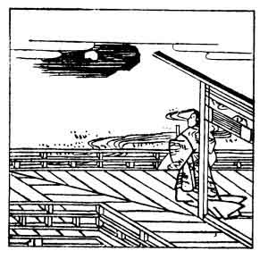

  
[Intangible Textual Heritage](../../index)  [Japan](../index.md) 
[Index](index)  [Previous](hvj068)  [Next](hvj070.md) 

------------------------------------------------------------------------

[Buy this Book on
Kindle](https://www.amazon.com/exec/obidos/ASIN/B002HRE8VG/internetsacredte.md)

------------------------------------------------------------------------

  
*A Hundred Verses from Old Japan (The Hyakunin-isshu)*, tr. by William
N. Porter, \[1909\], at Intangible Textual Heritage

------------------------------------------------------------------------

p. 68

 

### 68

### THE RETIRED EMPEROR SANJŌ

### SANJŌ IN

  Kokoro ni mo  
Arade uki yo ni  
  Nagaraeba  
Koishikarubeki  
Yowa no tsuki kana.

IF in this troubled world of ours  
  I still must linger on,  
My only friend shall be the moon,  
  Which on my sadness shone,  
  When other friends were gone.

The Emperor Sanjō, who reigned A.D. 1012-1015) was
the son of the Emperor Reisei; he fell into ill health, his palace was
burnt down twice, and he was forced to abdicate by Michinaga Fujiwara
(see verse No. [59](hvj060.htm#page_59).md)

------------------------------------------------------------------------

[Next: 69. The Priest Nō-in: Nō-in Hōshi](hvj070.md)
