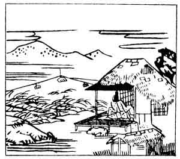

  
[Intangible Textual Heritage](../../index)  [Japan](../index.md) 
[Index](index)  [Previous](hvj071)  [Next](hvj073.md) 

------------------------------------------------------------------------

[Buy this Book on
Kindle](https://www.amazon.com/exec/obidos/ASIN/B002HRE8VG/internetsacredte.md)

------------------------------------------------------------------------

  
*A Hundred Verses from Old Japan (The Hyakunin-isshu)*, tr. by William
N. Porter, \[1909\], at Intangible Textual Heritage

------------------------------------------------------------------------

p. 71

 

### 71

### THE FIRST ADVISER OF STATE TSUNE-NOBU

### DAI-NAGON TSUNE-NOBU

  Yūsareba  
Kado-da no inaba  
  Otozurete  
Ashi no maroya ni  
Aki kaze zo fuku.

THIS autumn night the wind blows shrill,  
  And would that I could catch  
Its message, as it whistles through  
  The rushes in the thatch  
  And leaves of my rice-patch.

Tsune-nobu, a member of the Minamoto family, was
famous as a man of letters in the eleventh century, and died in the year
1096.

------------------------------------------------------------------------

[Next: 72. The Lady Kii, of the House of Princess Yūshi: Yūshi Naishinnō
Ke Kii](hvj073.md)
