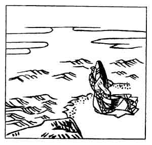

  
[Intangible Textual Heritage](../../index)  [Japan](../index.md) 
[Index](index)  [Previous](hvj072)  [Next](hvj074.md) 

------------------------------------------------------------------------

[Buy this Book on
Kindle](https://www.amazon.com/exec/obidos/ASIN/B002HRE8VG/internetsacredte.md)

------------------------------------------------------------------------

  
*A Hundred Verses from Old Japan (The Hyakunin-isshu)*, tr. by William
N. Porter, \[1909\], at Intangible Textual Heritage

------------------------------------------------------------------------

p. 72

 

### 72

### THE LADY KII, OF THE HOUSE OF PRINCESS YŪSHI

### YŪSHI NAISHINNŌ KE KII

  Oto ni kiku  
Takashi no hama no  
  Adanami wa  
Kakeji ya sode no  
Nure mo koso sure.

THE sound of ripples on the shore  
Ne’er fails at Takashi;  
My sleeves all worn and wet with tears  
Should surely prove to thee,  
I, too, will constant be.

The Lady Kii lived at the Court of the Emperor
Horikawa, who reigned A.D. 1087-1107. Takashi is a seaside place in the
Province of Izumi, not far from Ōsaka, and on the shore we see the Lady
Kii, perhaps composing this verse to her lover.

------------------------------------------------------------------------

[Next: 73. The Assistant Imperial Adviser Masafusa: Gon Chū-nagon
Masafusa](hvj074.md)
