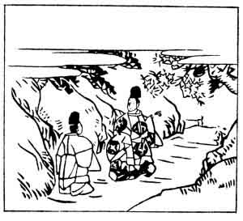

  
[Intangible Textual Heritage](../../index)  [Japan](../index) 
[Index](index)  [Previous](hvj073)  [Next](hvj075) 

------------------------------------------------------------------------

[Buy this Book on
Kindle](https://www.amazon.com/exec/obidos/ASIN/B002HRE8VG/internetsacredte)

------------------------------------------------------------------------

  
*A Hundred Verses from Old Japan (The Hyakunin-isshu)*, tr. by William
N. Porter, \[1909\], at Intangible Textual Heritage

------------------------------------------------------------------------

p. 73

 

### 73

### THE ASSISTANT IMPERIAL ADVISER MASAFUSA

### GON CHŪ-NAGON MASAFUSA

  Takasago no  
Once no zakura  
  Saki ni keri  
Toyama no kasumi  
Tatazu mo aranan.

THE cherry trees are blossoming  
  On Takasago's height;  
Oh may no mountain mist arise,  
  No clouds so soft and white,  
  To hide them from our sight.

This poet was the son of Chika-nari Ooi, and died in the year 1112.
Takasago is on the sea-coast in the Province of Harima, and is also
mentioned in verse No. [34](hvj035.htm#page_34).

Masafusa with his attendant appears in the illustration admiring the
cherry trees on the mountains, over which, however, the clouds are
already beginning to gather.

------------------------------------------------------------------------

[Next: 74. The Minister Toshi-yori Minamoto: Minamoto no Toshi-yori
Ason](hvj075)
