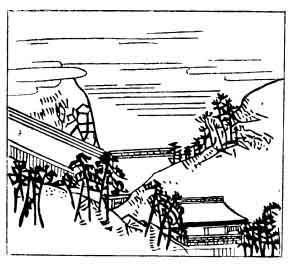

  
[Intangible Textual Heritage](../../index)  [Japan](../index.md) 
[Index](index)  [Previous](hvj074)  [Next](hvj076.md) 

------------------------------------------------------------------------

[Buy this Book on
Kindle](https://www.amazon.com/exec/obidos/ASIN/B002HRE8VG/internetsacredte.md)

------------------------------------------------------------------------

  
*A Hundred Verses from Old Japan (The Hyakunin-isshu)*, tr. by William
N. Porter, \[1909\], at Intangible Textual Heritage

------------------------------------------------------------------------

p. 74

 

### 74

### THE MINISTER TOSHI-YORI MINAMOTO

### MINAMOTO NO TOSHI-YORI ASON

  Ukari keru  
Hito wo Hatsuse no  
  Yama-oroshi  
Hageshikare to wa  
Inoranu mono wo.

OH! Kwannon, Patron of this hill,  
  The maid, for whom I pine,  
Is obstinate and wayward, like  
  The gusts around thy shrine.  
  What of those prayers of mine?

Toshi-yori is supposed to have been the son of the
writer of verse No. [71](hvj072.htm#page_71.md); he probably lived early in
the twelfth century. Hatsuse is a mountain village near Nara, in the
Province of Yamato; the temple there is dedicated to Kwannon, Goddess of
Mercy, 'who looketh for ever down above the sound of prayer.'

------------------------------------------------------------------------

[Next: 75. Mototoshi Fujiwara: Fujiwara no Mototoshi](hvj076.md)
