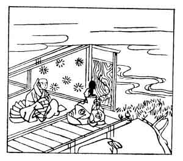

  
[Intangible Textual Heritage](../../index)  [Japan](../index) 
[Index](index)  [Previous](hvj075)  [Next](hvj077) 

------------------------------------------------------------------------

[Buy this Book on
Kindle](https://www.amazon.com/exec/obidos/ASIN/B002HRE8VG/internetsacredte)

------------------------------------------------------------------------

  
*A Hundred Verses from Old Japan (The Hyakunin-isshu)*, tr. by William
N. Porter, \[1909\], at Intangible Textual Heritage

------------------------------------------------------------------------

p. 75

 

### 75

### MOTOTOSHI FUJIWARA

### FUJIWARA NO MOTOTOSHI

  Chigiri okishi  
Sasemo ga tsuyu wo  
  Inochi nite  
Aware kotoshi no  
Aki mo inumeri.

IT is a promise unfulfilled,  
  For which I humbly sue  
The dainty little mugwort plant  
  Relies upon the dew,  
  And I rely—on you.

The writer lived early in the twelfth century, when
the Court was given over to intrigue. Tadamichi Fujiwara, the Regent,
had promised him a post of honour for his son, but had, year after year,
failed to fulfil it. The verse is a gentle reminder, and the last
couplet, which does not appear in the translation, delicately hints that
the autumn of the present year also is slipping away. In the
illustration we see Mototoshi addressing his petition to the
Regent.

------------------------------------------------------------------------

[Next: 76. The Late Regent and Prime Minister, the Lay Priest of the
Hōshō Temple: Hōshō-ji Nyūdō Saki no Kwambaku Daijōdaijin](hvj077)
