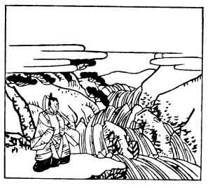

  
[Intangible Textual Heritage](../../index)  [Japan](../index) 
[Index](index)  [Previous](hvj077)  [Next](hvj079) 

------------------------------------------------------------------------

[Buy this Book on
Kindle](https://www.amazon.com/exec/obidos/ASIN/B002HRE8VG/internetsacredte)

------------------------------------------------------------------------

  
*A Hundred Verses from Old Japan (The Hyakunin-isshu)*, tr. by William
N. Porter, \[1909\], at Intangible Textual Heritage

------------------------------------------------------------------------

p. 77

 

### 77

### THE RETIRED EMPEROR SUTOKU

### SUTOKU IN

  Se wo hayami  
Iwa ni sekaruru  
  Taki-gawa no  
Warete mo sue ni  
Awan to zo omou.

THE rock divides the stream in two,  
  And both with might and main  
Go tumbling down the waterfall;  
  But well I know the twain  
  Will soon unite again.

The town of Kamakura, where is the great bronze image of Buddha Amida,
was built by this Emperor, who reigned A.D. 1124-1141; he was then
forced by his father, the ex-Emperor Toba, to abdicate in favour of his
brother, the Emperor Konoye; afterwards he entered the church, and died
in the year 1164, an exile in the Province of Sanuki. This verse is
intended to suggest the parting of two lovers, who will eventually meet
again.

------------------------------------------------------------------------

[Next: 78. Kanemasa Minamoto: Minamoto no Kanemasa](hvj079)
