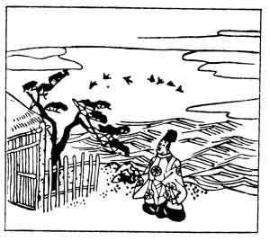

  
[Intangible Textual Heritage](../../index)  [Japan](../index) 
[Index](index)  [Previous](hvj078)  [Next](hvj080) 

------------------------------------------------------------------------

[Buy this Book on
Kindle](https://www.amazon.com/exec/obidos/ASIN/B002HRE8VG/internetsacredte)

------------------------------------------------------------------------

  
*A Hundred Verses from Old Japan (The Hyakunin-isshu)*, tr. by William
N. Porter, \[1909\], at Intangible Textual Heritage

------------------------------------------------------------------------

p. 78

 

### 78

### KANEMASA MINAMOTO

### MINAMOTO NO KANEMASA

  Awaji shima  
Kayou chidori no  
  Naku koe ni  
Iku yo nezamenu  
Suma no seki-mori.

BETWEEN Awaji and the shore  
  The birds scream in their flight  
Full oft they've made the Suma Guard  
  Toss through a sleepless night,  
  Until the morning light.

The writer was the son of Kanesuke, and died about
the year 1112. *Chidori* are snipe or plovers, but here are apparently
meant for seagulls. Awaji is a large island in the Inland Sea, near
Kobe, and Suma is a point on the mainland in the Province of Settsu,
immediately opposite.

------------------------------------------------------------------------

[Next: 79. The Shinto Official Aki-suke, of the Left Side of the
Capital: Sakyō no Taiu Aki-suke](hvj080)
