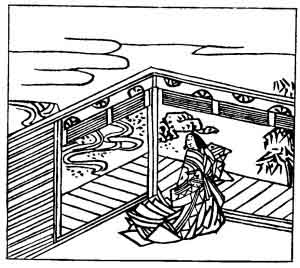

  
[Intangible Textual Heritage](../../index)  [Japan](../index) 
[Index](index)  [Previous](hvj080)  [Next](hvj082) 

------------------------------------------------------------------------

[Buy this Book on
Kindle](https://www.amazon.com/exec/obidos/ASIN/B002HRE8VG/internetsacredte)

------------------------------------------------------------------------

  
*A Hundred Verses from Old Japan (The Hyakunin-isshu)*, tr. by William
N. Porter, \[1909\], at Intangible Textual Heritage

------------------------------------------------------------------------

p. 80

 

### 80

### LADY HORIKAWA, IN ATTENDANCE ON THE DOWAGER EMPRESS TAIKEN

### TAIKEN MON-IN HORIKAWA

  Nagakaran  
Kokoro mo shirazu  
  Kuro kami no  
Midarete kesa wa  
Mono wo koso omoe.

MY doubt about his constancy  
  Is difficult to bear;  
Tangled this morning are my thoughts,  
  As is my long black hair.  
  I wonder—Does he care?

Lady Horikawa was the daughter of the First Adviser
of State, Sane-kyo, who lived about the year 1142. In this verse she is
anxiously pondering, how long her lover will continue to be true to her;
and she discovers, that her ideas on the subject are as tangled and
disordered as her hair is.

------------------------------------------------------------------------

[Next: 81. The Minister-of-the-Left of the Tokudai Temple: Go Tokudai-ji
Sadaijin](hvj082)
