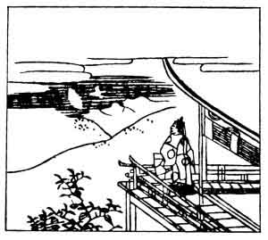

  
[Intangible Textual Heritage](../../index)  [Japan](../index.md) 
[Index](index)  [Previous](hvj081)  [Next](hvj083.md) 

------------------------------------------------------------------------

[Buy this Book on
Kindle](https://www.amazon.com/exec/obidos/ASIN/B002HRE8VG/internetsacredte.md)

------------------------------------------------------------------------

  
*A Hundred Verses from Old Japan (The Hyakunin-isshu)*, tr. by William
N. Porter, \[1909\], at Intangible Textual Heritage

------------------------------------------------------------------------

p. 81

 

### 81

### THE MINISTER-OF-THE-LEFT OF THE TOKUDAI TEMPLE:

### GO TOKUDAI-JI SADAIJIN

  Hototogisu  
Nakitsuru kata wo  
  Nagamureba  
Tada ariake no  
Tsuki zo nokoreru.

THE cuckoo's echo dies away,  
  And lo! the branch is bare  
I only see the morning moon,  
  Whose light is fading there  
  Before the daylight's glare.

The writer's name was Sanesada Fujiwara, and he
entered the priesthood in the year 1198. The cuckoo, according to
Japanese tradition, cries through the night until its eyes become
bloodshot. It is supposed to come from the Spirit-land across the
mountains of Hades, about the end of the fifth month, to warn the farmer
that it is time to sow his rice. In the illustration we see the morning
moon setting behind the hills, and the cuckoo flying away.

------------------------------------------------------------------------

[Next: 82. The Priest Dō-in: Dō-in Hoshi](hvj083.md)
