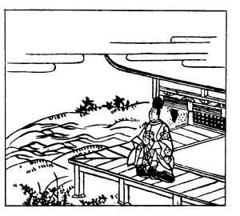

  
[Intangible Textual Heritage](../../index)  [Japan](../index.md) 
[Index](index)  [Previous](hvj084)  [Next](hvj086.md) 

------------------------------------------------------------------------

[Buy this Book on
Kindle](https://www.amazon.com/exec/obidos/ASIN/B002HRE8VG/internetsacredte.md)

------------------------------------------------------------------------

  
*A Hundred Verses from Old Japan (The Hyakunin-isshu)*, tr. by William
N. Porter, \[1909\], at Intangible Textual Heritage

------------------------------------------------------------------------

p. 84

 

### 84

### THE MINISTER KIYO-SUKE FUJIWARA

### FUJIWARA NO KIYO-SUKE ASON

  Nagaraeba  
Mata konogoro ya  
  Shinobaremu  
Ushi to mishi yo zo  
Ima wa koishiki.

TIME was when I despised my youth,  
  As boyhood only can;  
What would I give for boyhood now,  
  When finishing life's span  
  An old decrepid man!

Kiyo-suke was the son of the writer of verse No.
[79](hvj080.htm#page_79.md), and lived in the latter part of the twelfth
century.

------------------------------------------------------------------------

[Next: 85. The Priest Shun-ye: Shun-ye Hōshi](hvj086.md)
