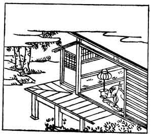

  
[Intangible Textual Heritage](../../index)  [Japan](../index.md) 
[Index](index)  [Previous](hvj085)  [Next](hvj087.md) 

------------------------------------------------------------------------

[Buy this Book on
Kindle](https://www.amazon.com/exec/obidos/ASIN/B002HRE8VG/internetsacredte.md)

------------------------------------------------------------------------

  
*A Hundred Verses from Old Japan (The Hyakunin-isshu)*, tr. by William
N. Porter, \[1909\], at Intangible Textual Heritage

------------------------------------------------------------------------

p. 85

 

### 85

### THE PRIEST SHUN-YE

### SHUN-YE HŌSHI

  Yomosugara  
Mono omou koro wa  
  Ake yarade  
Neya no hima sae  
Tsurena kari keri.

ALL through the never-ending night  
  I lie awake and think;  
In vain I look to try and see  
  The daybreak's feeble blink  
  Peep through the shutter's chink.

This priest was the son of the author of verse No.
[74](hvj075.htm#page_74.md). He describes in this poem a sleepless night,
when he looks in vain to catch the first glimpse of daybreak through the
joints of the sliding screens, that form the walls of a Japanese house.
But in the picture, as will be noticed, one of the sliding screens is
removed, in order to show the priest within.

------------------------------------------------------------------------

[Next: 86. The Priest Saigyō: Saigyō Hōshi](hvj087.md)
