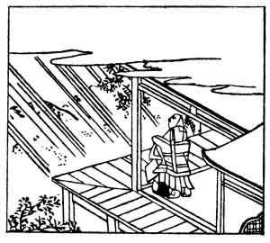

  
[Intangible Textual Heritage](../../index)  [Japan](../index.md) 
[Index](index)  [Previous](hvj087)  [Next](hvj089.md) 

------------------------------------------------------------------------

[Buy this Book on
Kindle](https://www.amazon.com/exec/obidos/ASIN/B002HRE8VG/internetsacredte.md)

------------------------------------------------------------------------

  
*A Hundred Verses from Old Japan (The Hyakunin-isshu)*, tr. by William
N. Porter, \[1909\], at Intangible Textual Heritage

------------------------------------------------------------------------

p. 87

 

### 87

### THE PRIEST JAKU-REN

### JAKU-REN HŌSHI

 

  Murasame no  
Tsuyu mo mada hinu  
  Maki no ha ni  
Kiri tachi-noboru  
Aki no yūgure.

THE rain, which fell from passing showers,  
  Like drops of dew, still lies  
Upon the fir-tree needles, and  
  The mists of evening rise  
  Up to the autumn skies.

This verse is a good example of a picture verse, intended to call up the
scene to one's imagination. Jaku-ren was another of the great Fujiwara
clan, and lived about the end of the twelfth century.

*Murasame* means 'rain falling in showers, here and there', and the
illustration plainly shows it raining on one side of the house only.

------------------------------------------------------------------------

[Next: 88. An Official of the Dowager Empress Kwōka: Kwōka Mon-in no
Betto](hvj089.md)
