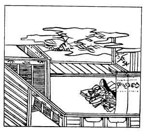

  
[Intangible Textual Heritage](../../index)  [Japan](../index.md) 
[Index](index)  [Previous](hvj088)  [Next](hvj090.md) 

------------------------------------------------------------------------

[Buy this Book on
Kindle](https://www.amazon.com/exec/obidos/ASIN/B002HRE8VG/internetsacredte.md)

------------------------------------------------------------------------

  
*A Hundred Verses from Old Japan (The Hyakunin-isshu)*, tr. by William
N. Porter, \[1909\], at Intangible Textual Heritage

------------------------------------------------------------------------

p. 88

 

### 88

### AN OFFICIAL OF THE DOWAGER EMPRESS KWŌKA

### KWŌKA MON-IN NO BETTO

  Naniwa e no  
Ashi no karine no  
  Hito yo yue  
Mi wo tsukushite ya  
Koi wataru beki.

I'VE seen thee but a few short hours;  
  As short, they seemed to me,  
As bamboo reeds at Naniwa;  
  But tide-stakes in the sea  
  Can't gauge my love for thee.

This verse was written some time in the twelfth century; and Naniwa is
the ancient name of Ōsaka.

There are several double meanings in this verse lines 2 and 3 can mean
either 'one section of a reed cut off between the joints', or 'one
night's sleep as short as a reed'. In the fourth line also,
*miotsukushi* means a tide-gauge, as explained in the note to verse No.
[20](hvj021.htm#page_20.md), but the whole line, taken as printed, reads,
'How can I be already tired of thee!' The contrast here is between the
length of only one section of a short reed and the long stake set up to
measure the rise and fall of the tide.

The illustration seems to show the lady to whom the verse was addressed.

------------------------------------------------------------------------

[Next: 89. Princess Shikishi: Shikishi Naishinnō](hvj090.md)
