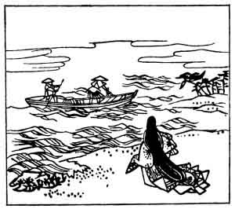

  
[Intangible Textual Heritage](../../index)  [Japan](../index.md) 
[Index](index)  [Previous](hvj090)  [Next](hvj092.md) 

------------------------------------------------------------------------

[Buy this Book on
Kindle](https://www.amazon.com/exec/obidos/ASIN/B002HRE8VG/internetsacredte.md)

------------------------------------------------------------------------

  
*A Hundred Verses from Old Japan (The Hyakunin-isshu)*, tr. by William
N. Porter, \[1909\], at Intangible Textual Heritage

------------------------------------------------------------------------

p. 90

 

### 90

### THE CHIEF VICE-OFFICIAL IN ATTENDANCE ON THE DOWAGER EMPRESS IMPU

### IMPU MON-IN NO ŌSUKE

  Misebayana  
Ojima no ama no  
  Sode dani no  
Nure ni zo nureshi  
Iro wa kawaraji.

THE fisher's clothes, though cheap, withstand  
  The drenching they receive;  
But see I my floods of tears have blurred  
  The colours of my sleeve,  
  As for thy love I grieve.

The writer is said to have been one of the Fujiwara family, and to have
died in the year 1210. Ojima is an island in the Inland Sea.

In the last line the word *iro* can mean both 'colour' and 'love'; so
that the meaning is, the writer's love will remain as constant as the
colour of the fisher's clothes, even though drenched with salt water. In
connexion with this word *iro*, it may be mentioned that a crimson maple
leaf, When sent by a lady to her lover, is a gentle hint that she wishes
to see him no more; the meaning being, that as the colour (*iro*) of the
leaf has changed, so her love (*iro*) has changed also.

------------------------------------------------------------------------

[Next: 91. The Regent and Former Prime Minister Go-kyō-goku: Go-kyō-goku
Sesshō Saki no Daijōdaijin](hvj092.md)
