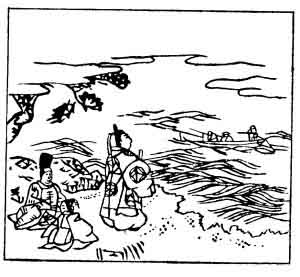

  
[Intangible Textual Heritage](../../index)  [Japan](../index.md) 
[Index](index)  [Previous](hvj093)  [Next](hvj095.md) 

------------------------------------------------------------------------

[Buy this Book on
Kindle](https://www.amazon.com/exec/obidos/ASIN/B002HRE8VG/internetsacredte.md)

------------------------------------------------------------------------

  
*A Hundred Verses from Old Japan (The Hyakunin-isshu)*, tr. by William
N. Porter, \[1909\], at Intangible Textual Heritage

------------------------------------------------------------------------

p. 93

 

### 93

### THE MINISTER OF THE RIGHT DISTRICT OF KAMAKURA

### KAMAKURA UDAIJIN

  Yo no naka wa  
Tsune ni moga mo na  
  Nagisa kogu  
Ama no obune no  
Tsunade kanashi mo.

I LOVE to watch the fishing-boats  
  Returning to the bay,  
The crew, all straining at the oars,  
  And coiling ropes away;  
  For busy folk are they.

The name of the writer of this verse was Sanetomo
Minamato, the second son of the great General Yoritomo. He was a famous
man of letters, and was murdered in the year 1219 by his nephew, the
Priest Kugyō, at the Temple of Hachiman at Kamakura, whither he had gone
to return thanks for his promotion to a high office of state. He seems
to have had a premonition of his coming fate; for that morning, while
being dressed, he composed the farewell poem to his plum tree given in
the Introduction, and pulling out a hair he gave it to his servant,
bidding him keep it in memory of him. The assassin sprang out from
behind a tree, which is still pointed out to-day, growing at the side of
the temple steps, cut him down, and ran off with the head. Kugyō was
caught and executed, but the head was never found, and so the single
hair was buried in its stead.

------------------------------------------------------------------------

[Next: 94. The Privy Councillor Masatsune: Sangi Masatsune](hvj095.md)
