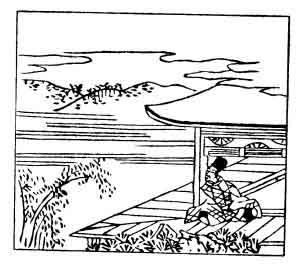

  
[Intangible Textual Heritage](../../index)  [Japan](../index) 
[Index](index)  [Previous](hvj094)  [Next](hvj096) 

------------------------------------------------------------------------

[Buy this Book on
Kindle](https://www.amazon.com/exec/obidos/ASIN/B002HRE8VG/internetsacredte)

------------------------------------------------------------------------

  
*A Hundred Verses from Old Japan (The Hyakunin-isshu)*, tr. by William
N. Porter, \[1909\], at Intangible Textual Heritage

------------------------------------------------------------------------

p. 94

 

### 94

### THE PRIVY COUNCILLOR MASATSUNE

### SANGI MASATSUNE

  Miyoshino no  
Yama no aki kaze  
  Sayo fukete  
Furu sato samuku  
Koromo utsu nari.

AROUND Mount Miyoshino's crest  
  The autumn winds blow drear;  
The villagers are beating cloth,  
  Their merry din I hear,  
  This night so cold and clear.

Masatsune was a son of the writer of verse No.
[83](hvj084.htm#page_83); he died in the year 1221. He appears in the
illustration sitting alone in his house, listening to the sound of the
villagers beating the cloth to make it supple.

------------------------------------------------------------------------

[Next: 95. The Former Archbishop Jiyen: Saki No Daisōjō Jiyen](hvj096)
