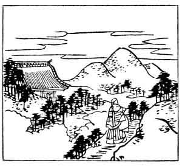

  
[Intangible Textual Heritage](../../index)  [Japan](../index.md) 
[Index](index)  [Previous](hvj095)  [Next](hvj097.md) 

------------------------------------------------------------------------

[Buy this Book on
Kindle](https://www.amazon.com/exec/obidos/ASIN/B002HRE8VG/internetsacredte.md)

------------------------------------------------------------------------

  
*A Hundred Verses from Old Japan (The Hyakunin-isshu)*, tr. by William
N. Porter, \[1909\], at Intangible Textual Heritage

------------------------------------------------------------------------

p. 95

 

### 95

### THE FORMER ARCHBISHOP JIYEN

### SAKI NO DAISŌJŌ JIYEN

  Ōkenaku  
Uki yo no tami ni  
  Ōu kana  
Waga tatsu soma ni  
Sumizome no sode.

UNFIT to rule this wicked world  
  With all its pomp and pride,  
I'd rather in my plain black robe  
  A humble priest abide,  
  Far up the mountain side.

The Archbishop was a son of the author of verse No.
[76](hvj077.htm#page_76.md). He had just been promoted to his exalted rank,
which entailed living at the Temple of Mount Hiei, near Kyōto, and this
is his modest deprecatory verse on his new appointment. He is said to
have put an end to his life by the method described in the note to verse
No. [12](hvj013.htm#page_12.md).

In the picture we see the Archbishop in his robes, and the great Temple
of Mount Hiei, while in the distance are: the wild hills where he longs
to be.

------------------------------------------------------------------------

[Next: 96. The Lay-Priest, a Former Prime Minister of State: Nyūdō Saki
Daijōdaijin](hvj097.md)
