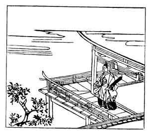

  
[Intangible Textual Heritage](../../index)  [Japan](../index) 
[Index](index)  [Previous](hvj096)  [Next](hvj098) 

------------------------------------------------------------------------

[Buy this Book on
Kindle](https://www.amazon.com/exec/obidos/ASIN/B002HRE8VG/internetsacredte)

------------------------------------------------------------------------

  
*A Hundred Verses from Old Japan (The Hyakunin-isshu)*, tr. by William
N. Porter, \[1909\], at Intangible Textual Heritage

------------------------------------------------------------------------

p. 96

 

### 96

### THE LAY-PRIEST, A FORMER PRIME MINISTER OF STATE

### NYŪDŌ SAKI DAIJŌDAIJIN

  Hana sasou  
Arashi no niwa no  
  Yuki narade  
Furi yuku mono wa  
Waga mi nari keri.

THIS snow is not from blossoms white  
  Wind-scattered, here and there,  
That whiten all my garden paths  
  And leave the branches bare;  
  ’Tis age that snows my hair!

The writer's name was Kintsune; he retired from office to enter the
church, and died in the year 1244, aged seventy-six.

Note the play upon *yuki*, 'snow,' and *yuku*, the verb 'to go'; *furi
yuku* means 'going to fall' (as snow), but *furi* also suggests the idea
of 'growing old'. He says it is really he himself that is fading and
falling, rather than the petals of his garden flowers blown by the
storm.

The picture does not seem to illustrate the verse very well; it is
probably meant to show Kintsune on his verandah, lamenting over his
increasing years; but in the original edition, from which the pictures
were taken, fallen cherry blossoms are shown underneath the verse at the
bottom of the page.

------------------------------------------------------------------------

[Next: 97. The Assistant Imperial Adviser Sada-iye: Gon Chu-Nagon
Sada-iye](hvj098)
