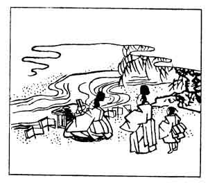

  
[Intangible Textual Heritage](../../index)  [Japan](../index.md) 
[Index](index)  [Previous](hvj098)  [Next](hvj100.md) 

------------------------------------------------------------------------

[Buy this Book on
Kindle](https://www.amazon.com/exec/obidos/ASIN/B002HRE8VG/internetsacredte.md)

------------------------------------------------------------------------

  
*A Hundred Verses from Old Japan (The Hyakunin-isshu)*, tr. by William
N. Porter, \[1909\], at Intangible Textual Heritage

------------------------------------------------------------------------

p. 98

 

### 98

### THE OFFICIAL IYE-TAKA

### JŪNII IYE-TAKA

  Kaze soyogu  
Nara no ogawa no  
  Yūgure wa  
Misogi zo natsu no  
Shirushi nari keri.

THE twilight dim, the gentle breeze  
  By Nara's little stream,  
The splash of worshippers who wash  
  Before the shrine, all seem  
  A perfect summer's dream.

Iye-taka was another of the great Fujiwara family; he died in the year
1237.

The word *misogi* means the Shinto ceremony of purifying the body before
worship by washing or sprinkling with water. This verse is said to have
been inscribed on a screen in the apartments of the Empress at Nara.

------------------------------------------------------------------------

[Next: 99. The Retired Emperor Gotoba: Gotoba no In](hvj100.md)
