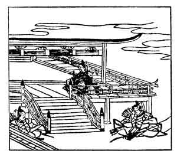

  
[Intangible Textual Heritage](../../index)  [Japan](../index.md) 
[Index](index)  [Previous](hvj100)  [Next](hvj102.md) 

------------------------------------------------------------------------

[Buy this Book on
Kindle](https://www.amazon.com/exec/obidos/ASIN/B002HRE8VG/internetsacredte.md)

------------------------------------------------------------------------

  
*A Hundred Verses from Old Japan (The Hyakunin-isshu)*, tr. by William
N. Porter, \[1909\], at Intangible Textual Heritage

------------------------------------------------------------------------

p. 100

 

### 100

### THE RETIRED EMPEROR JUN-TOKU

### JUN-TOKU IN

  Momoshiki ya  
Furuki nokiba no  
  Shinobu ni mo  
Nao amari aru  
Mukashi nari keri.

MY ancient Palace I regret,  
  Though rot attacks the eaves,  
And o'er the roof the creeping vine  
  Spreads out and interweaves  
  Unpruned its straggling leaves.

This writer was the third son of the Emperor Gotoba, author of the
previous verse ([99](hvj100.htm#page_99).md); he reigned A.D. 1211-1221,
and was deposed like his father, and banished to the Island of Sado. It
was during his reign that the first Japanese warships were built by
Sanetomo, the writer of verse No. [93](hvj094.htm#page_93.md), who headed a
rebellion against the Emperor.

*Shinobu* means 'a creeping vine ', but it is also the verb 'to long for
'; and the verse suggests that the Emperor, while mourning over the
decay of the Imperial power, still longs for the o d Palace, neglected
and grown over with creepers as it is.

And so the Collection ends, as it began, with two verses by Imperial
poets.

------------------------------------------------------------------------

[Next: Index](hvj102.md)
