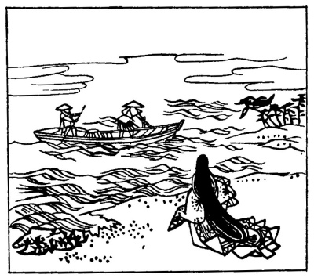

  
[Intangible Textual Heritage](../../index)  [Japan](../index.md) 

------------------------------------------------------------------------

[Buy this Book on
Kindle](https://www.amazon.com/exec/obidos/ASIN/B002HRE8VG/internetsacredte.md)

------------------------------------------------------------------------

<table width="75%">
<colgroup>
<col style="width: 50%" />
<col style="width: 50%" />
</colgroup>
<tbody>
<tr class="odd">
<td width="50%" data-valign="TOP"></td>
<td width="50%" data-valign="CENTER"><h1 id="a-hundred-verses-from-old-japan" data-align="CENTER">A Hundred Verses from Old Japan</h1>
<h4 id="the-hyakunin-isshu" data-align="CENTER">(The <em>Hyakunin-isshu</em>)</h4>
<h2 id="translated-by-william-n.-porter" data-align="CENTER">translated by William N. Porter</h2>
<h4 id="section" data-align="CENTER">[1909]</h4></td>
</tr>
</tbody>
</table>

------------------------------------------------------------------------

[Contents](#contents)    [Start Reading](hvj000.md)    [Page
Index](pageidx)    [Text \[Zipped\]](hvj.txt.gz.md)

------------------------------------------------------------------------

|                                                                                                                           |
|---------------------------------------------------------------------------------------------------------------------------|
|  |

This is a collection of 100 specimens of Japanese *Tanka* poetry
collected in the 13th Century C.E., with some of the poems dating back
to the 7th Centry. *Tanka* is a 31 syllable format in the pattern
5-7-5-7-7. Most of these poems were written about the time of the Norman
Conquest and display a sophistication that western literature would not
achieve for a long time thereafter. These little gems are on themes such
as nature, the round of the seasons, the impermanence of life, and the
vicissitudes of love. There are obvious Buddhist and Shinto influences
throughout. Porter's notes put the poems into a cultural and historical
context. Each poem is illustrated in this edition with an 18th century
Japanese woodcut by an anonymous illustrator.

Production Notes: The original book has Japanese and English on facing
pages, each of which are numbered according to the poem. This means that
there are two duplicate page numbers per poem. The preface and index
have no page numbers. In this text I have put the Japanese, English and
the notes on one virtual page per poem, and supplied page numbers for
the apparatus.

--John Bruno Hare, 9/19/2004

------------------------------------------------------------------------

 [Title Page](hvj000.md)  
[Introduction](hvj001.md)  
[1. The Emperor Tenchi: Tenchi Tennō](hvj002.md)  
[2. The Empress Jitō: Jitō Tennō](hvj003.md)  
[3. The Nobleman Kaki-no-Moto: Kaki-no-Moto no Hitomaro](hvj004.md)  
[4. Akahito Yamabe: Yamabe no Akahito](hvj005.md)  
[5. Saru Maru, A Shinto Official: Saru Maru Taiu](hvj006.md)  
[6. The Imperial Adviser Yakamochi: Chū-nagon Yakamochi](hvj007.md)  
[7. Nakamaro Abe: Abe no Nakamaro](hvj008.md)  
[8. The Priest Kizen: Kizen Hōshi](hvj009.md)  
[9. Komachi Ono: Ono no Komachi](hvj010.md)  
[10. Semi Maru](hvj011.md)  
[II. The Privy Councillor Takamura: Sangi Takamura](hvj012.md)  
[12. Bishop Henjō: Sōjō Henjō](hvj013.md)  
[13. The Retired Emperor Yōzei: Yōzei In](hvj014.md)  
[14. The Minister-of-the-Left of the Kawara (District of Kyōto): Kawara
no Sadaijin](hvj015.md)  
[15. The Emperor Kwōkō: Kwōkō Tennō](hvj016.md)  
[16. The Imperial Adviser Yuki-hira Ariwara: Chū-Nagon Ariwara no
Yuki-hira](hvj017.md)  
[17. The Minister Nari-hira Ariwara: Ariwara no Nari-hira
Ason](hvj018.md)  
[18. The Minister Toshi-yuki Fujiwara: Fujiwara No Toshi-yuki
Ason](hvj019.md)  
[19. The Princess Ise: Ise](hvj020.md)  
[20. The Heir-Apparent Moto-yoshi: Moto-yoshi Shinnō](hvj021.md)  
[21. The Priest Sosei: Sosei Hōshi](hvj022.md)  
[22. Yasuhide Bunya: Bunya No Yasuhide](hvj023.md)  
[23. Chisato Ōye: Ōye no Chisato](hvj024.md)  
[24. Kwan-ke](hvj025.md)  
[25. The Minister-of-the-Right of the Sanjō (District of Kyōto): Sanjō
Udaijin](hvj026.md)  
[26. Prince Tei-shin: Tei-shin Kō](hvj027.md)  
[27. The Imperial Adviser Kanesuke: Chū-Nagon Kanesuke](hvj028.md)  
[28. The Minister Mune-yuki Minamoto: Minamoto no Mune-yuki
Ason](hvj029.md)  
[29. Mitsune Ōshi-kōchi: Ōshi-kōchi No Mitsune](hvj030.md)  
[30. Tadamine Nibu: Nibu no Tadamine](hvj031.md)  
[31. Korenori Saka-no-Uye: Saka-no-Uye no Korenori](hvj032.md)  
[32. Tsuraki Harumichi: Harumichi no Tsuraki](hvj033.md)  
[33. Tomonori Kino: Kino Tomonori](hvj034.md)  
[34. Oki-kaze Fujiwara: Fujiwara No Oki-kaze](hvj035.md)  
[35. Tsura-yuki Kino: Kino Tsura-yuki](hvj036.md)  
[36. Fuka-yabu Kiyowara: Kiyowara no Fuka-yabu](hvj037.md)  
[37. Asayasu Bunya: Bunya no Asayasu](hvj038.md)  
[38. Ukon](hvj039.md)  
[39. The Privy Councillor Hitoshi: Sangi Hitoshi](hvj040.md)  
[40. Kanemori Taira: Taira no Kanemori](hvj041.md)  
[41. Tadami Nibu: Nibu no Tadami](hvj042.md)  
[42. Moto-suke Kiyowara: Kiyowara no Moto-suke](hvj043.md)  
[43. The Imperial Adviser Yatsu-tada: Chū-nagon Yatsu-tada](hvj044.md)  
[44. The Imperial Adviser Asa-tada: Chū-Nagon Asa-tada](hvj045.md)  
[45. Prince Ken-toku: Ken-toku Kō](hvj046.md)  
[46. The Priest Ne-yoshi-tada: Sō Ne-yoshi-tada](hvj047.md)  
[47. The Priest Ye-kei: Ye-kei Hōshi](hvj048.md)  
[48. Shige-yuki Minamoto: Minamoto no Shige-yuki](hvj049.md)  
[49. The Minister Yoshi-nobu, of Priestly Rank: Ōnakatomi no Yoshi-nobu
Ason](hvj050.md)  
[50. Yoshitaka Fujiwara: Fujiwara no Yoshitaka](hvj051.md)  
[51. The Minister Sanekata Fujiwara: Fujiwara no Sanekata
Ason](hvj052.md)  
[52. The Minister Michi-nobu Fujiwara: Fujiwara no Michi-nobu
Ason](hvj053.md)  
[53. The Mother of Michi-tsuna, Commander of the Right Imperial Guard:
Udaishō Michi-tsuna no Haha](hvj054.md)  
[54. The Mother of the Minister of State: Gidō-sanshi no Haha](hvj055.md)  
[55. The First Adviser of State Kintō: Dai-Nagon Kintō](hvj056.md)  
[56. Izumi Shikibu](hvj057.md)  
[57. Murasaki Shikibu](hvj058.md)  
[58. Daini no Sammi](hvj059.md)  
[59. Akazome Emon](hvj060.md)  
[60. Lady-in-Waiting Ko-shikibu: Ko-shikibu no Naishi](hvj061.md)  
[61. The Lady Ise: Ise no Taiu](hvj062.md)  
[62. The Lady Sei: Sei Shō-nagon](hvj063.md)  
[63. The Shinto Official Michimasa, of the Left Side of the Capital:
Sakyō Taiu Michimasa](hvj064.md)  
[64. The Assistant Imperial Adviser Sada-yori: Gon Chū-nagon
Sada-yori](hvj065.md)  
[65. Sagami](hvj066.md)  
[66. The Archbishop Gyōson: Daisōjō Gyōson](hvj067.md)  
[67. The Lady-in-Waiting Suwo: Suwo no Naishi](hvj068.md)  
[68. The Retired Emperor Sanjō: Sanjō In](hvj069.md)  
[69. The Priest Nō-in: Nō-in Hōshi](hvj070.md)  
[70. The Priest Riyō-zen: Riyō-zen Hōshi](hvj071.md)  
[71. The First Adviser of State Tsune-nobu: Dai-Nagon
Tsune-nobu](hvj072.md)  
[72. The Lady Kii, of the House of Princess Yūshi: Yūshi Naishinnō Ke
Kii](hvj073.md)  
[73. The Assistant Imperial Adviser Masafusa: Gon Chū-nagon
Masafusa](hvj074.md)  
[74. The Minister Toshi-yori Minamoto: Minamoto no Toshi-yori
Ason](hvj075.md)  
[75. Mototoshi Fujiwara: Fujiwara no Mototoshi](hvj076.md)  
[76. The Late Regent and Prime Minister, the Lay Priest of the Hōshō
Temple: Hōshō-ji Nyūdō Saki no Kwambaku Daijōdaijin](hvj077.md)  
[77. The Retired Emperor Sutoku: Sutoku In](hvj078.md)  
[78. Kanemasa Minamoto: Minamoto no Kanemasa](hvj079.md)  
[79. The Shinto Official Aki-suke, of the Left Side of the Capital:
Sakyō no Taiu Aki-suke](hvj080.md)  
[80. Lady Horikawa, in Attendance on the Dowager Empress Taiken: Taiken
Mon-in Horikawa](hvj081.md)  
[81. The Minister-of-the-Left of the Tokudai Temple: Go Tokudai-ji
Sadaijin](hvj082.md)  
[82. The Priest Dō-in: Dō-in Hoshi](hvj083.md)  
[83. Toshi-Nari, A Shinto Official in Attendance on the Empress Dowager:
Kwō-tai-kōgū no Taiu Toshi-nari](hvj084.md)  
[84. The Minister Kiyo-suke Fujiwara: Fujiwara No Kiyo-suke
Ason](hvj085.md)  
[85. The Priest Shun-ye: Shun-ye Hōshi](hvj086.md)  
[86. The Priest Saigyō: Saigyō Hōshi](hvj087.md)  
[87. The Priest Jaku-ren: Jaku-ren Hōshi](hvj088.md)  
[88. An Official of the Dowager Empress Kwōka: Kwōka Mon-in no
Betto](hvj089.md)  
[89. Princess Shikishi: Shikishi Naishinnō](hvj090.md)  
[90. The Chief Vice-Official in Attendance on the Dowager Empress Impu:
Impu Mon-in no Ōsuke](hvj091.md)  
[91. The Regent and Former Prime Minister Go-kyō-goku: Go-kyō-goku
Sesshō Saki no Daijōdaijin](hvj092.md)  
[92. Sanuki, in Attendance on the Retired Emperor Nijō: Nijō In
Sanuki](hvj093.md)  
[93. The Minister of the Right District of Kamakura: Kamakura
Udaijin](hvj094.md)  
[94. The Privy Councillor Masatsune: Sangi Masatsune](hvj095.md)  
[95. The Former Archbishop Jiyen: Saki No Daisōjō Jiyen](hvj096.md)  
[96. The Lay-Priest, a Former Prime Minister of State: Nyūdō Saki
Daijōdaijin](hvj097.md)  
[97. The Assistant Imperial Adviser Sada-iye: Gon Chu-Nagon
Sada-iye](hvj098.md)  
[98. The Official Iye-Taka: Jūnii Iye-taka](hvj099.md)  
[99. The Retired Emperor Gotoba: Gotoba no In](hvj100.md)  
[100. The Retired Emperor Jun-toku: Jun-Toku In](hvj101.md)  
[Index](hvj102.md)  
