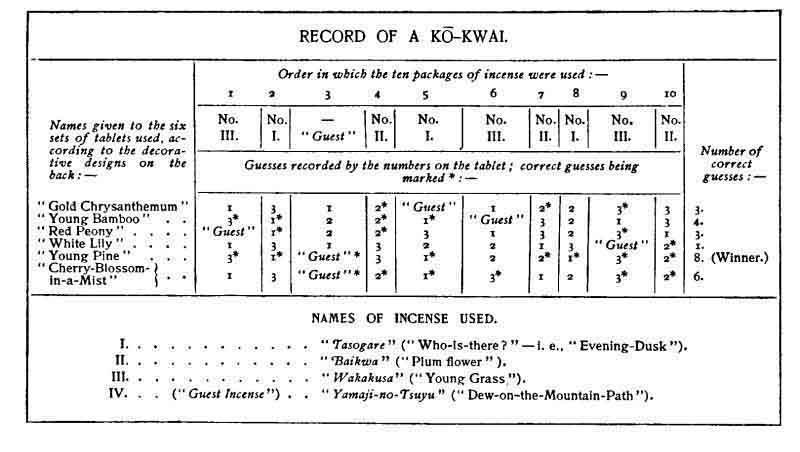
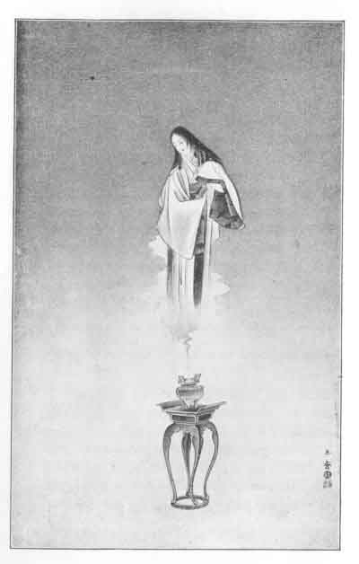

[Intangible Textual Heritage](../../index)  [Shinto](../index) 
[Images](imglist)  [Index](index)  [Previous](igj04)  [Next](igj06) 

------------------------------------------------------------------------

# Incense

### I.

I SEE, rising out of darkness, a lotos in a vase. Most of the vase is
invisible; but I know that it is of bronze, and that its glimpsing
handles are bodies of dragons. Only the lotos is fully illuminated:
three pure white flowers, and five great leaves of gold and green,--gold
above, green on the upcurling under-surface,--an artificial lotos. It is
bathed by a slanting stream of sunshine;--the darkness beneath and
beyond is the dusk of a temple-chamber. I do not see the opening through
which the radiance pours; but I am aware that it is a small window
shaped in the outline-form of a temple-bell.

The reason that I see the lotos--one memory of my first visit to a
Buddhist sanctuary--is that there has come to me an odor of incense.
Often when I smell incense, this vision defines; and usually thereafter
other sensations of my first day

{p. 20}

in Japan revive in swift succession with almost painful acuteness.

It is almost ubiquitous,--this perfume of incense. It makes one element
of the faint but complex and never-to-be-forgotten odor of the Far East.
It haunts the dwelling-house not less than the temple,--the home of the
peasant not less than the yashiki of the prince. Shintô shrines, indeed,
are free from it;--incense being an abomination to the elder gods. But
wherever Buddhism lives there is incense. In every house containing a
Buddhist shrine or Buddhist tablets, incense is burned at certain times;
and in even the rudest country solitudes you will find incense
smouldering before wayside images,--little stone figures of Fudô, Jizô,
or Kwannon. Many experiences of travel,--strange impressions of sound as
well as of sight,--remain associated in my own memory with that
fragrance:--vast silent shadowed avenues leading to weird old
shrines;--mossed flights of worn steps ascending to temples that moulder
above the clouds;--joyous tumult of festival nights;--sheeted
funeral-trains gliding by in glimmer of lanterns;--murmur of household
prayer in fishermen's huts on far wild

{p. 21}

coasts;--and visions of desolate little graves marked only by threads of
blue smoke ascending,--graves of pet animals or birds remembered by
simple hearts in the hour of prayer to Amida, the Lord of Immeasurable
Light.

But the odor of which I speak is that of cheap incense only,--the
incense in general use. There are many other kinds of incense; and the
range of quality is amazing. A bundle of common incense-rods--(they are
about as thick as an ordinary pencil-lead, and somewhat longer)--can be
bought for a few sen; while a bundle of better quality, presenting to
inexperienced eyes only some difference in color, may cost several yen,
and be cheap at the price. Still costlier sorts of incense,--veritable
luxuries,--take the form of lozenges, wafers, pastilles; and a small
envelope of such material may be worth four or five pounds-sterling. But
the commercial and industrial questions relating to Japanese incense
represent the least interesting part of a remarkably curious subject.

{p. 22}

### II

Curious indeed, but enormous by reason of its infinity of tradition and
detail. I am afraid even to think of the size of the volume that would
be needed to cover it. . . . Such a work would properly begin with some
brief account of the earliest knowledge and use of aromatics in Japan.
it would next treat of the records and legends of the first introduction
of Buddhist incense from Korea,--when King Shômyô of Kudara, in 551 A.
D., sent to the island-empire a collection of sutras, an image of the
Buddha, and one complete set of furniture for a temple. Then something
would have to be said about those classifications of incense which were
made during the tenth century, in the periods of Engi and of
Tenryaku,--and about the report of the ancient state-councillor,
Kimitaka-Sangi, who visited China in the latter part of the thirteenth
century, and transmitted to the Emperor Yômei the wisdom of the Chinese
concerning incense. Then mention should be made of the ancient incenses
still preserved in various Japanese temples, and of the famous fragments
of *ranjatai* (publicly exhibited at

{p. 23}

Nara in the tenth year of Meiji) which furnished supplies to the three
great captains, Nobunaga, Hideyoshi, and Iyeyasu. After this should
follow an outline of the history of mixed incenses made in Japan,--with
notes on the classifications devised by the luxurious Takauji, and on
the nomenclature established later by Ashikaga Yoshimasa, who collected
one hundred and thirty varieties of incense, and invented for the more
precious of them names recognized even to this day,--such as
"Blossom-Showering," "Smoke-of-Fuji," and "Flower-of-the-Pure-Law."
Examples ought to be given likewise of traditions attaching to
historical incenses preserved in several princely families; together
with specimens of those hereditary recipes for incense-making which have
been transmitted from generation to generation through hundreds of
years, and are still called after their august inventors,--as "the
Method of Hina-Dainagon," "the Method of Sentô-In," etc. Recipes also
should be given of those strange incenses made "*to imitate the perfume
of the lotos, the smell of the summer breeze, and the odor of the autumn
wind*." Some legends of the great period of incense-luxury should be
cited,--such as the story of

{p. 24}

Sué Owari-no-Kami, who built for himself a palace of incense-woods, and
set fire to it on the night of his revolt, when the smoke of its burning
perfumed the land to a distance of twelve miles. . . . Of course the
mere compilation of materials for a history of mixed-incenses would
entail the study of a host of documents, treatises, and
books,--particularly of such strange works as the *Kun-Shû-Rui-Shô*, or
"Incense-Collector's-Classifying-Manual";--containing the teachings of
the Ten Schools of the Art of Mixing Incense; directions as to the best
seasons for incense-making; and instructions about the "*different kinds
of fire*" to be used for burning incense--(one kind is called "literary
fire," and another "military fire"); together with rules for pressing
the ashes of a censer into various artistic designs corresponding to
season and occasion. . . . A special chapter should certainly be given
to the incense-bags (*kusadama*) hung up in houses to drive away
goblins,--and to the smaller incense-bags formerly carried about the
person as a protection against evil spirits. Then a very large part of
the work would have to be devoted to the religious uses and legends of
incense,--a huge subject in itself. There would also have to be
considered the

{p. 25}

curious history of the old "incense-assemblies," whose elaborate
ceremonial could be explained only by help of numerous diagrams. One
chapter at least would be required for the subject of the ancient
importation of incense-materials from India, China, Annam, Siam,
Cambodia, Ceylon, Sumatra, Java, Borneo, and various islands of the
Malay archipelago,--places all named in rare books about incense. And a
final chapter should treat of the romantic literature of incense,--the
poems, stories, and dramas in which incense-rites are mentioned; and
especially those love-songs comparing the body to incense, and passion
to the eating flame:--

Even as burns the perfume lending my robe its fragrance,  
Smoulders my life away, consumed by the pain of longing!

. . . The merest outline of the subject is terrifying! I shall attempt
nothing more than a few notes about the religious, the luxurious, and
the ghostly uses of incense.

{p. 26}

### III

The common incense everywhere burned by poor people before Buddhist
icons is called *ansoku-kô*. This is very cheap. Great quantities of it
are burned by pilgrims in the bronze censers set before the entrances of
famous temples; and in front of roadside images you may often see
bundles of it. These are for the use of pious wayfarers, who pause
before every Buddhist image on their path to repeat a brief prayer and,
when possible, to set a few rods smouldering at the feet of the statue.
But in rich temples, and during great religious ceremonies, much more
expensive incense is used. Altogether three classes of perfumes are
employed in Buddhist rites: *kô*, or incense--proper, in many
varieties--(the word literally means only "fragrant
substance");--*dzukô*, an odorous ointment; and *makkô*, a fragrant
powder. *Kô* is burned; *dzukô* is rubbed upon the hands of the priest
as an ointment of purification; and *makkô* is sprinkled about the
sanctuary. This *makkô* is said to be identical with the
sandalwood-powder so frequently mentioned in Buddhist texts. But it is
only the true

{p. 27}

incense which can be said to bear an important relation to the religious
service.

"Incense," declares the *Soshi-Ryahu*,\[1\] "Is the Messenger
of Earnest Desire. When the rich Sudatta wished to invite the Buddha to
a repast, he made use of incense. He was wont to ascend to the roof of
his house on the eve of the day of the entertainment, and to remain
standing there all night, holding a censer of precious incense. And as
often as he did thus, the Buddha never failed to come on the following
day at the exact time desired."

This text plainly implies that incense, as a burnt-offering, symbolizes
the pious desires of the faithful. But it symbolizes other things also;
and it has furnished many remarkable similes to Buddhist literature.
Some of these, and not the least interesting, occur in prayers, of which
the following, from the book called *Hôji-san*\[2\] is a
striking example:--

--"*Let my body remain pure like a censer!--let my thought be ever as a
fire of wisdom, purely consuming the incense of sîla and of
dhyâna*,\[3\]--

\[1. "Short \[or Epitomized\] History of Priests."

2\. "The Praise of Pious Observances."

3\. By *sîla* is meant the observance of the rules of purity {footnote
p. 28} in act and thought. *Dhyâna* (called by Japanese Buddhists
*Zenjô*) is one of the higher forms of meditation.\]

{p. 28}

that so may I do homage to all the Buddhas in the Ten Directions of the
Past, the Present, and the Future!"

Sometimes in Buddhist sermons the destruction of Karma by virtuous
effort is likened to the burning of incense by a pure flame,--sometimes,
again, the life of man is compared to the smoke of incense. In his
"Hundred Writings" (*Hyaku-tsû-kiri-kami*), the Shinshû priest Myôden
says, quoting from the Buddhist work *Kujikkajô*, or "Ninety
Articles":--

"In the burning of incense we see that so long as any incense remains,
so long does the burning continue, and the smoke mount skyward. Now the
breath of this body of ours,--this impermanent combination of Earth,
Water, Air, and Fire,--is like that smoke. And the changing of the
incense into cold ashes when the flame expires is an emblem of the
changing of our bodies into ashes when our funeral pyres have burnt
themselves out."

He also tells us about that Incense-Paradise of which every believer
ought to be reminded by the

{p. 29}

perfume of earthly incense:--"In the Thirty-Second Vow for the
Attainment of the Paradise of Wondrous Incense," he says, "it is
written:--*'That Paradise is formed of hundreds of thousands of
different kinds of incense, and of substances incalculably
precious;--the beauty of it incomparably exceeds anything in the heavens
or in the sphere of man;--the fragrance of it perfumes all the worlds of
the Ten Directions of Space; and all who perceive that odor practise
Buddha-deeds.'* In ancient times there were men of superior wisdom and
virtue who, by reason of their vow, obtained perception of the odor; but
we, who are born with inferior wisdom and virtue in these later days,
cannot obtain such perception. Nevertheless it will be well for us, when
we smell the incense kindled before the image of Amida, to imagine that
its odor is the wonderful fragrance of Paradise, and to repeat the
*Nembutsu* in gratitude for the mercy of the Buddha."

{p. 30}

### IV

But the use of incense in Japan is not confined to religious rites and
ceremonies: indeed the costlier kinds of incense are manufactured
chiefly for social entertainments. Incense-burning has been an amusement
of the aristocracy ever since the thirteenth century. Probably you have
heard of the Japanese tea-ceremonies, and their curious Buddhist
history; and I suppose that every foreign collector of Japanese
*bric-â-brac* knows something about the luxury to which these ceremonies
at one period attained,--a luxury well attested by the quality of the
beautiful utensils formerly employed in them. But there were, and still
are, incense-ceremonies much more elaborate and costly than the
tea-ceremonies,--and also much more interesting. Besides music,
embroidery, poetical composition and other branches of the old-fashioned
female education, the young lady of pre-Meiji days was expected to
acquire three especially polite accomplishments,--the art of arranging
flowers, (*ikébana*), the art of ceremonial tea-making

{p. 31}

(*cha-no-yu* or *cha-no-é*),\[1\] and the etiquette of
incense-parties (*kô-kwai* or *kô-é*). Incense-parties were invented
before the time of the Ashikaga shôguns, and were most in vogue during
the peaceful period of the Tokugawa rule. With the fall of the shôgunate
they went out of fashion; but recently they have been to some extent
revived. It is not likely, however, that they will again become really
fashionable in the old sense,--partly because they represented rare
forms of social refinement that never can be revived, and partly because
of their costliness.

In translating *kô-kwai* as "incense-party," I use the word "party" in
the meaning that it takes in such compounds as "card-party,"
"whist-party," "chess-party";--for a *kô-kwai* is a meeting held only
with the object of playing a game,--a very curious game. There are
several kinds of incense-games; but in all of them

\[1. Girls are still trained in the art of arranging flowers, and in the
etiquette of the dainty, though somewhat tedious, *cha-no-yu*. Buddhist
priests have long enjoyed a reputation as teachers of the latter. When
the pupil has reached a certain degree of proficiency, she is given a
diploma or certificate. The tea used in these ceremonies is a powdered
tea of remarkable fragrance,--the best qualities of which fetch very
high prices.\]

{p. 32}

the contest depends upon the ability to remember and to name different
kinds of incense by the perfume alone. That variety of *kô-kwai* called
*Jitchû-kô* ("ten-burning-incense") is generally conceded to be the most
amusing; and I shall try to tell you how it is played.

The numeral "ten," in the Japanese, or rather Chinese name of this
diversion, does not refer to ten kinds, but only to ten packages of
incense; for *Jitchû-kô*, besides being the most amusing, is the very
simplest of incense-games, and is played with only four kinds of
incense. One kind must be supplied by the guests invited to the party;
and three are furnished by the person who gives the entertainment. Each
of the latter three supplies of incense-usually prepared in packages
containing one hundred wafers--is divided into four parts; and each part
is put into a separate paper numbered or marked so as to indicate the
quality. Thus four packages are prepared of the incense classed as No.
1, four of incense No. 2, and four of incense No. 3,--or twelve in all.
But the incense given by the guests,--always called "guest-incense"--is
not divided: it is only put into a wrapper marked with an abbreviation

{p. 33}

of the Chinese character signifying "guest." Accordingly we have a total
of thirteen packages to start with; but three are to be used in the
preliminary sampling, or "experimenting"--as the Japanese term
it,--after the following manner.

We shall suppose the game to be arranged for a party of six,--though
there is no rule limiting the number of players. The six take their
places in line, or in a half circle--if the room be small; but they do
not sit close together, for reasons which will presently appear. Then
the host, or the person appointed to act as incense-burner, prepares a
package of the incense classed as No. 1, kindles it in a censer, and
passes the censer to the guest occupying the first seat\[1\],
with the announcement:--"This is incense No. 1" The guest receives the
censer according to the graceful etiquette required in the *kô-kwai*,
inhales the perfume, and passes on the vessel to his neighbor, who
receives it in like manner and passes it to the third guest, who
presents it to

\[1. The places occupied by guests in a Japanese *zasbiki*, or
reception-room, are numbered from the alcove of the apartment. The place
of the most honored is immediately before the alcove: this is the first
seat; and the rest are numbered from it, usually to the left.\]

{p. 34}

the fourth,--and so on. When the censer has gone the round of the party,
it is returned to the incense-burner. One package of incense No. 2, and
one of No. 3, are similarly prepared, announced, and tested. But with
the "guest-incense" no experiment is made. The player should be able to
remember the different odors of the incenses tested; and he is expected
to identify the guest-incense at the proper time merely by the
unfamiliar quality of its fragrance.

The original thirteen packages having thus by "experimenting" been
reduced to ten, each player is given one set of ten small
tablets--usually of gold-lacquer,--every set being differently
ornamented. The backs only of these tablets are decorated; and the
decoration is nearly always a floral design of some sort:--thus one set
might be decorated with chrysanthemums in gold, another with tufts of
iris-plants, another with a spray of plum-blossoms, etc. But the faces
of the tablets bear numbers or marks; and each set comprises three
tablets numbered "l," three numbered "2," three numbered "3," and one
marked with the character signifying "guest." After these tablet-sets
have been distributed, a box called the "tablet-box "is placed

{p. 35}

before the first player; and all is ready for the real game.

The incense-burner retires behind a little screen, shuffles the flat
packages like so many cards, takes the uppermost, prepares its contents
in the censer, and then, returning to the party, sends the censer upon
its round. This time, of course, he does not announce what kind of
incense he has used. As the censer passes from hand to hand, each
player, after inhaling the fume, puts into the tablet-box one tablet
bearing that mark or number which he supposes to be the mark or number
of the incense he has smelled. If, for example, he thinks the incense to
be "guest-incense," he drops into the box that one of his tablets marked
with the ideograph meaning "guest;" or if he believes that he has
inhaled the perfume of No. 2, he puts into the box a tablet numbered
"2." When the round is over, tablet-box and censer are both returned to
the incense-burner. He takes the six tablets out of the box, and wraps
them up in the paper which contained the incense guessed about. The
tablets themselves keep the personal as well as the general
record,--since each player remembers the particular design upon his own
set.

{p. 36}

The remaining nine packages of incense are consumed and judged in the
same way, according to the chance order in which the shuffling has
placed them. When all the incense has been used, the tablets are taken
out of their wrappings, the record is officially put into writing, and
the victor of the day is announced. I here offer the translation of such
a record: it will serve to explain, almost at a glance, all the
complications of the game.

According to this record the player who used the tablets decorated with
the design called "Young Pine," made but two mistakes; while the holder
of the "White-Lily" set made only one correct guess. But it is quite a
feat to make ten correct judgments in succession. The olfactory nerves
are apt to become somewhat numbed long before the game is concluded; and
therefore it is customary during the *Kô-kwai* to rinse the mouth at
intervals with pure vinegar, by which operation the sensitivity is
partially restored.

To the Japanese original of the foregoing record were appended the names
of the players, the date of the entertainment, and the name of the place
where the party was held. It is the

{p. 37}

{p. 38}

custom in some families to enter all such records in a book especially
made for the purpose, and furnished with an index which enables the
*Kô-kwai* player to refer immediately to any interesting fact belonging
to the history of any past game.

The reader will have noticed that the four kinds of incense used were
designated by very pretty names. The incense first mentioned, for
example, is called by the poets' name for the gloaming,--*Tasogaré*
(lit.: "Who is there?" or "Who is it?")--a word which in this relation
hints of the toilet-perfume that reveals some charming presence to the
lover waiting in the dusk. Perhaps some curiosity will be felt regarding
the composition of these incenses. I can give the Japanese recipes for
two sorts; but I have not been able to identify all of the materials
named:--

 

Recipe for Yamaji-no-Tsuyu.

(To 21 Pastilles)

|                               |              |         |
|-------------------------------|--------------|---------|
| Ingredients.                  | Proportions. | about   |
| Jinkô (aloes-wood)            | 4 *mommé*    | (½ oz.) |
| Chôji (cloves)                | 4 *mommé*    |    "    |
| Kunroku (olibanum)            | 4 *mommé*    |    "    |
| Hakkô (artemisia Schmidtiana) | 4 *mommé*    |    "    |
| Jakô (musk)                   | 1 *bu*       | (½ oz.) |
| Kôkô (?)                      | 4 *mommé*    | (½ oz.) |

 

{p. 39

Recipe for Baikwa.

(To 21 Pastilles)

|                                |                                     |                                    |
|--------------------------------|-------------------------------------|------------------------------------|
| Ingredients.                   | Proportions.                        | about                              |
| Jinkô (aloes)                  | 20 *mommé*                          | (2½ oz.)                           |
| Chôji (cloves)                 | 12 *mommé*                          | (1½ oz.)                           |
| Kôkô (?)                       | 8 1/3 *mommé* | (1 1/40 oz.) |
| Byakudan (sandal-wood)         | 4 *mommé*                           | (½ oz.)                            |
| Kanshô (spikenard)             | 2 *bu*                              | (¼ oz.)                            |
| Kwakkô (Bishop's-wort?)        | 1 *bu* 2 *shu*                      | (3/16 oz.)   |
| Kunroku (olibanum)             | 3 *bu* 3 *shu*                      | (15/22 oz.)  |
| Shômokkô (?)                   | 2 *bu*                              | (¼ oz.)                            |
| Jajô (musk)                    | 3 *bu* 2 *shu*                      | (7/16 oz.)   |
| Ryûnô (refined Borneo Camphor) | 3 *shu*                             | (3/8 oz.)    |

 

The incense used at a *Kô-kwai* ranges in value, according to the style
of the entertainment, from $2.50 to $30.00 per envelope of 100
wafers--wafers usually not more than one-fourth of an inch in diameter.
Sometimes an incense is used worth even more than $30.00 per envelope:
this contains *ranjatai*, an aromatic of which the perfume is compared
to that of "musk mingled with orchid-flowers." But there is some
incense,--never sold,--which is much more precious than
*ranjatai*,--incense valued less for its composition than for its
history: I mean the incense brought centuries ago from China or from
India by the Buddhist missionaries, and presented to princes or to other
persons of high rank. Several

{p. 40}

ancient Japanese temples also include such foreign incense among their
treasures. And very rarely a little of this priceless material is
contributed to an incense-party,--much as in Europe, on very
extraordinary occasions, some banquet is glorified by the production of
a wine several hundred years old.

Like the tea-ceremonies, the *Kô-kwai* exact observance of a very
complex and ancient etiquette. But this subject could interest few
readers; and I shall only mention some of the rules regarding
preparations and precautions. First of all, it is required that the
person invited to an incense-party shall attend the same in as odorless
a condition as possible: a lady, for instance, must not use hair-oil, or
put on any dress that has been kept in a perfumed chest-of-drawers.
Furthermore, the guest should prepare for the contest by taking a
prolonged hot bath, and should eat only the lightest and least odorous
kind of food before going to the rendezvous. it is forbidden to leave
the room during the game, or to open any door or window, or to indulge
in needless conversation. Finally I may observe that, while judging the
incense, a player is expected to take not less than three inhalations,
or more than five.

{p. 41}

In this economical era, the *Kô-kwai* takes of necessity a much humbler
form than it assumed in the time of the great daimyô, of the princely
abbots, and of the military aristocracy. A full set of the utensils
required for the game can now be had for about $50.00; but the materials
are of the poorest kind. The old-fashioned sets were fantastically
expensive. Some were worth thousands of dollars. The incense-burner's
desk,--the writing-box, paper-box, tablet-box, etc.,--the various stands
or *dai*,--were of the costliest gold-lacquer;--the pincers and other
instruments were of gold, curiously worked;--and the censer--whether of
precious metal, bronze, or porcelain,--was always a *chef-d'œuvre*,
designed by some artist of renown.

### V

Although the original signification of incense in Buddhist ceremonies
was chiefly symbolical, there is good reason to suppose that various
beliefs older than Buddhism,--some, perhaps, peculiar to the race;
others probably of Chinese or Korean derivation,--began at an early
period

{p. 42}

to influence the popular use of incense in Japan. Incense is still
burned in the presence of a corpse with the idea that its fragrance
shields both corpse and newly-parted soul from malevolent demons; and by
the peasants it is often burned also to drive away goblins and the evil
powers presiding over diseases. But formerly it was used to summon
spirits as well as to banish them. Allusions to its employment in
various weird rites may be found in some of the old dramas and romances.
One particular sort of incense, imported from China, was said to have
the power of calling up human spirits. This was the wizard-incense
referred to in such ancient love-songs as the following:--

"I have heard of the magical incense that summons the souls of the
absent:  
Would I had some to burn, in the nights when I wait alone!"

There is an interesting mention of this incense in the Chinese book,
*Shang-hai-king*. It was called *Fwan-hwan-hiang* (by Japanese
pronunciation, *Hangon-kô*), or "Spirit-Recalling-Incense;" and it was
made in Tso-Chau, or the District of the Ancestors, situated by the
Eastern Sea. To summon the ghost of any dead person--or

  
THE MAGICAL INCENSE

{p. 43}

even that of a living person, according to some authorities,--it was
only necessary to kindle some of the incense, and to pronounce certain
words, while keeping the mind fixed upon the memory of that person.
Then, in the smoke of the incense, the remembered face and form would
appear.

In many old Japanese and Chinese books mention is made of a famous story
about this incense,--a story of the Chinese Emperor Wu, of the Han
dynasty. When the Emperor bad lost his beautiful favorite, the Lady Li,
he sorrowed so much that fears were entertained for his reason. But all
efforts made to divert his mind from the thought of her proved
unavailing. One day he ordered some Spirit-Recalling-Incense to be
procured, that he might summon her from the dead. His counsellors prayed
him to forego his purpose, declaring that the vision could only
intensify his grief. But he gave no heed to their advice, and himself
performed the rite,--kindling the incense, and keeping his mind fixed
upon the memory of the Lady Li. Presently, within the thick blue smoke
arising from the incense, the outline of a feminine form became visible.
It defined, took tints of life,

{p. 44}

slowly became luminous; and the Emperor recognized the form of his
beloved. At first the apparition was faint; but it soon became distinct
as a living person, and seemed with each moment to grow more beautiful.
The Emperor whispered to the vision, but received no answer. He called
aloud, and the presence made no sign. Then unable to control himself, he
approached the censer. But the instant that he touched the smoke, the
phantom trembled and vanished.

Japanese artists are still occasionally inspired by the legends of the
*Hangon-kô*. Only last year, in Tôkyô, at an exhibition of new kakemono,
I saw a picture of a young wife kneeling before an alcove wherein the
smoke of the magical incense was shaping the shadow of the absent
husband.

\[1\]

Although the power of making visible the forms of the dead has been
claimed for one sort

\[1. Among the curious Tôkyô inventions of 1898 was a new variety of
cigarettes called *Hangon-sô*, or "Herb of Hangon,"--a name suggesting
that their smoke operated like the spirit-summoning incense. As a matter
of fact, the chemical action of the tobacco-smoke would define, upon a
paper fitted into the mouth-piece of each cigarette, the photographic
image of a dancing-girl.\]

{p. 45}

of incense only, the burning of any kind of incense is supposed to
summon viewless spirits in multitude. These come to devour the smoke.
They are called *Jiki-kô-ki*, or "incense-eating goblins;" and they
belong to the fourteenth of the thirty-six classes of Gaki (*prêtas*)
recognized by Japanese Buddhism. They are the ghosts of men who
anciently, for the sake of gain, made or sold bad incense; and by the
evil karma of that action they now find themselves in the state of
hunger-suffering spirits, and compelled to seek their only food in the
smoke of incense.

{p. 48}

------------------------------------------------------------------------

[Next: A Story of Divination](igj06)
