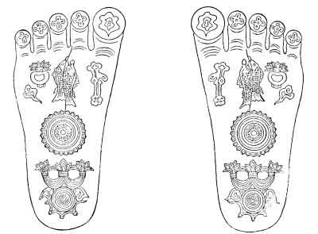
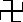
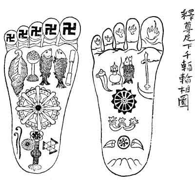

[Intangible Textual Heritage](../../index)  [Shinto](../index) 
[Images](imglist)  [Index](index)  [Previous](igj08)  [Next](igj10) 

------------------------------------------------------------------------

# Footprints of the Buddha

I WAS recently surprised to find, in Anderson's catalogue of Japanese
and Chinese paintings in the British Museum, this remarkable
statement:--"It is to be noted that in Japan the figure of the Buddha is
never represented by the feet, or pedestal alone, as in the Amravâtî
remains, and many other Indian art-relics." As a matter of fact the
representation is not even rare in Japan. It is to be found not only
upon stone monuments, but also in religious paintings,--especially
certain kakémono suspended in temples. These kakémono usually display
the footprints upon a very large scale, with a multitude of mystical
symbols and characters. The sculptures may be less common; but in Tôkyô
alone there are a number of '*Butsu-soku-séki*, or "Buddha-foot stones,"
which I have seen,--and probably several which I have

{p. 118}

not seen. There is one at the temple of Ekô-In, near Ryôgoku-bashi; one
at the temple of Dentsu-In, in Koishikawa; one at the temple of
Denbô-In, in Asakusa; and a beautiful example at Zôjôji in Shiba. These
are not cut out of a single block, but are composed of fragments
cemented into the irregular traditional shape, and capped with a heavy
slab of Nebukawa granite, on the polished surface of which the design is
engraved in lines about one-tenth of an inch in depth. I should judge
the average height of these pedestals to be about two feet four inches,
and their greatest diameter about three feet. Around the footprints
there are carved (in most of the examples) twelve little bunches of
leaves and buds of the *Bodai-jû* ("Bodhidruma"), or Bodhi-tree of
Buddhist legend. In all cases the footprint design is about the same;
but the monuments are different in quality and finish. That of
Zôjôji,--with figures of divinities cut in low relief on its sides,--is
the most ornate and costly of the four. The specimen at Ekô-In is very
poor and plain.

The first *Butsu-soku-séki* made in Japan was that erected at Tôdaiji,
in Nara. It was designed

{p. 119}

after a similar monument in China, said to be the faithful copy of an
Indian original. Concerning this Indian original, the following
tradition is given in an old Buddhist book\[1\]:--"In a
temple of the province of Makada \[*Maghada*\] there is a great stone.
The Buddha once trod upon this stone; and the prints of the soles of his
feet remain upon its surface. The length of the impressions is one foot
and eight inches,\[2\] and the width of them a little more
than six inches. On the sole-part of each footprint there is the
impression of a wheel; and upon each of the prints of the ten toes there
is a flower-like design, which sometimes radiates light. When the Buddha
felt that the time of his Nirvana was approaching, he went to Kushina
\[*Kusinârâ*\], and there stood upon that stone. He stood with his face
to the south. Then he said to his disciple Anan \[*Ananda*\]:--'In this
place I leave the impression of my feet, to remain for a last

\[1. The Chinese title is pronounced by Japanese as *Sei-iki-ki*.
"*Sei-Iki*" (the Country of the West) was the old Japanese name for
India; and thus the title might be rendered, "The Book about India" I
suppose this is the work known to Western scholars as *Si-yu-ki*.

2 "One *shaku* and eight *sun*." But the Japanese foot and inch are
considerably longer than the English.\]

{p. 120}

token. Although a king of this country will try to destroy the
impression, it can never be entirely destroyed.' And indeed it has not
been destroyed unto this day. Once a king who hated Buddhism caused the
top of the stone to be pared off, so as to remove the impression; but
after the surface had been removed, the footprints reappeared upon the
stone."

 

Concerning the virtue of the representation of the footprints of the
Buddha, there is sometimes quoted a text from the
*Kwan-butsu-sanmai-kyô* \["Buddha-dhyâna-samâdhi-sâgara-sûtra"\], thus
translated for me:--"In that time Shaka \["Sâkyamuni"\] lifted up his
foot. . . . When the Buddha lifted up his foot all could perceive upon
the sole of it the appearance of a wheel of a thousand spokes. . . . And
Shaka said:--'Whosoever beholds the sign upon the sole of my foot shall
be purified from all his faults. Even he who beholds the sign after my
death shall be delivered from all the evil results of all his errors.'"
Various other texts of Japanese Buddhism affirm that whoever looks upon
the footprints of the Buddha "shall be freed from the bonds of error,
and conducted upon the Way of Enlightenment."

{p. 121}

  
S'RÎPADÂ-TRACING AT DENTSU-IN, KOISHIKAWA, TÔKYÔ

{p. 123}

An outline of the footprints as engraved on one of the Japanese
pedestals\[1\] should have some interest even for persons
familiar with Indian sculptures of the S'rîpâda. The double-page
drawing, accompanying this paper, and showing both footprints, has been
made after the tracing at Dentsu-In, where the footprints have the full
legendary dimension. It will be observed that there are only seven
emblems: these are called in Japan the *Shichi-Sô*, or "Seven
Appearances." I got some information about them from the
*Shô-Ekô-Hô-Kwan*,--a book used by the Jôdo sect. This book also
contains rough woodcuts of the footprints; and one of them I reproduce
here for the purpose of calling attention to the curious form of the
emblems upon the toes. They are said to be modifications of the *manji*,
or svastika (); but I doubt it. In the
*Butsu-soku-séki*-tracings, the corresponding figures suggest the
"flower-like design" mentioned in the tradition of the Maghada stone;
while the symbols in the book-print suggest fire. Indeed their outline
so much

\[1. A monument at Nara exhibits the *S'rîpâda* in a form differing
considerably from the design upon the Tôkyô pedestals.\]

{p. 124}

resembles the conventional flamelet-design of Buddhist decoration, that
I cannot help thinking them originally intended to indicate the
traditional luminosity of the footprints. Moreover,

  
SHÔ-EKÔ-HÔ-KWAN

there is a text in the book called *Hô-Kai-Shidai* that lends support to
this supposition: "The sole of the foot of the Buddha is flat, like the
base of a toilet-stand. . . . Upon it are lines

{p. 125}

forming the appearance of a wheel of a thousand spokes. . . . The toes
are slender, round, long, straight, graceful, and *somewhat luminous*."

The explanation of the Seven Appearances which is given by the
*Shô-Ekô-Hô-Kwan* cannot be called satisfactory; but it is not without
interest in relation to Japanese popular Buddhism. The emblems are
considered in the following order:--

1.--*The Svastikâ*. The figure upon each toe is said to be a
modification of the manji\[1\] (); and
although I doubt whether this is always the case, I have observed that
on some of the large kakémono representing the footprints, the emblem
really is the svastikâ,--not a flamelet nor a
flower-shape.\[2\] The Japanese commentator explains the
svastikâ as a symbol of "everlasting bliss."

II.--*The Fish (Gyo)*. The fish signifies freedom from all restraints.
As in the water a fish moves easily in any direction, so in the
Buddha-state the fully-emancipated knows no restraints or obstructions.

\[1. Lit.: "The thousand-character" sign.

2\. On some monuments and drawings there is a sort of disk made by a
single line in spiral, on each toe,--together with the image of a small
wheel.\]

{p. 126}

III.--*The Diamond-Mace* (Jap. *Kongô-sho*;--Sansc. "Vadjra"). Explained
as signifying the divine force that "strikes and breaks all the lusts
(*bonnô*) of the world."

IV.--*The Conch-Shell* (Jap. "*Hora*") or Trumpet. Emblem of the
preaching of the Law. The book *Shin-zohu-butsu-ji-hen* calls it the
symbol of the voice of the Buddha. The *Dai-hi-kyô* calls it the token
of the preaching and of the power of the Mâhâyâna doctrine. The
Dai-Nichi-Kyô says:--"At the sound of the blowing of the shell, all the
heavenly deities are filled with delight, and come to hear the Law."

V.--*The Flower-Vase* (Jap. "*Hanagamé*"). Emblem of *murô*,--a mystical
word which might be literally rendered as "not-leaking,"--signifying
that condition of supreme intelligence triumphant over birth and death.

VI.-*The Wheel-of-a-Thousand-Spokes* (Sansc. "Tchakra"). This emblem,
called in Japanese *Senfuku-rin-sô*, is curiously explained by various
quotations. The *Hokké-Monku* says:--"The effect of a wheel is to crush
something; and the effect of the Buddha's preaching is to crush all
delusions, errors, doubts, and superstitions. Therefore

{p. 127}

preaching the doctrine is called, 'turning the Wheel.'" . . . The
*Sei-Ri-Ron* says: "Even as the common wheel has its spokes and its hub,
so in Buddhism there are many branches of the *Hasshi Shôdo*
('Eight-fold Path,' or eight rules of conduct)."

VII.--*The Crown of Brahma*. Under the heel of the Buddha is the
Treasure-Crown (*Hô-Kwan*) of Brahma (*Bon-Ten-O*),--in symbol of the
Buddha's supremacy above the gods.

But I think that the inscriptions upon any of these *Butsu-soku-séki*
will be found of more significance than the above imperfect attempts at
an explanation of the emblems. The inscriptions upon the monument at
Dentsu-In are typical. On different sides of the structure,--near the
top, and placed by rule so as to face certain points of the
compass,--there are engraved five Sanscrit characters which are symbols
of the Five Elemental Buddhas, together with scriptural and
commemorative texts. These latter have been translated for me as
follows:--

'The HO-KO-HON-NYO-KYO

says:--"In that time, from beneath his feet, the Buddha radiated a light
having the appearance of a wheel of a

{p. 128}

thousand spokes. And all who saw that radiance became strictly upright,
and obtained the Supreme Enlightenment."

'The KWAN-BUTSU-SANMAI-KYO

says:--"Whosoever looks upon the footprints of the Buddha shall be freed
from the results even of innumerable thousands of imperfections."

The BUTSU-SETSU-MU-RYO-JU-KYO

says:--"In the land that the Buddha threads in journeying, there is not
even one person in all the multitude of the villages who is not
benefited. Then throughout the world there is peace and good will. The
sun and the moon shine clear and bright. Wind and rain come only at a
suitable time. Calamity and pestilence cease. The country prospers; the
people are free from care. Weapons become useless. All men reverence
religion, and regulate their conduct in all matters with earnestness and
modesty."

\[Commemorative Text.\]

--The Fifth Month of the Eighteenth Year of Meiji, all the priests of
this temple made and set up this pedestal-stone, bearing the likeness of
the footprints of the Buddha, and placed the same within the main court
of Dentsu-In, in order that the seed of holy enlightenment might be sown
for future time, and for the sake of the advancement of Buddhism.

TAIJO, priest,--being the sixty-sixth chief-priest by succession of this
temple,--has respectfully composed.

JUNYU, the minor priest, has reverentially Inscribed.

{p. 129}

### II

Strange facts crowd into memory as one contemplates those graven
footprints,--footprints giant-seeming, yet less so than the human
personality of which they remain the symbol. Twenty-four hundred years
ago, out of solitary meditation upon the pain and the mystery of being,
the mind of an Indian pilgrim brought forth the highest truth ever
taught to men, and in an era barren of science anticipated the uttermost
knowledge of our present evolutional philosophy regarding the secret
unity of life, the endless illusions of matter and of mind, and the
birth and death of universes. He, by pure reason,--and he alone before
our time,--found answers of worth to the questions of the Whence, the
Whither, and the Why;--and he made with these answers another and a
nobler faith than the creed of his fathers. He spoke, and returned to
his dust; and the people worshipped the prints of his dead feet, because
of the love that he had taught them. Thereafter waxed and waned the name
of Alexander, and the power of Rome,

{p. 130}

and the might of Islam;--nations arose and vanished;-- cities grew and
were not;--the children of another civilization, vaster than Rome's,
begirdled the earth with conquest, and founded far-off empires, and came
at last to rule in the land of that pilgrim's birth. And these, rich in
the wisdom of four and twenty centuries, wondered at the beauty of his
message, and caused all that he had said and done to be written down
anew in languages unborn at the time when he lived and taught. Still
burn his footprints in the East; and still the great West, marvelling,
follows their gleam to seek the Supreme Enlightenment. Even thus, of
old, Milinda the king followed the way to the house of Nagasena,--at
first only to question, after the subtle method of the Greeks; yet,
later, to accept with noble reverence the nobler method of the Master.

{p. 133}

------------------------------------------------------------------------

[Next: Ululation](igj10)
