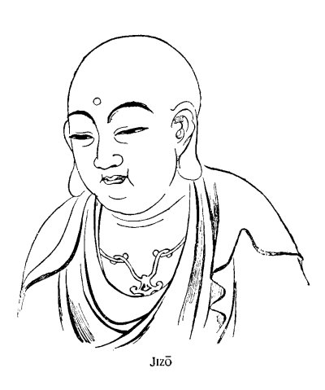
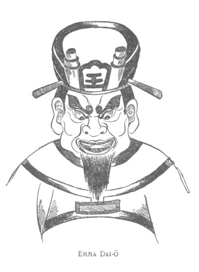

[Intangible Textual Heritage](../../index)  [Shinto](../index) 
[Images](imglist)  [Index](index)  [Previous](igj11)  [Next](igj13) 

------------------------------------------------------------------------

# Japanese Buddhist Proverbs

AS representing that general quality of moral experience which remains
almost unaffected by social modifications of any sort, the proverbial
sayings of a people must always possess a special psychological interest
for thinkers. In this kind of folklore the oral and the written
literature of Japan is rich to a degree that would require a large book
to exemplify. To the subject as a whole no justice could be done within
the limits of a single essay. But for certain classes of proverbs and
proverbial phrases something can be done within even a few pages; and
sayings related to Buddhism, either by allusion or derivation, form a
class which seems to me particularly worthy of study. Accordingly, with
the help of a Japanese friend, I have selected and translated the
following series of examples,--choosing the more simple and

{p. 168}

familiar where choice was possible, and placing the originals in
alphabetical order to facilitate reference. Of course the selection is
imperfectly representative; but it will serve to illustrate certain
effects of Buddhist teaching upon popular thought and speech.

1.--*Akuji mi ni tomaru*.

All evil done clings to the body.

\[1\]

2.--

Atama soru yori kokoro wo soré.

Better to shave the heart than to shave the head.

\[2\]

3.--*Au wa wakaré no hajimé*.

Meeting is only the beginning of separation.

\[3\]

\[1. The consequence of any evil act or thought never,--so long as karma
endures,--will cease to act upon the existence of the person guilty of
it.

2\. Buddhist nuns and priests have their heads completely shaven. The
proverb signifies that it is better to correct the heart,--to conquer
all vain regrets and desires,--than to become a religious. In common
parlance the phrase "to shave the head" means to become a monk or a nun.

3\. Regret and desire are equally vain in this world of impermanency;
for all joy is the beginning of an experience that must have its pain.
This proverb refers directly to the sutra-text,--*Shôja hitsumetsu
é-sha-jori*,--"All that live must surely die; and all that meet will
surely part."\]

{p. 169}

4.--*Banji wa yumé*.

All things\[1\] are merely dreams.

5.--

Bonbu mo satoréba hotoké nari.

Even a common man by obtaining knowledge becomes a Buddha.

\[2\]

6.--

Bonnô kunô.

All lust is grief.

\[3\]

7.--

Buppô to wara-ya no amé, dété kiké.

One must go outside to hear Buddhist doctrine or the sound of rain on a
straw roof.

\[4\]

8.--

Busshô en yori okoru.

Out of karma-relation even the divine nature itself grows.

\[5\]

\[1. Literally, "ten thousand things."

2\. The only real differences of condition are differences in knowledge
of the highest truth.

3\. All sensual desire invariably brings sorrow.

4\. There is an allusion here to the condition of the *shukké* (priest):
literally, "one who has left his house." The proverb suggests that the
higher truths of Buddhism cannot be acquired by those who continue to
live in the world of follies and desires.

5\. There is good as well as bad karma. Whatever happiness we enjoy is
not less a consequence of the acts and thoughts of previous lives, than
is any misfortune that {footnote p. 170} comes to us. Every good thought
and act contributes to the evolution of the Buddha-nature within each of
us. Another proverb \[No. 10\],--*En naki shujô wa doshi
gatashi*,--further illustrates the meaning of this one.\]

{p. 170}

9.--

Enkô ga tsuki wo toran to suru ga gotoshi.

Like monkeys trying to snatch the moon's reflection on water.

\[1\]

10.--

En naki shujô wa doshi gatashi.

To save folk having no karma-relation would be difficult indeed!

\[2\]

11.--

Fuji seppô suru hôshi wa, hirataké ni umaru.

The priest who preaches foul doctrine shall be reborn as a fungus.

\[1. Allusion to a parable, said to have been related by the Buddha
himself, about some monkeys who found a well under a tree, and mistook
for reality the image of the moon in the water. They resolved to seize
the bright apparition. One monkey suspended himself by the tail from a
branch overhanging the well, a second monkey clung to the first, a third
to the second, a fourth to the third, and so on,--till the long chain of
bodies had almost reached the water. Suddenly the branch broke under the
unaccustomed weight; and all the monkeys were drowned.

2\. No karma-relation would mean an utter absence of merit as well as of
demerit.\]

{p. 171}

12.--

Gaki mo ninzu.

Even gaki (*prêtas*) can make a crowd.

\[1\]

13.--

Gaki no mé ni midzu miézu.

To the eyes of gaki water is viewless.

\[2\]

14.--

Goshô wa daiji.

The future life is the all-important thing.

\[3\]

15.--

Gun-mô no tai-zô wo saguru ga gotoshi.

Like a lot of blind men feeling a great elephant.

\[4\]

\[1. Literally: "Even gaki are a multitude (or, 'population')." This is
a popular saying used in a variety of ways. The ordinary meaning is to
the effect that no matter how poor or miserable the individuals
composing a multitude, they collectively represent a respectable force.
Jocosely the saying is sometimes used of a crowd of wretched or
tired-looking people,--sometimes of an assembly of weak boys desiring to
make some demonstration,--sometimes of a miserable-looking company of
soldiers.--Among the lowest classes of the people it is not uncommon to
call a deformed or greedy person a "gaki."

2 Some authorities state that those *prêtas* who suffer especially from
thirst, as a consequence of faults committed in former lives, are unable
to see water. This proverb is used in speaking of persons too stupid or
vicious to perceive a moral truth.

3\. The common people often use the curious expression "*gosho-daiji*"
as an equivalent for "extremely important."

4\. Said of those who ignorantly criticise the doctrines of {footnote p.
172} Buddhism.--The proverb alludes to a celebrated fable in the
*Avadânas*, about a number of blind men who tried to decide the form of
an elephant by feeling the animal. One, feeling the leg, declared the
elephant to be like a tree; another, feeling the trunk only, declared
the elephant to be like a serpent; a third, who felt only the side, said
that the elephant was like a wall; a fourth, grasping the tail, said
that the elephant was like a rope, etc.\]

{p. 172}

16.--

Gwai-men nyo-Bosatsu; nai shin nyo-Yasha.

In outward aspect a Bodhisattva; at innermost heart a demon.

\[1\]

17.--

Hana wa né ni kaeru.

The flower goes back to its root.

\[2\]

18.--

Hibiki no koë ni ozuru ga gotoshi.

Even as the echo answers to the voice.\[3\]

19.--

Hito wo tasukéru ga shukké no yuku.

The task of the priest is to save mankind.

\[1. Yasha (Sanscrit *Yaksha*), a man-devouring demon.

2\. This proverb is most often used in reference to death,--signifying
that all forms go back into the nothingness out of which they spring.
But it may also be used in relation to the law of cause-and-effect.

3\. Referring to the doctrine of cause-and-effect. The philosophical
beauty of the comparison will be appreciated only if we bear in mind
that even the tone of the echo repeats the tone of the voice.\]

{p. 173}

20.--

Hi wa kiyurédomo tô-shin wa hiyédzu.

Though the flame be put out, the wick remains.\[1\]

21.--

Hotoké mo motowa bonbu.

Even the Buddha was originally but a common man.

22.--

Hotoké ni naru mo shami wo heru.

Even to become a Buddha one must first become a novice.

23.--

Hotoké no kao mo sando.

Even a Buddha's face,--only three times.

\[2\]

24.--

Hotoké tanondé Jigoku é yuku.

Praying to Buddha one goes to hell.\[3\]

2 5.--

Hotoké tsukutté tamashii irédzu.

Making a Buddha without putting in the soul.\[4\]

\[1. Although the passions may be temporarily overcome, their sources
remain. A proverb of like meaning is, *Bonnô no inu oëdomo sarazu*:
"Though driven away, the Dog of Lust cannot be kept from coming back
again."

2\. This is a short popular form of the longer proverb, *Hotoké no kao
mo sando nazuréba, hara wo tatsu:* "Stroke even the face of a Buddha
three times, and his anger will be roused."

3\. The popular saying, *Oni no Nembutsu*,"--a devil's praying,"--has a
similar meaning.

4\. That is to say, making an image of the Buddha without giving it a
soul. This proverb is used in reference to {footnote p. 174} the conduct
of those who undertake to do some work, and leave the most essential
part of the work unfinished. It contains an allusion to the curious
ceremony called *Kai-gen*, or--"Eye-Opening." This *Kai-gen* is a kind
of consecration, by virtue of which a newly-made image is supposed to
become animated by the real presence of the divinity represented.\]

{p. 174}

26.--

Ichi-ju no kagé, ichi-ga no nagaré, tashô no en.

Even \[the experience of\] a single shadow or a single flowing of water,
is \[made by\] the karma-relations of a former life.

\[1\]

2 7.--

Ichi-mô shû-mô wo hiku.

One blind man leads many blind Men.

\[2\]

28.--

Ingwa na ko.

A karma-child.

\[3\]

\[1. Even so trifling an occurrence as that of resting with another
person under the shadow of a tree, or drinking from the same spring with
another person, is caused by the karma-relations of some previous
existence.

2\. From the Buddhist work *Dai-chi-dô-ron*.--The reader will find a
similar proverb in Rhys-David's "*Buddhist Suttas*" (Sacred Books of the
East), p. 173,--together with a very curious parable, cited in a
footnote, which an Indian commentator gives in explanation.

3\. A common saying among the lower classes in reference to an
unfortunate or crippled child. Here the word *ingwa* is used especially
in the retributive sense. It usually signifies evil karma; *kwabô* being
the term used in speaking of meritorious {footnote p. 175} karma and its
results. While an unfortunate child is spoken of as "a child of
*ingwa*," a very lucky person is called a "*kwabô-mono*,"--that is to
say, an instance, or example of *kwabô*.\]

{p. 175}

29.--

Ingwa wa, kuruma no wa.

Cause-and-effect is like a wheel.

\[1\]

30.--

Innen ga fukai.

The karma-relation is deep.

\[2\]

31.--

Inochi wa fû-zen no tomoshibi.

Life is a lamp-flame before a wind.

\[3\]

32.--

Issun no mushi ni mo, gobu no tamashii.

Even a worm an inch long has a soul half-an-inch long.

\[4\]

\[1. The comparison of karma to the wheel of a wagon will be familiar to
students of Buddhism. The meaning of this proverb is identical with that
of the *Dhammapada* verse:--"If a man speaks or acts with an evil
thought, pain follows him as the wheel follows the foot of the ox that
draws the carriage."

2\. A saying very commonly used in speaking of the attachment of lovers,
or of the unfortunate results of any close relation between two persons.

3\. Or, "like the flame of a lamp exposed to the wind." A frequent
expression in Buddhist literature is, "the Wind of Death."

4\. Literally, "has a soul of five bu,"--five *bu* being equal to half
of the Japanese inch. Buddhism forbids all taking {footnote p. 176} of
life, and classes as *living* things (*Ujô*) all forms having sentiency.
The proverb, however,--as the use of the word "soul" (*tamashii*)
implies,--reflects popular belief rather than Buddhist philosophy. It
signifies that any life, however small or mean, is entitled to mercy.\]

{p. 176}

33.--*Iwashi*\[1\]

no atama mo shinjin kara.

Even the head of an *iwashi*, by virtue of faith, \[will have power to
save, or heal\].

34\. *Jigô-jitoku.*

\[2\]

The fruit of one's own deeds \[in a previous state of existence\].

35\.

Jigoku dé hotoké.

Like meeting with a Buddha in hell.

\[3\]

\[1. The *iwashi* is a very small fish, much resembling a sardine. The
proverb implies that the object of worship signifies little, so long as
the prayer is made with perfect faith and pure intention.

2\. Few popular Buddhist phrases are more often used than this. *Jigô*
signifies one's own acts or thoughts; *jitoku*, to bring upon
oneself,--nearly always in the sense of misfortune, when the word is
used in the Buddhist way. "Well, it is a matter of *Jigô-jitoku*,"
people will observe on seeing a man being taken to prison; meaning, "He
is reaping the consequence of his own faults."

3 Refers to the joy of meeting a good friend in time of misfortune. The
above is an abbreviation. The full proverb is, *Jigoku dé hotoké ni ôta
yo da.*\]

{p. 177}

36.--

Jigoku Gokuraku wa kokoro ni ari.

Hell and Heaven are in the hearts of men.

\[1\]

37.--

Jigoku mo sumika.

Even Hell itself is a dwelling-place.

\[2\]

38.--

Jigoku ni mo shiru hito.

Even in hell old acquaintances are welcome.

39.--

Kagé no katachi ni shitagau gotoshi.

Even as the shadow follows the shape.

\[3\]

40.--

Kané wa Amida yori hikaru.

Money shines even more brightly than Amida.

\[4\]

\[1. A proverb in perfect accord with the higher Buddhism.

2\. Meaning that even those obliged to live in hell must learn to
accommodate themselves to the situation. One should always try to make
the best of circumstances. A proverb of kindred signification is,
*Sumeha, Miyako:* "Wheresover one's home is, that is the Capital \[or,
Imperial City\]."

3\. Referring to the doctrine of cause-and-effect. Compare with verse 2
of the *Dhammapada*.

4\. Amitâbha, the Buddha of Immeasurable Light. His image in the temples
is usually gilded from head to foot.--There are many other ironical
proverbs about the power of wealth,-such as *Jigoku no sata mo kané
shidai:* "Even the Judgments of Hell may be influenced by money."\]

{p. 178}

{p. 179}

{p. 180}

41.--

Karu-toki no Jizô-gao; nasu-toki no Emma-gao.

Borrowing-time, the face of Jizô; repaying-time, the face of Emma.

\[1\]

42.--Kitté Gokuraku, mité Jigoku.

Heard of only, it is Paradise; seen, it is Hell.

\[2\]

43.--

Kôji mon wo idézu: akuji sen ri wo hashiru.

Good actions go not outside of the gate: bad deeds travel a thousand
*ri*.

44.--

Kokoro no koma ni tadzuna wo yurusuna.

Never let go the reins of the wild colt of the heart.

4 5.--

Kokoro no oni ga mi wo séméru.

The body is tortured only by the demon of the heart.

\[3\]

\[1. Emma is the Chinese and Japanese Yama,--in Buddhism the Lord of
Hell, and the Judge of the Dead. The proverb is best explained by the
accompanying drawings, which will serve to give an idea of the commoner
representations of both divinities.

2\. Rumor is never trustworthy.

3\. Or "mind." That is to say that we suffer only from the consequences
of our own faults.--The demon-torturer in the Buddhist hell says to his
victim:--"Blame not me!--I am only the creation of your own deeds and
thoughts: you made me for this!"--Compare with No. 36.\]

{p. 181}

46.--

Kokoro no shi to wa naré; kokoro wo shi to sezaré.

Be the teacher of your heart: do not allow your heart to become your
teacher.

47.--

Kono yo wa kari no yado.

This world is only a resting-place.

\[1\]

48.--

Kori wo chiribamé; midzu ni égaku.

To inlay ice; to paint upon water.

\[2\]

49.--

    Korokoro to  
Naku wa yamada no  
    Hototogisu,  
Chichi nitéya aran,  
Haha nitéya aran.

The bird that cries *korokoro* in the mountain rice--field I know to be
a *hototogisu*;--yet it may

\[1. "This world is but a travellers' inn," would be an almost equally
correct translation. *Yado* literally means a lodging, shelter, inn; and
the word is applied often to those wa side resting-houses at which
Japanese travellers halt during a journey. *Kari* signifies temporary,
transient, fleeting,--as in the common Buddhist saying, *Kono yo kari no
yo:* "This world is a fleeting world." Even Heaven and Hell represent to
the Buddhist only halting places upon the journey to Nirvâna.

2\. Refers to the vanity of selfish effort for some merely temporary
end.\]

{p. 182}

have been my father; it may have been my mother.

\[1\]

50.--

Ko wa Sangai no kubikase.

A child is a neck-shackle for the Three States of Existence.

\[2\]

51.--

Kuchi wa wazawai no kado.

The mouth is the front-gate of all misfortune.

\[3\]

\[1. This verse-proverb is cited in the Buddhist work *Wôjô Yôshû*, with
the following comment:--"Who knows whether the animal in the field, or
the bird in the mountain-wood, has not been either his father or his
mother in some former state of existence?"--The *hototogisu* is a kind
of cuckoo.

2\. That is to say, The love of parents for their child may impede their
spiritual progress--not only in this world, but through all their future
states of being,--just as a *kubikasé*, or Japanese cangue, impedes the
movements of the person upon whom it is placed. Parental affection,
being the strongest of earthly attachments, is particularly apt to cause
those whom it enslaves to commit wrongful acts in the hope of benefiting
their offspring.--The term *Sangai* here signifies the three worlds of
Desire, Form, and Formlessness,--all the states of existence below
Nirvâna. But the word is sometimes used to signify the Past, the
Present, and the Future.

3\. That is to say, The chief cause of trouble is unguarded speech. The
word *Kado* means always the main entrance to a residence.\]

{p. 183}

52.--

Kwahô wa, nété maté.

If you wish for good luck, sleep and wait.

\[1\]

53.--

Makanu tané wa haënu.

Nothing will grow, if the seed be not sown.

\[2\]

54.--

Matéba, kanrô no hiyori.

If you wait, ambrosial weather will come.

\[3\]

55.--

Meidô no michi ni Ô wa nashi.

There is no King on the Road of Death.

\[4\]

56.--

Mekura hebi ni ojizu.

The blind man does not fear the snake.

\[5\]

\[1. *Kwahô*, a purely Buddhist term, signifying good fortune as the
result of good actions in a previous life, has come to mean in common
parlance good fortune of any kind. The proverb is often used in a sense
similar to that of the English saying: "Watched pot never boils." In a
strictly Buddhist sense it would mean, "Do not be too eager for the
reward of good deeds."

2\. Do not expect harvest, unless you sow the seed. Without earnest
effort no merit can be gained.

3\. Kanrô, the sweet dew of Heaven, or *amrita*. All good things come to
him who waits.

4 Literally, "on the Road of Meidô." The *Meidô* is the Japanese
Hades,--the dark under-world to which all the dead must journey.

5 The ignorant and the vicious, not understanding the law of
cause-and-effect, do not fear the certain results of their folly.\]

{p. 184}

57.--

Mitsuréba, kakuru.

Having waxed, wanes.

\[1\]

58.--

Mon zen no kozô narawanu kyô wo yomu.

The shop-boy in front of the temple-gate repeats the sûtra which he
never learned.

\[2\]

59.--

Mujô no kazé wa, toki erabazu.

The Wind of Impermanency does not choose a time.

\[3\]

\[1. No sooner has the moon waxed full than it begins to wane. So the
height of prosperity is also the beginning of fortune's decline.

2\. *Kozô* means "acolyte" as well as "shop-boy," "errand-boy," or
"apprentice;" but in this case it refers to a boy employed in a shop
situated near or before the gate of a Buddhist temple. By constantly
hearing the sûtra chanted in the temple, the boy learns to repeat the
words. A proverb of kindred meaning is, *Kangaku-In no suzumé wa, Môgyû
wo sayézuru:* "The sparrows of Kangaku-In \[an ancient seat of
learning\] chirp the Môgyû,"--a Chinese text formerly taught to young
students. The teaching of either proverb is excellently expressed by a
third:--*Narau yori wa naréro:* "Rather than study \[an art\], get
accustomed to it,"--that is to say, "keep constantly in contact with
it." Observation and practice are even better than study.

3\. Death and Change do not conform their ways to human expectation.\]

{p. 185}

60.--

Neko mo Busshô ari.

In even a cat the Buddha-nature exists.

\[1\]

61.--

Néta ma ga Gokuraku.

The interval of sleep is Paradise.

\[2\]

62.--

Nijiu-go Bosatsu mo soré-soré no yaku.

Even each of the Twenty-five Bodhisattvas has his own particular duty to
perform.

63.--

Nin mité, hô toké.

\[First\] see the person, \[then\] preach the doctrine.\[3\]

64.--

Ninshin ukégataku Buppô aigatashi.

It is not easy to be born among men, and to meet with \[*the good
fortune of hearing the doctrine of*\] Buddhism.

\[4\]

\[1. Notwithstanding the legend that only the cat and the *mamushi* (a
poisonous viper) failed to weep for the death of the Buddha.

2\. Only during sleep can we sometimes cease to know the sorrow and pain
of this world. (Compare with No. 83.)

3\. The teaching of Buddhist doctrine should always be adapted to the
intelligence of the person to be instructed. There is another proverb of
the same kind,--Ki ni yorité, hô wo toké: "According to the
understanding \[of the person to be taught\], preach the Law."

4 Popular Buddhism teaches that to be born in the {footnote p. 186}
world of mankind, and especially among a people professing Buddhism, is
a very great privilege. However miserable human existence, it is at
least a state in which some knowledge of divine truth may be obtained;
whereas the beings in other and lower conditions of life are relatively
incapable of spiritual progress.\]

{p. 186}

65.--

Oni mo jiu-hachi.

Even a devil \[is pretty\] at eighteen.

\[1\]

66.--

Oni mo mi, narétaru ga yoshi.

Even a devil, when you become accustomed to the sight of him, may prove
a pleasant acquaintance.

67.--

Oni ni kanabô.

An iron club for a demon.\[2\]

\[1. There are many curious sayings and proverbs about the oni, or
Buddhist devil,--such as *Oni no mé ni mo namida*, "tears in even a
devil's eyes;"--*Oni no kakuran*, "devil's cholera" (said of the
unexpected sickness of some very strong and healthy person), etc.,
etc.--The class of demons called Oni, properly belong to the Buddhist
hells, where they act as torturers and jailers. They are not to be
confounded with the *Ma, Yasha, Kijin*, and other classes of evil
spirits. In Buddhist art they are represented as beings of enormous
strength, with the heads of bulls and of horses. The bull-headed demons
are called *Go-zu*; the horse-headed *Mé-zu*.

2\. Meaning that great power should be given only to the strong.\]

{p. 187}

68.--

Oni no nyôbo ni hijin.

A devil takes a goblin to wife.

\[1\]

69.--

Onna no ké ni wa dai-zô mo tsunagaru.

With one hair of a woman you can tether even a great elephant.

70.--

Onna wa Sangai ni iyé nashi.

Women have no homes of their own in the Three States of Existence.

71.--

Oya no ingwa ga ko ni mukuü.

The karma of the parents is visited upon the child.

\[2\]

72.--

Rakkwa éda ni kaerazu.

The fallen blossom never returns to the branch.

\[3\]

\[1. Meaning that a wicked man usually marries a wicked woman.

2\. Said of the parents of crippled or deformed children. But the
popular idea here expressed is not altogether in accord with the
teachings of the higher Buddhism.

3\. That which has been done never can be undone: the past cannot be
recalled.--This proverb is an abbreviation of the longer Buddhist text:
*Rakkwa éda ni kaerazu; ha-kyô futatabi terasazu:* "The fallen blossom
never returns to the branch; the shattered mirror never again
reflects:"\]

{p. 188}

73.--

Raku wa ku no tané; ku wa raku no tané.

Pleasure is the seed of pain; pain is the seed of pleasure.

74.--

Rokudô wa, mé no maé.

The Six Roads are right before your eyes.

\[1\]

75.--

Sangai mu-an.

There is no rest within the Three States of Existence.

76.--

Sangai ni kaki nashi;--Rokudô ni hotori nashi.

There is no fence to the Three States of Existence;--there is no
neighborhood to the Six Roads.

\[2\]

\[1. That is to say, Your future life depends upon your conduct in this
life; and you are thus free to choose for yourself the place of your
next birth.

2\. Within the Three States (Sangai), or universes, of Desire, Form, and
Formlessness; and within the Six Worlds, or conditions of
being,--*Jigokudô* (Hell), *Gakidô* (Pretas), *Chikushôdô* (Animal
Life), *Shuradô* (World of Fighting and Slaughter), *Ningendô*
(Mankind), *Tenjôdô* (Heavenly Spirits)--all existence is included.
Beyond there is only Nirvâna. "There is no fence," "no
neighborhood,"--that is to say, no limit beyond which to escape,--no
middle-path between any two of these states. We shall be reborn into
{footnote p. 189} some one of them according to our karma.--Compare with
No. 74.\]

{p. 189}

77.--

Sangé ni wa sannen no tsumi mo hôrobu.

One confession effaces the sins of even three years.

78.--

Sannin yoréba, kugai.

Where even three persons come together, there is a world of pain.

\[1\]

79--

San nin yoréba, Monjû no chié.

Where three persons come together, there is the wisdom of Monjû.

\[2\]

80.--

Shaka ni sekkyô.

Preaching to Sâkyamuni.

81.--

Shami kara chôrô.

To become an abbot one must begin as a novice.

\[1. *Kugai* (lit.: "bitter world") is a term often used to describe the
life of a prostitute.

2\. Monjû Bosatsu \[*Mañdjus'ri Bodhisattva*\] figures in Japanese
Buddhism as a special divinity of wisdom--The proverb signifies that
three heads are better than one. A saying. of like meaning is, *Hiza to
mo dankô:* "Consult even with your own knee;" that is to say, Despise no
advice, no matter how humble the source of it.\]

{p. 190}

82.--

Shindaréba, koso ikitaré.

Only by reason of having died does one enter into life.

\[1\]

83.--

Shiranu ga, hotoké; minu ga, Gokuraku.

Not to know is to be a Buddha; not to see is Paradise.

84.--

Shôbo ni kidoku nashi.

There is no miracle in true doctrine.

\[2\]

85.--

Shô-chié wa Bodai no samatagé.

A little wisdom is a stumbling-block on the way to Buddhahood.

\[3\]

\[1. I never hear this singular proverb without being reminded of a
sentence in Huxley's famous essay, *On the Physical Basis of
Life:*--"The living protoplasm not only ultimately dies and is resolved
into its mineral and lifeless constituents, but is always dying, and,
strange as the paradox may sound, *could not live unless it died*."

2\. Nothing can happen except as a result of eternal and irrevocable
law.

3\. Bodai is the same word as the Sanscrit *Bodhi*, signifying the
supreme enlightenment,--the knowledge that leads to Buddhahood; but it
is often used by Japanese Buddhists in the sense of divine bliss, or the
Buddha-state itself.\]

{p. 191}

86.--

Shôshi no kukai hetori nashi.

There is no shore to the bitter Sea of Birth and Death.

\[1\]

87.--

Sodé no furi-awasé mo tashô no en.

Even the touching of sleeves in passing is caused by some relation in a
former life.

88.--

Sun zen; shaku ma.

An inch of virtue; a foot of demon.

\[2\]

89.--

Tanoshimi wa kanashimi no motoi.

All joy is the source of sorrow.

90.--

Tondé bi ni iru natsu no mushi.

So the insects of summer fly to the flame.

\[3\]

91.--

Tsuchi-botoké no midzu-asobi.

Clay-Buddha's water-playing.

\[4\]

\[1. Or, "the Pain-Sea of Life and Death."

2\. *Ma* (Sanscrit, *Mârakâyikas*) is the name given to a particular
class of spirits who tempt men to evil. But in Japanese folklore the
*Ma* have a part much resembling that occupied in Western popular
superstition by goblins and fairies.

3\. Said especially in reference to the result of sensual indulgence.

4\. That is to say, "As dangerous as for a clay Buddha to play with
water." Children often amuse themselves by making little Buddhist images
of mud, which melt into shapelessness, of course, if placed in water.\]

{p. 192}

92.--

Tsuki ni murakumo, hana ni kazé.

Cloud-wrack to the moon; wind to flowers.

\[1\]

93.--

Tsuyu no inochi.

Human life is like the dew of morning.

94.--

U-ki wa, kokoro ni ari.

Joy and sorrow exist only in the mind.

95.--

Uri no tsuru ni nasubi wa naranu.

Egg-plants do not grow upon melon-vines.

96.--

Uso mo hôben.

Even an untruth may serve as a device.

\[2\]

97.--

Waga ya no hotoké tattoshi.

My family ancestors, were all excellent Buddhas.

\[3\]

\[1. The beauty of the moon is obscured by masses of clouds; the trees
no sooner blossom than their flowers are scattered by the wind. All
beauty is evanescent.

2\. That is, a pious device for effecting conversion, Such a device is
justified especially by the famous parable of the third chapter of the
*Saddharma Pundarîka*.

8 Meaning that one most reveres the *hotoké*--the spirits of the dead
regarded as Buddhas--in one's own household-shrine. There is an ironical
play upon the word *hotoké*, which may mean either a dead person simply,
or a Buddha. Perhaps the spirit of this proverb may be better explained
by the help of another: *Nigéta sakana ni* {footnote p. 193} *chisai wa
nai; shinda kodomo ni warui ko wa nai*--"fish that escaped was never
small; child that died was never bad."\]

{p. 193}

98.--

Yuki no haté wa, Neban.

The end of snow is Nirvâna.

\[1\]

99.--

Zen ni wa zen no mukui; aku ni wa aku no mukui.

Goodness \[or, virtue\] is the return for goodness; evil is the return
for evil.

\[2\]

100.--

Zensé no yahusoku-goto.

Promised \[or, destined\] from a former birth.

\[3\]

\[1. This curious saying is the only one in my collection containing the
word *Neban* (Nirvâna), and is here inserted chiefly for that reason,
The common people seldom speak of *Neban*, and have little knowledge of
those profound doctrines to which the term is related. The above phrase,
as might be inferred, is not a popular expression: it is rather an
artistic and poetical reference to the aspect of a landscape covered
with snow to the horizon-line,--so that beyond the snow-circle there is
only the great void of the sky.

2\. Not so commonplace a proverb as might appear at first sight; for it
refers especially to the Buddhist belief that every kindness shown to us
in this life is a return of kindness done to others in a former life,
and that every wrong inflicted upon us is the reflex of some injustice
which we committed in a previous birth.

3\. A very common saying,--often uttered as a comment upon the
unhappiness of separation, upon sudden misfortune, {footnote p. 194}upon
sudden death, etc. It is used especially in relation to *shinjû*, or
lovers' suicide. Such suicide is popularly thought to be a result of
cruelty in some previous state of being, or the consequence of having
broken, in a former life, the mutual promise to become husband and
wife.\]

{p. 197}

------------------------------------------------------------------------

[Next: Suggestion](igj13)
