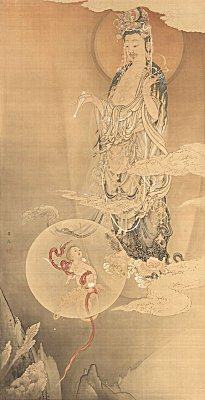

  
[Intangible Textual Heritage](../../index)  [Japan](../index) 
[Buddhism](../../bud/index) 

------------------------------------------------------------------------

<table width="75%">
<colgroup>
<col style="width: 50%" />
<col style="width: 50%" />
</colgroup>
<tbody>
<tr class="odd">
<td data-valign="CENTER" width="50%"></td>
<td data-valign="CENTER" width="50%"><h1 id="the-ideals-of-the-east" data-align="CENTER">The Ideals of the East</h1>
<h5 id="with-special-reference-to-the-art-of-japan" data-align="CENTER">with Special Reference to the Art of Japan</h5>
<h2 id="by-kakuzo-okakura" data-align="CENTER">by Kakuzo Okakura</h2>
<h4 id="section" data-align="CENTER">[1904]</h4></td>
</tr>
</tbody>
</table>

------------------------------------------------------------------------

This is a short but very concise introduction to Asian art by the author
of [The Book of Tea](../../bud/tea). Written from a Japanese
perspective, and focusing on Japanese art, one of the major themes is
the relationship between spirituality, particularly Buddhism, and the
evolution of Asian art.

------------------------------------------------------------------------

[Title Page](ioe00)  
[Table of Contents](ioe01)  
[Introduction](ioe02)  
[The Range of Ideals](ioe03)  
[The Primitive Art of Japan](ioe04)  
[Confucianism--Northern China](ioe05)  
[Laoism and Taoism--Southern China](ioe06)  
[Buddhism and Indian Art](ioe07)  
[The Asuka Period: 550 to 700 A.D.](ioe08)  
[The Nara Period: 700 to 800 A.D.](ioe09)  
[The Heian Period: 800 to 900 A.D.](ioe10)  
[The Fujiwara Period: 900 to 1200 A.D.](ioe11)  
[The Kamakura Period: 1200-1400 A.D.](ioe12)  
[Ashikaga Period: 1400-1600 A.D.](ioe13)  
[Toyotomi and Early Tokugawa Period: 1600-1700 A.D.](ioe14)  
[Later Tokugawa Period: 1700-1850 A.D.](ioe15)  
[The Meiji Period: 1850 to the Present Day](ioe16)  
[The Vista](ioe17)  
