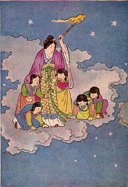

  
[Intangible Textual Heritage](../../index)  [Shinto](../index.md) 
[Index](index)  [Previous](jft202)  [Next](jft204.md) 

------------------------------------------------------------------------

# THE FIRST RABBITS

THE children in the sky were all crying. "Boo-hoo," said one. "Boo-hoo,"
said another. "Boo-hoo," said the rest.

"Children, children, what is the matter?" asked the fairy mother of the
sky.

"We've nothing to play," replied one. "There's nothing to do," said
another. "We can't play for there's nothing to do," said the rest.

"Why don't you twinkle the stars?" asked the fairy mother of the sky.

"The star lights are all put out," sobbed one. "The sun is shining and
the star lights are out," sobbed another. "We can't twinkle the stars
when the sun is shining and the star lights are out," sobbed the rest.

"Why don't you beat the thunder drums?" asked the fairy mother of the
sky.

"The thunder drums are all broken," sighed one. "We've beaten all the
thunder out of them," sighed another. "We can't beat the thunder drums
for the thunder is all beaten out of them," sighed the rest.

"Why don't you shake the snow out of the snow sieves?" asked the fairy
mother of the sky.

"It won't shake through the sieve," said one. "We've made the snow into
balls," said another. '' We can't shake the snow through the sieve when
its all made into balls," said the rest.

"Why don't you roll the snowballs?" asked the fairy mother of the sky.

"Oh, we will!" cried one. ''Yes,we will," cried another. "Of course we
will," said the rest.

Away they ran to the snowball field.

"Let's throw them," said one. "Let's toss them," said another. ''Let's
catch them," said the rest.

Up and down, this way and that way, back and forth, how the white balls
danced and flew!

"Oh, look! They're falling through the sky floor," cried one. "They're
all falling through the twinkle holes of the stars," said another.
"They're falling through the holes down on to the earth," said the rest.

Away the snowballs jumped and bobbed. The star children all began to cry
again.

Just then the fairy mother of the sky came with a torch to light the
star lamps. "Crying again?" she said. "What's the matter now?"

|                   |
|-------------------|
|  |

"Our snowballs all fell through the sky floor," said one. "They all fell
through the twinkle holes of the stars," said another. "They've fallen
though the holes down on to the earth," said the rest.

''You naughty, naughty snowballs," said the fairy mother of the sky. So
she threw her torch after them, but it only scorched their tails and
turned them black.

Down on the earth they are hopping still, these soft white balls with
their little black tails, and you children call them the rabbits.

------------------------------------------------------------------------

[Next: Lord Bag of Rice](jft204.md)
