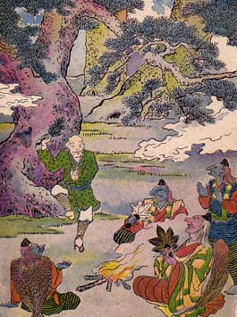

  
[Intangible Textual Heritage](../../index)  [Shinto](../index) 
[Index](index)  [Previous](jft205)  [Next](jft207) 

------------------------------------------------------------------------

# THE OLD MAN WITH A WART

THERE was once an old man who had a wart on the side of his face. It was
such a huge wart that it looked like a peach growing there. It hurt
every time he ate his rice or drank his tea, but he never complained.

One day he was up in the mountains, cutting wood, when a dreadful storm
arose. The pine trees, that usually murmured a soft and whispering song,
now shrieked and groaned as the wind tore through them.

He found a hollow tree and climbed in. Here he was dry and warm while
the rain poured down as though the very sky were falling.

He had never been in such a storm before, and as he listened to the
wind, and breathed the fresh damp odor of the rain, he was glad he was
there. The great pines, hundreds of years old, were bent and twisted
about like grass.

The old man had thought he was the only one in the woods, but he soon
heard voices of people coming nearer and nearer. "They must enjoy the
storm," he thought, for they were singing and shouting most happily.

They did not sound quite like men, but more like the rushing of the wind
and the hurried swaying of the trees.

They kindled a fire which leaped up in little sharp tongues of flame,
for all the world like lightning. Each flash lighted up the forest, and
then he saw that his jolly companions were the Storm Spirits. They sat
in a circle around the fire and began their song. If you could but hear
it!

It sounded like the wind whipping the tree-tops back and forth, or the
breezes bowing the long grasses in lines before it. It was like great
waves, trampling and tumbling upon the shore, or the pounding of tiny
raindrops, hammering upon the dry leaves.

It seemed as though all the trees were swaying and bending in time with
the wind because they loved it.

The old man could not sit still. He sprang into the midst of the group
and began to dance. The air was sweet. The grass gave a faint fresh
odor. He seemed to be dancing like the trees and flowers. Like a willow
by the river he bent and swayed and bowed. The song grew softer and
sweeter until the trees were still and the sun peeped through the
clouds. At last the old man sat down to rest.

|                   |
|-------------------|
|  |

Then the Storm Spirits said: "Oh, good man, come to us again and dance
for us. As a pledge that you will come we will take this peach that
grows on the side of your face. Is it not the most precious thing you
possess?" So they took his wart and let him go.

When he reached home his wife cried, ''Oh, husband, what have you done
with your wart?'' Then he told her all about it, and they were very
glad.

These old people had a neighbor who had a wart on the left side of his
face. This wart was red and shiny like an apple. He heard how the Storm
Spirits had taken the other man's wart, so he, too, went to the mountain
and crept into the hollow tree. There he waited until the storm came.

How it raged! The rain lashed the leaves like whips, and the lightning
tore yellow gashes in the black clouds. This old man shivered and shook
with fear.

At last the Storm Spirits saw him and dragged him forth to dance for
them, but he was so frightened that he could only shake and tremble.

Then they were angry and said: ''Well, if you can't dance better than
this we don't want you any more." So they put the other wart on the
right side of his face and started him off.

Poor man! He was sorry he came, for now he had a wart on each side of
his face and was wet to the skin as well.

------------------------------------------------------------------------

[Next: The Eighty-One Brothers](jft207)
