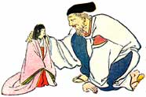

  
[Intangible Textual Heritage](../../index)  [Shinto](../index) 
[Index](index)  [Previous](jft207)  [Next](jft209) 

------------------------------------------------------------------------

# THE BAMBOO-CUTTER'S DAUGHTER

### THE BAMBOO PRINCESS

AN old bamboo-cutter was going home through the shades of evening. Far
away among the stalks of the feathery bamboo he saw a soft light. He
went nearer to see what it was, and found it came from within one of the
stalks.

He opened the bamboo stalk carefully, and found a tiny baby girl. She
was only a few inches tall, but as beautiful as a fairy. Indeed he
wondered if she were not really a fairy.

|                   |
|-------------------|
|  |

He carried her home and told his wife how he had found her. They were
very glad for they had no child, so they loved her as their own. In a
few years she had grown to be a young woman. She was as sweet and kind
as she was beautiful. A soft light always seemed to follow her.

When the time came to name her they called her The Bamboo Princess,
because she was found among the bamboo, and because she was more
beautiful than any princess.

People heard of how beautiful she was, and many peeped through the hedge
at the edge of the garden in hopes of seeing her. All who saw her
thought she was so lovely that they came back for another glimpse.

Among those who came often to the hedge were five princes. Each one
thought The Bamboo Princess the most beautiful woman he had ever seen,
and each wished her for his wife.

So each of the five wrote to the father of the princess asking to marry
her. It so happened that all five letters were brought to the old man at
the same time.

The old man did not know which one to choose, nor what to do. He was
afraid, too, that if he chose one of the princes, the other four would
be angry. But the princess had a plan. "Have them all come here," she
said, "then we can choose better."

On a certain day the five princes came to the house of the
bamboo-cutter. They were very glad to have another chance to see her,
and each one thought he would be the one she would marry.The princess
did not wish to marry any of them. She wanted stay with her dear father
and mother. She wished to take care of them as long as they lived. So
she gave each one something to do which was impossible.

The first she asked to go to India and find the great stone bowl of
Buddha. The second one was to bring her a branch from the jeweled trees
that grew on the floating mountain of Horai.

The third prince asked what he might do to show his love. The princess
said that he might bring her a robe made from the skins of the fire
rats.

She asked the fourth to bring a jewel from the neck of the sea dragon,
and the fifth prince offered to bring her the shell which the swallows
keep hidden in their nests.

The princes hurried away, each anxious to be the first to return, and so
marry the beautiful Bamboo Princess.

------------------------------------------------------------------------

[Next: The Great Stone Bowl](jft209)
