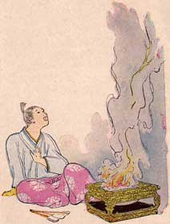

  
[Intangible Textual Heritage](../../index)  [Shinto](../index) 
[Index](index)  [Previous](jft210)  [Next](jft212) 

------------------------------------------------------------------------

### THE FIRE ROBE

THE third prince was to bring the robe made of the fur of the fire rats.
He was rich and very much loved. He had friends in all parts of the
world. He had one very dear friend who lived in China.

To him the prince sent a messenger with a great bag full of gold, asking
him to find the robe made of the skins of fire rats.

When the friend read the letter he was very sad. ''How can I ever do
this?" he said. "Who ever heard of such a thing! Still I would do
anything for Prince Abe, so I will try."

He sent messengers all over China seeking for the wonderful robe, but
they all came back sadly, saying that they could not find it.

He sent to every temple, inquiring of the priests if they knew anything
of this robe, and where it could be found, but the reply was always the
same. No one had ever heard where it was, although everyone had heard
that there was such a mantle.

He sent for all the merchants who went from place to place buying and
selling. None of them knew of it.

At last he said to himself, "This robe that Prince Abe asks for is not
to be found. There cannot be such a thing. To-morrow I will return his
bag of gold to him, and tell him that I have searched my best but cannot
find what he wishes."

The next morning, just as he was about to send the messenger back to
Japan he heard a great noise in the street and looked out.

A great troupe of beggars was passing by.

"I will ask them if they have heard of this fire robe," he thought. So
all the beggars were brought in.

They were surprised at being taken into the house of this great lord,
and shown into the very room where he was.

He told them what he wanted, and asked if in their wanderings they had
ever heard of this fire robe, and knew where it might be found.

They all stared at him in wonder. Some nearly laughed in his face. The
idea of it! That he, one of the greatest lords in the country, should
ask them, common beggars, for a fire robe.

One after another told him that they had heard of it, but it was only a
story, for there was really no such thing.

Finally all had gone but one old man. He limped slowly up to the lord
and knelt before him.

"My lord," he said, "When I was a child I remember hearing my
grandfather tell about this fire robe. It was kept in a temple upon the
top of a certain mountain, hundreds of miles from here."

The lord was delighted at this, but wondered why his messengers had not
found this temple. He sent for the one who had visited the temples in
that part of the country.

This man declared that there was no temple on that mountain. "There was
in my grandfather's time," said the beggar, "for he had been there and
had seen the beautiful fire robe with his own eyes."

The lord sent messengers to search out this mountain and find the temple
at its top. The old beggar went with them.

When they reached there they found no temple, only a heap of stones.
They searched around a long time, and finally found a large iron box
buried under the stones.

They opened this box and found within it, wrapped in many folds of rich
silk, a strange, beautiful fur robe. They carried it home joyfully to
the lord, who was very glad to receive it, you may be sure.

He sent it as quickly as possible to the Prince Abe, who was no less
joyful to receive it than his friend had been.

He took it out of the iron box, unfolded the rich silk wrappings, and
looked with delight on the beautiful silvery fur. "Ah, how beautiful the
Bamboo Princess will look in this!" he thought.

Then he remembered that every time this wonderful robe was put into the
fire, it came out more silvery bright than before.

"It cannot be too beautiful for the lovely Bamboo Princess, so I will
put it in once more, that it may be more beautiful for her than it has
ever been for anyone else."

So he ordered a fire brought and laid the dazzling silver robe over the
burning coals.

Like a flash the red flames leaped up, and before he could snatch it
from the fire there was nothing left but silvery smoke drifting off on
the wind, and silvery ashes dimming the red of the coals.

|                   |
|-------------------|
|  |

Poor Prince Abe! He was heartbroken. He could not blame his faithful
friend, for he had done his best. He was glad he had not taken it to the
princess before he knew it was the right one, for then she might think
he too wished to deceive her.

He could only write to her telling her all, and then go away forever.

The princess was very sad when she knew what had happened, for she saw
that this man was true.

She sent him a note asking him to come to her, but he had already gone
away, so she never saw nor heard of him again.

------------------------------------------------------------------------

[Next: The Shell in the Swallows' Nest](jft212)
