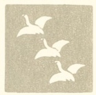

  
[Intangible Textual Heritage](../../index)  [Japan](../index.md) 
[Index](index)  [Previous](jh03)  [Next](jh05.md) 

------------------------------------------------------------------------

*Japanese Haiku*, by Peter Beilenson, \[1955\], at Intangible Textual
Heritage

------------------------------------------------------------------------

p. 26

<table data-border="0">
<colgroup>
<col style="width: 50%" />
<col style="width: 50%" />
</colgroup>
<tbody>
<tr class="odd">
<td data-valign="top" width="327">
OLD DARK SLEEPY POOL... 
  QUICK UNEXPECTED 
  FROG 
GOES PLOP! WATERSPLASH! 
 

</td>
<td data-valign="top" width="327">
 
</td>
</tr>
<tr class="even">
<td data-valign="top" width="327">
BASHO
</td>
<td data-valign="top" width="327">
 
</td>
</tr>
</tbody>
</table>

 

<table data-border="0">
<colgroup>
<col style="width: 50%" />
<col style="width: 50%" />
</colgroup>
<tbody>
<tr class="odd">
<td data-valign="top" width="327">
MY SHADOWY PATH 
  I'VE SWEPT ALL DAY 
  AND NOW ... OH NO! 
CAMELLIA-SHOWER! 
 

</td>
<td data-valign="top" width="327">
 
</td>
</tr>
<tr class="even">
<td data-valign="top" width="327">
YAHA
</td>
<td data-valign="top" width="327">
 
</td>
</tr>
</tbody>
</table>

 

<table data-border="0">
<colgroup>
<col style="width: 50%" />
<col style="width: 50%" />
</colgroup>
<tbody>
<tr class="odd">
<td data-valign="top" width="327">
HARD THE BEGGAR'S BED ... 
  BUT SOCIABLE 
  AND BUSY 
WITH INSECT-TALKING 
 

</td>
<td data-valign="top" width="327">
 
</td>
</tr>
<tr class="even">
<td data-valign="top" width="327">
CHIYO-NI
</td>
<td data-valign="top" width="327">
 
</td>
</tr>
</tbody>
</table>

 

<table data-border="0">
<colgroup>
<col style="width: 50%" />
<col style="width: 50%" />
</colgroup>
<tbody>
<tr class="odd">
<td data-valign="top" width="327">
COME COME! COME OUT! 
  FROM BOGS OLD FROGS 
  COMMAND THE DARK 
AND LOOK ... THE STARS! 
 

</td>
<td data-valign="top" width="327">
 
</td>
</tr>
<tr class="even">
<td data-valign="top" width="327">
KIKAKU
</td>
<td data-valign="top" width="327">
 
</td>
</tr>
</tbody>
</table>

 

p. 27

<table data-border="0">
<colgroup>
<col style="width: 50%" />
<col style="width: 50%" />
</colgroup>
<tbody>
<tr class="odd">
<td data-valign="top" width="327">
OVER THE MOUNTAIN 
  BRIGHT THE FULL WHITE 
  MOON NOW SMILES... 
ON THE FLOWER-THIEF 
 

</td>
<td data-valign="top" width="327">
 
</td>
</tr>
<tr class="even">
<td data-valign="top" width="327">
ISSA
</td>
<td data-valign="top" width="327">
 
</td>
</tr>
</tbody>
</table>

 

<table data-border="0">
<colgroup>
<col style="width: 50%" />
<col style="width: 50%" />
</colgroup>
<tbody>
<tr class="odd">
<td data-valign="top" width="327">
STARTING TO CALL YOU: 
  COME WATCH 
  THESE BUTTERFLIES ... 
OH! I'M ALL ALONE 
 

</td>
<td data-valign="top" width="327">
 
</td>
</tr>
<tr class="even">
<td data-valign="top" width="327">
TAIGI
</td>
<td data-valign="top" width="327">
 
</td>
</tr>
</tbody>
</table>

 

<table data-border="0">
<colgroup>
<col style="width: 50%" />
<col style="width: 50%" />
</colgroup>
<tbody>
<tr class="odd">
<td data-valign="top" width="327">
GOOD FRIEND GRASSHOPPER 
  WILL YOU PLAY 
  THE CARETAKER 
FOR MY LITTLE GRAVE? 
 

</td>
<td data-valign="top" width="327">
 
</td>
</tr>
<tr class="even">
<td data-valign="top" width="327">
ISSA
</td>
<td data-valign="top" width="327">
 
</td>
</tr>
</tbody>
</table>

 

<table data-border="0">
<colgroup>
<col style="width: 50%" />
<col style="width: 50%" />
</colgroup>
<tbody>
<tr class="odd">
<td data-valign="top" width="327">
A LOST CHILD CRYING 
  STUMBLING OVER 
  THE DARK FIELDS ... 
CATCHING FIREFLIES 
 

</td>
<td data-valign="top" width="327">
 
</td>
</tr>
<tr class="even">
<td data-valign="top" width="327">
RYUSUI
</td>
<td data-valign="top" width="327">
 
</td>
</tr>
</tbody>
</table>

 

p. 28

<table data-border="0">
<colgroup>
<col style="width: 50%" />
<col style="width: 50%" />
</colgroup>
<tbody>
<tr class="odd">
<td data-valign="top" width="327">
THE SNAKE DEPARTED 
  BUT THE LITTLE EYES 
  THAT GLARED... 
DEW, SHINING IN THE GRASS 
 

</td>
<td data-valign="top" width="327">
 
</td>
</tr>
<tr class="even">
<td data-valign="top" width="327">
KYOSHI
</td>
<td data-valign="top" width="327">
 
</td>
</tr>
</tbody>
</table>

 

<table data-border="0">
<colgroup>
<col style="width: 50%" />
<col style="width: 50%" />
</colgroup>
<tbody>
<tr class="odd">
<td data-valign="top" width="327">
AH! BRAVE DRAGON-FLY ... 
  TAKING FOR YOUR PERCH 
  THIS SWATTER 
CONSECRATE TO DEATH 
 

</td>
<td data-valign="top" width="327">
 
</td>
</tr>
<tr class="even">
<td data-valign="top" width="327">
KOHYO
</td>
<td data-valign="top" width="327">
 
</td>
</tr>
</tbody>
</table>

 

<table data-border="0">
<colgroup>
<col style="width: 50%" />
<col style="width: 50%" />
</colgroup>
<tbody>
<tr class="odd">
<td data-valign="top" width="327">
I RAISED MY KNIFE TO IT: 
  THEN WALKED 
  EMPTY-HANDED ON ... 
PROUD ROSE OF SHARON 
 

</td>
<td data-valign="top" width="327">
 
</td>
</tr>
<tr class="even">
<td data-valign="top" width="327">
SAMPU
</td>
<td data-valign="top" width="327">
 
</td>
</tr>
</tbody>
</table>

 

<table data-border="0">
<colgroup>
<col style="width: 50%" />
<col style="width: 50%" />
</colgroup>
<tbody>
<tr class="odd">
<td data-valign="top" width="327">
GIDDY GRASSHOPPER 
  TAKE CARE ... DO NOT 
  LEAP AND CRUSH 
THESE PEARLS OF DEWDROP 
 

</td>
<td data-valign="top" width="327">
 
</td>
</tr>
<tr class="even">
<td data-valign="top" width="327">
ISSA
</td>
<td data-valign="top" width="327">
 
</td>
</tr>
</tbody>
</table>

 

p. 29

<table data-border="0">
<colgroup>
<col style="width: 50%" />
<col style="width: 50%" />
</colgroup>
<tbody>
<tr class="odd">
<td data-valign="top" width="327">
DARTING DRAGON-FLY ... 
  PULL OFF ITS SHINY 
  WINGS AND LOOK... 
BRIGHT RED PEPPER-POD 
 

</td>
<td data-valign="top" width="327">
 
</td>
</tr>
<tr class="even">
<td data-valign="top" width="327">
KIKAKU
</td>
<td data-valign="top" width="327">
 
</td>
</tr>
</tbody>
</table>

 

<table data-border="0">
<colgroup>
<col style="width: 50%" />
<col style="width: 50%" />
</colgroup>
<tbody>
<tr class="odd">
<td data-valign="top" width="327">
REPLY: 
BRIGHT RED PEPPER-POD ... 
  IT NEEDS BUT SHINY 
  WINGS AND LOOK... 
DARTING DRAGON-FLY! 
 

</td>
<td data-valign="top" width="327">
 
</td>
</tr>
<tr class="even">
<td data-valign="top" width="327">
BASHO
</td>
<td data-valign="top" width="327">
 
</td>
</tr>
</tbody>
</table>

 

<table data-border="0">
<colgroup>
<col style="width: 50%" />
<col style="width: 50%" />
</colgroup>
<tbody>
<tr class="odd">
<td data-valign="top" width="327">
TINY SENTENCES 
  BRUSHING SOFT ON 
  MY SHUTTERS... 
BUSH-CLOVER VOICES 
 

</td>
<td data-valign="top" width="327">
 
</td>
</tr>
<tr class="even">
<td data-valign="top" width="327">
SESSHI
</td>
<td data-valign="top" width="327">
 
</td>
</tr>
</tbody>
</table>

 

<table data-border="0">
<colgroup>
<col style="width: 50%" />
<col style="width: 50%" />
</colgroup>
<tbody>
<tr class="odd">
<td data-valign="top" width="327">
MIRROR-POND OF STARS ... 
  SUDDENLY A SUMMER 
  SHOWER 
DIMPLES THE WATER 
 

</td>
<td data-valign="top" width="327">
 
</td>
</tr>
<tr class="even">
<td data-valign="top" width="327">
SORA
</td>
<td data-valign="top" width="327">
 
</td>
</tr>
</tbody>
</table>

 

p. 30

<table data-border="0">
<colgroup>
<col style="width: 50%" />
<col style="width: 50%" />
</colgroup>
<tbody>
<tr class="odd">
<td data-valign="top" width="327">
SADNESS AT TWILIGHT... 
  VILLAIN! I HAVE 
  LET MY HAND 
CUT THAT PEONY 
 

</td>
<td data-valign="top" width="327">
 
</td>
</tr>
<tr class="even">
<td data-valign="top" width="327">
BUSON
</td>
<td data-valign="top" width="327">
 
</td>
</tr>
</tbody>
</table>

 

<table data-border="0">
<colgroup>
<col style="width: 50%" />
<col style="width: 50%" />
</colgroup>
<tbody>
<tr class="odd">
<td data-valign="top" width="327">
IN DIM DUSK AND SCENT 
  A WITNESS 
  NOW HALF HIDDEN... 
EVENFALL ORCHID 
 

</td>
<td data-valign="top" width="327">
 
</td>
</tr>
<tr class="even">
<td data-valign="top" width="327">
BUSON
</td>
<td data-valign="top" width="327">
 
</td>
</tr>
</tbody>
</table>

 

<table data-border="0">
<colgroup>
<col style="width: 50%" />
<col style="width: 50%" />
</colgroup>
<tbody>
<tr class="odd">
<td data-valign="top" width="327">
NOW BE A GOOD BOY 
  TAKE GOOD CARE OF 
  OUR HOUSE ... 
CRICKET MY CHILD 
 

</td>
<td data-valign="top" width="327">
 
</td>
</tr>
<tr class="even">
<td data-valign="top" width="327">
ISSA
</td>
<td data-valign="top" width="327">
 
</td>
</tr>
</tbody>
</table>

 

<table data-border="0">
<colgroup>
<col style="width: 50%" />
<col style="width: 50%" />
</colgroup>
<tbody>
<tr class="odd">
<td data-valign="top" width="327">
WAKE! THE SKY IS LIGHT! 
  LET US TO THE ROAD 
  AGAIN... 
COMPANION BUTTERFLY! 
 

</td>
<td data-valign="top" width="327">
 
</td>
</tr>
<tr class="even">
<td data-valign="top" width="327">
BASHO
</td>
<td data-valign="top" width="327">
 
</td>
</tr>
</tbody>
</table>

 

p. 31

<table data-border="0">
<colgroup>
<col style="width: 50%" />
<col style="width: 50%" />
</colgroup>
<tbody>
<tr class="odd">
<td data-valign="top" width="327">
STILLNESS ... THEN THE BAT 
  FLYING AMONG 
  THE WILLOWS 
BLACK AGAINST GREEN SKY 
 

</td>
<td data-valign="top" width="327">
 
</td>
</tr>
<tr class="even">
<td data-valign="top" width="327">
KIKAKU
</td>
<td data-valign="top" width="327">
 
</td>
</tr>
</tbody>
</table>

 

<table data-border="0">
<colgroup>
<col style="width: 50%" />
<col style="width: 50%" />
</colgroup>
<tbody>
<tr class="odd">
<td data-valign="top" width="327">
NOW MY LONELINESS 
  FOLLOWING 
  THE FIREWORKS... 
LOOK! A FALLING STAR! 
 

</td>
<td data-valign="top" width="327">
 
</td>
</tr>
<tr class="even">
<td data-valign="top" width="327">
SHIKI
</td>
<td data-valign="top" width="327">
 
</td>
</tr>
</tbody>
</table>

 

<table data-border="0">
<colgroup>
<col style="width: 50%" />
<col style="width: 50%" />
</colgroup>
<tbody>
<tr class="odd">
<td data-valign="top" width="327">
STUPID HOT MELONS... 
  ROLLING 
  LIKE FAT IDIOTS 
OUT FROM LEAFY SHADE! 
 

</td>
<td data-valign="top" width="327">
 
</td>
</tr>
<tr class="even">
<td data-valign="top" width="327">
KYORA
</td>
<td data-valign="top" width="327">
 
</td>
</tr>
</tbody>
</table>

 

<table data-border="0">
<colgroup>
<col style="width: 50%" />
<col style="width: 50%" />
</colgroup>
<tbody>
<tr class="odd">
<td data-valign="top" width="327">
FOR MORNING-GLORIES 
  I CAN FORESEE GRAVE 
  DANGER... 
SINGLE-STICK PRACTICE 
 

</td>
<td data-valign="top" width="327">
 
</td>
</tr>
<tr class="even">
<td data-valign="top" width="327">
OHORA
</td>
<td data-valign="top" width="327">
 
</td>
</tr>
</tbody>
</table>

 

p. 32

<table data-border="0">
<colgroup>
<col style="width: 50%" />
<col style="width: 50%" />
</colgroup>
<tbody>
<tr class="odd">
<td data-valign="top" width="327">
CAN'T IT GET AWAY 
  FROM THE STICKY 
  PINE-BRANCHES ... 
CICADA SINGING? 
 

</td>
<td data-valign="top" width="327">
 
</td>
</tr>
<tr class="even">
<td data-valign="top" width="327">
GIJOENS
</td>
<td data-valign="top" width="327">
 
</td>
</tr>
</tbody>
</table>

 

<table data-border="0">
<colgroup>
<col style="width: 50%" />
<col style="width: 50%" />
</colgroup>
<tbody>
<tr class="odd">
<td data-valign="top" width="327">
SILENT THE OLD TOWN... 
  THE SCENT OF FLOWERS 
  FLOATING... 
AND EVENING BELL 
 

</td>
<td data-valign="top" width="327">
 
</td>
</tr>
<tr class="even">
<td data-valign="top" width="327">
BASHO
</td>
<td data-valign="top" width="327">
 
</td>
</tr>
</tbody>
</table>

 

<table data-border="0">
<colgroup>
<col style="width: 50%" />
<col style="width: 50%" />
</colgroup>
<tbody>
<tr class="odd">
<td data-valign="top" width="327">
VENDOR OF BRIGHT FANS 
  CARRYING HIS PACK 
  OF BREEZE... 
SUFFOCATING HEAT! 
 

</td>
<td data-valign="top" width="327">
 
</td>
</tr>
<tr class="even">
<td data-valign="top" width="327">
SHIRI
</td>
<td data-valign="top" width="327">
 
</td>
</tr>
</tbody>
</table>

 

<table data-border="0">
<colgroup>
<col style="width: 50%" />
<col style="width: 50%" />
</colgroup>
<tbody>
<tr class="odd">
<td data-valign="top" width="327">
VOICES OF TWO BELLS 
  THAT SPEAK FROM 
  TWILIGHT TEMPLES... 
AH! COOL DIALOGUE 
 

</td>
<td data-valign="top" width="327">
 
</td>
</tr>
<tr class="even">
<td data-valign="top" width="327">
BUSON
</td>
<td data-valign="top" width="327">
 
</td>
</tr>
</tbody>
</table>

 

p. 33

<table data-border="0">
<colgroup>
<col style="width: 50%" />
<col style="width: 50%" />
</colgroup>
<tbody>
<tr class="odd">
<td data-valign="top" width="327">
DEEP IN DARK FOREST 
  A WOODCUTTER'S 
  DULL AXE TALKING... 
AND A WOODCUTTER 
 

</td>
<td data-valign="top" width="327">
 
</td>
</tr>
<tr class="even">
<td data-valign="top" width="327">
BUSON
</td>
<td data-valign="top" width="327">
 
</td>
</tr>
</tbody>
</table>

 

<table data-border="0">
<colgroup>
<col style="width: 50%" />
<col style="width: 50%" />
</colgroup>
<tbody>
<tr class="odd">
<td data-valign="top" width="327">
CAMELLIA-PETAL 
  FELL IN SILENT DAWN ... 
  SPILLING 
A WATER-JEWEL 
 

</td>
<td data-valign="top" width="327">
 
</td>
</tr>
<tr class="even">
<td data-valign="top" width="327">
BASHO
</td>
<td data-valign="top" width="327">
 
</td>
</tr>
</tbody>
</table>

 

<table data-border="0">
<colgroup>
<col style="width: 50%" />
<col style="width: 50%" />
</colgroup>
<tbody>
<tr class="odd">
<td data-valign="top" width="327">
IN THE TWILIGHT RAIN 
  THESE BRILLIANT-HUED 
  HIBISCUS ... 
A LOVELY SUNSET 
 

</td>
<td data-valign="top" width="327">
 
</td>
</tr>
<tr class="even">
<td data-valign="top" width="327">
BASHO
</td>
<td data-valign="top" width="327">
 
</td>
</tr>
</tbody>
</table>

 

<table data-border="0">
<colgroup>
<col style="width: 50%" />
<col style="width: 50%" />
</colgroup>
<tbody>
<tr class="odd">
<td data-valign="top" width="327">
FRIEND, THAT OPEN MOUTH 
  REVEALS YOUR 
  WHOLE INTERIOR... 
SILLY HOLLOW FROG! 
 

</td>
<td data-valign="top" width="327">
 
</td>
</tr>
<tr class="even">
<td data-valign="top" width="327">
ANON.
</td>
<td data-valign="top" width="327">
 
</td>
</tr>
</tbody>
</table>

 

p. 34

<table data-border="0">
<colgroup>
<col style="width: 50%" />
<col style="width: 50%" />
</colgroup>
<tbody>
<tr class="odd">
<td data-valign="top" width="327">
BUTTERFLY ASLEEP 
  FOLDED SOFT ON 
  TEMPLE BELL... 
THEN BRONZE GONG RANG! 
 

</td>
<td data-valign="top" width="327">
 
</td>
</tr>
<tr class="even">
<td data-valign="top" width="327">
BUSON
</td>
<td data-valign="top" width="327">
 
</td>
</tr>
</tbody>
</table>

 

<table data-border="0">
<colgroup>
<col style="width: 50%" />
<col style="width: 50%" />
</colgroup>
<tbody>
<tr class="odd">
<td data-valign="top" width="327">
GOOD EVENING BREEZE! 
  CROOKED AND 
  MEANDERING 
YOUR HOMEWARD JOURNEY 
 

</td>
<td data-valign="top" width="327">
 
</td>
</tr>
<tr class="even">
<td data-valign="top" width="327">
ISSA
</td>
<td data-valign="top" width="327">
 
</td>
</tr>
</tbody>
</table>

 

<table data-border="0">
<colgroup>
<col style="width: 50%" />
<col style="width: 50%" />
</colgroup>
<tbody>
<tr class="odd">
<td data-valign="top" width="327">
SEE THE MORNING BREEZE 
  RUFFLING HIS SO 
  SILKY HAIR... 
COOL CATERPILLAR 
 

</td>
<td data-valign="top" width="327">
 
</td>
</tr>
<tr class="even">
<td data-valign="top" width="327">
BUSON
</td>
<td data-valign="top" width="327">
 
</td>
</tr>
</tbody>
</table>

 

<table data-border="0">
<colgroup>
<col style="width: 50%" />
<col style="width: 50%" />
</colgroup>
<tbody>
<tr class="odd">
<td data-valign="top" width="327">
OH LUCKY BEGGAR!... 
  BRIGHT HEAVEN 
  AND COOL EARTH 
YOUR SUMMER OUTFIT 
 

</td>
<td data-valign="top" width="327">
 
</td>
</tr>
<tr class="even">
<td data-valign="top" width="327">
KIKAKU
</td>
<td data-valign="top" width="327">
 
</td>
</tr>
</tbody>
</table>

 

p. 35

<table data-border="0">
<colgroup>
<col style="width: 50%" />
<col style="width: 50%" />
</colgroup>
<tbody>
<tr class="odd">
<td data-valign="top" width="327">
THE TURNIP FARMER ROSE 
  AND WITH A FRESH- 
  PULLED TURNIP... 
POINTED TO MY ROAD 
 

</td>
<td data-valign="top" width="327">
 
</td>
</tr>
<tr class="even">
<td data-valign="top" width="327">
ISSA
</td>
<td data-valign="top" width="327">
 
</td>
</tr>
</tbody>
</table>

 

<table data-border="0">
<colgroup>
<col style="width: 50%" />
<col style="width: 50%" />
</colgroup>
<tbody>
<tr class="odd">
<td data-valign="top" width="327">
FLOWER IN THE STREAM 
  THUS TOO MY LOVELY LIFE 
  MUST END, ANOTHER 
FLOWER... 
TO FALL AND FLOAT AWAY 
 

</td>
<td data-valign="top" width="327">
 
</td>
</tr>
<tr class="even">
<td data-valign="top" width="327">
ONITSURA
</td>
<td data-valign="top" width="327">
 
</td>
</tr>
</tbody>
</table>

 

<table data-border="0">
<colgroup>
<col style="width: 50%" />
<col style="width: 50%" />
</colgroup>
<tbody>
<tr class="odd">
<td data-valign="top" width="327">
I AM GOING OUT ... 
  BE GOOD AND PLAY 
  TOGETHER 
MY CRICKET CHILDREN 
 

</td>
<td data-valign="top" width="327">
 
</td>
</tr>
<tr class="even">
<td data-valign="top" width="327">
ISSA
</td>
<td data-valign="top" width="327">
 
</td>
</tr>
</tbody>
</table>

 

<table data-border="0">
<colgroup>
<col style="width: 50%" />
<col style="width: 50%" />
</colgroup>
<tbody>
<tr class="odd">
<td data-valign="top" width="327">
NOT A VOICE OR STIR ... 
  DARKNESS LIES ON 
  FIELDS AND STREETS 
SAD: THE MOON HAS SET 
 

</td>
<td data-valign="top" width="327">
 
</td>
</tr>
<tr class="even">
<td data-valign="top" width="327">
IMOZENI
</td>
<td data-valign="top" width="327">
 
</td>
</tr>
</tbody>
</table>

 

------------------------------------------------------------------------

[Next: Part 4](jh05.md)
