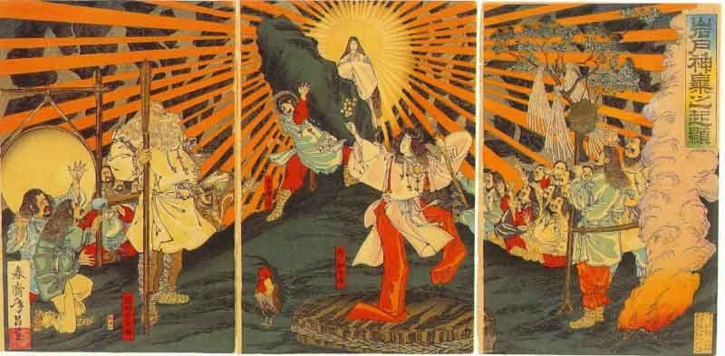

  
[Intangible Textual Heritage](../../index)  [Shinto](../index.md) 

------------------------------------------------------------------------

[Buy this Book at
Amazon.com](https://www.amazon.com/exec/obidos/ASIN/B0028Y4SZY/internetsacredte.md)

------------------------------------------------------------------------

<table width="75%">
<colgroup>
<col style="width: 50%" />
<col style="width: 50%" />
</colgroup>
<tbody>
<tr class="odd">
<td width="50%" data-valign="TOP"> 
The Emergence of Amaterasu (Public Domain Image)</td>
<td width="50%" data-valign="CENTER"><h1 id="the-kojiki" data-align="CENTER">The Kojiki</h1>
<h2 id="translated-by-basil-hall-chamberlain" data-align="CENTER">translated by Basil Hall Chamberlain</h2>
<h4 id="section" data-align="CENTER">[1919]</h4></td>
</tr>
</tbody>
</table>

------------------------------------------------------------------------

[Contents](#contents)    [Start Reading](kj000.md)    [Page
Index](pageidx)    [Text \[Zipped\]](kj.txt.gz.md)

------------------------------------------------------------------------

|                                                                                                                           |
|---------------------------------------------------------------------------------------------------------------------------|
|  |

The Kojiki is one of the two primary sources for Shinto, the Japanese
national religion. It starts in the realm of myth, with the creation of
Japan from foam. Innumerable gods and goddesses are described. The
narrative moves from mythology to historical legends, and culminates in
a chronology of the early Imperial line.

The book is densely footnoted, almost to the point where the text is
buried in apparatus. However, even this cannot shroud the wonderful
story-telling. There are supernatural episodes, and tales of murder,
passion and betrayal, all interspersed with extemporaneous poetry,
reminiscent of Icelandic sagas.

Production notes: I worked on this for four years, on and off. I
searched for a long time to locate a copy of the Tuttle reprint of the
Chamberlain translation, which, despite being published in the 1970s is
out of print and hard to obtain. In 2000, a copy fortuitously turned up
in a local used bookstore. However, limitations of OCR technology at the
time made it difficult to proof the text, so I put it aside. In 2005, I
rescanned the book using more recent OCR software with better results,
and managed to complete the proof. Even still, it took quite a bit of
work to finish the job, particularly creating bitmaps of hundreds of
images of Chinese and Japanese characters.

------------------------------------------------------------------------

[Title Page](kj000.md)  

### Introduction

[Introduction](kj001.md)  
[I. The Text and its Authenticity, Together with Bibliographical
Notes](kj002.md)  
[II. Methods of Translation](kj003.md)  
[III. The Chronicles of Japan](kj004.md)  
[IV. Manners and Customs of the Early Japanese](kj005.md)  
[V. Religious And Political Ideas of the Early Japanese, Beginnings of
the Japanese Nation, and Credibility of the National Records](kj006.md)  

### Volume I

[Preface](kj007.md)  
[Section I.—The Beginning of Heaven and Earth](kj008.md)  
[Section II.—The Seven Divine Generations](kj009.md)  
[Section III.—The Island of Onogoro](kj010.md)  
[Section IV.—Courtship of the Deities The Male-Who-Invites and the
Female Who-Invites](kj011.md)  
[Section V.—Birth of the Eight Islands](kj012.md)  
[Section VI.—Birth of the Various Deities](kj013.md)  
[Section VII.—Retirement of Her Augustness The
Princess-Who-Invites](kj014.md)  
[Section VIII.—The Slaying of the Fire-Deity](kj015.md)  
[Section IX.—The Land of Hades](kj016.md)  
[Section X.—The Purification of the August Person](kj017.md)  
[Section XI.—Investiture of the Three Deities; The Illustrious August
Children](kj018.md)  
[Section XII.—The Crying and Weeping of His
Impetuous-Male-Augustness](kj019.md)  
[Section XIII.—The August Oath](kj020.md)  
[Section XIV.—The August Declaration of the Division of the August Male
Children and the August Female Children](kj021.md)  
[Section XV.—The August Ravages of His
Impetuous-Male-Augustness](kj022.md)  
[Section XVI.—The Door of the Heavenly Rock-Dwelling](kj023.md)  
[Section XVII.—The August Expulsion of
His-Impetuous-Male-Augustness](kj024.md)  
[Section XVIII.—The Eight-Forked Serpent](kj025.md)  
[Section XIX.—The Palace of Suga](kj026.md)  
[Section XX.—The August Ancestors of the Deity-Master-Of-The-Great
Land](kj027.md)  
[Section XII.—The White Hare of Inaba](kj028.md)  
[Section XXII.—Mount Tema](kj029.md)  
[Section XXIII.—The Nether-Distant-Land](kj030.md)  
[Section XXIV.—The Wooing of the
Deity-of-Eight-Thousand-Spears](kj031.md)  
[Section XXV.—The Cup Pledge](kj032.md)  
[Section XXVI.—The Deities the August Descendants of the Deity
Master-of-the-Great-Land](kj033.md)  
[Section XXVII.—The Little-Prince-the-Renowned-Deity](kj034.md)  
[Section XXVIII.—The
August-Luck-Spirit-the-August-Wondrous-Spirit](kj035.md)  
[Section XXIX.—The August Children of the Great-Harvest-Deity And of the
Swift-Mountain-Deity](kj036.md)  
[Section XXX.—The August Deliberation for Pacifying the Land](kj037.md)  
[Section XXXI.—The Heavenly-Young-Prince](kj038.md)  
[Section XXXII.—Abdication of the Deity
Master-of-the-Great-Land](kj039.md)  
[Section XXXIII.—The August Descent from Heaven of His Augustness the
August Grandchild](kj040.md)  
[Section XXXIV.—The August Reign in Himuka of His Augustness Prince
Rice-Ear-Ruddy-Plenty](kj041.md)  
[Section XXXV.—The Duchess of Saru](kj042.md)  
[Section XXXVI.—The Deity Prince of Saruta at Azaka](kj043.md)  
[Section XXXVII.—The Curse of the Deity
Great-Mountain-Possessor](kj044.md)  
[Section XXXVIII.—The August Child-Bearing of Princess-Blossoming
Brilliantly-Like-the-Flowers-of-the-Trees](kj045.md)  
[Section XXXIX.—The August Exchange of Luck](kj046.md)  
[Section XL.—The Palace of the Ocean-Possessor](kj047.md)  
[Section XLI.—Submission of His Augustness Fire-Shine](kj048.md)  
[Section XLII.—The Parturition-House of Cormorants' Feathers](kj049.md)  
[Section XLIII.—The August Children of His Augustness
Cormorant-Thatch-Meeting-Incompletely](kj050.md)  

### Volume II

[Section XLIV.—Reign of the Emperor Jim-mu (Part I.—His Progress
Eastward, and Death of His Elder Brother)](kj051.md)  
[Section XLV.—Emperor Jim-mu (Part II.—The Cross-Sword Sent Down From
Heaven).](kj052.md)  
[Section XLVI.—Emperor Jim-mu (Part III.—The Gigantic Crow and Gods With
Tails)](kj053.md)  
[Section XLVII.—Emperor Jim-mu (Part IV.—The Ukashi Brethren)](kj054.md)  
[Section XLVIII.—Emperor Jim-mu (Part V.—The Earth-Spider of the Cave of
Osaka)](kj055.md)  
[Section XLIX.—Emperor Jim-mu (Part. VI.—The Prince of Tomi and the
Shiki Brethren)](kj056.md)  
[Section L.—Emperor Jim-mu (Part VII.—The Empire Pacified)](kj057.md)  
[Section LI.—Emperor Jim-mu (Part. VIII.—He Weds
I-suke-yori-hime)](kj058.md)  
[Section LII.—Emperor Jim-mu (Part. IX—Troubles Which Followed His
Decease).](kj059.md)  
[Section LIII.—Emperor Jim-mu (Part X.—Genealogies)](kj060.md)  
[Section LIV.—Emperor Jim-mu (Part XI.—His Age and Place Of
Burial)](kj061.md)  
[Section LV.—Emperor Sui-zei](kj062.md)  
[Section LVI.—Emperor An-nei](kj063.md)  
[Section LVII.—Emperor I-toku](kj064.md)  
[Section LVIII.—Emperor Ko-sho](kj065.md)  
[Section LIX.—Emperor Koan](kj066.md)  
[Section LX.—Emperor Kō-rei](kj067.md)  
[Section XLI.—Emperor Kō-gen](kj068.md)  
[Section LXII.—Emperor Kai-kuwa](kj069.md)  
[Section LXIII.—Emperor Sū-jin (Part I.—Genealogies)](kj070.md)  
[Section LXIV.—Emperor Sū-jin (Part II.—A Pestilence Is Staid By
Oho-tata-ne-ko)](kj071.md)  
[Section LXV.—Emperor Sū-jin (PART III: Story of Oho-tata-ne-ko's
Birth)](kj072.md)  
[Section LXVI.—Emperor Sū-jin (Part IV.—War With King
Take-hani-yasu)](kj073.md)  
[Section LXVII.—Emperor Sū-jin (Part V.—Peace Restored and Tribute
Levied)](kj074.md)  
[Section LXVIII.—Emperor Sū-jin (Part VI.—His Age and Place of
Burial).](kj075.md)  
[Section LXIX.—Emperor Sui-nin (Part I.—Genealogies)](kj076.md)  
[Section LXX. Emperor Sui-nin (Part II. Conspiracy of King Saho-biko and
the Empress Saho-bime)](kj077.md)  
[Section LXXI.—Emperor Sui-nin (Part III.—Birth of Prince Homu-chi-wake
and Death of the Conspirators)](kj078.md)  
[Section LXXII.—Emperor Sui-nin (Part IV.—The Dumb Prince
Homu-chi-wake)](kj079.md)  
[Section LXXIII. Emperor Sui-nin (Part. V.—His Later Wives.)](kj080.md)  
[Section LXXIV.—Emperor Sui-nin (Part VI.—Taji-Mori Brings Back the
Orange From the Eternal Land.)](kj081.md)  
[Section LXXV.—Emperor Sui-nin (Part VII.—His Death and that of the
Empress Hibasu.)](kj082.md)  
[Section LXXVI.—Empress Kei-ko (Part I,—Genealogies)](kj083.md)  
[Section LXXVII.—Emperor Kei-kō (Part II.—The Maidens Ye-Hime and
Oto-Hime).](kj084.md)  
[Section LXXVIII.—Emperor Kei-kō (Part III. Various Deeds.)](kj085.md)  
[Section LXXIX.—Emperor Kei-kō (Part IV.—Yamato-take Slays His Elder
Brother)](kj086.md)  
[Section LXXX. Emperor Kei-kō (Part V.—Yamato-Take Slays the Kumaso
Bravoes)](kj087.md)  
[Section LXXXI.—Emperor Kei-kō (Part VI.—Yamato-take Slays the Idzumo
Bravo)](kj088.md)  
[Section LXXXII.—Emperor Kei-kō (Part VII.—Yamato-take is Sent to Subdue
the East, and Visits His Aunt at Ise)](kj089.md)  
[Section LXXXIII.—Emperor Kei-kō (Part VIII.—Yamato-take Slays the
Rulers of Sagamu.)](kj090.md)  
[Section LXXXIV.—Emperor Kei-kō (Part IX.—Yamato-take's Empress Stills
the Waves](kj091.md)  
[Section LXXXV.—Emperor Kei-kō (Part X.—Yamato-Take Slays the Deity of
the Ashigara Pass.)](kj092.md)  
[Section LXXXVI.—Emperor Kei-kō (Part XI.—Yamato-take Dwells in the
Palace of Sakawori.)](kj093.md)  
[Section LXXXVII.—Emperor Kei-kō (Part XII.—Yamato-take Wooes Princess
Miyazu)](kj094.md)  
[Section LXXXVIII.—Emperor Kei-kō (Part XIII.—Yamato-take Meets the
Deity of Mount Ibuki)](kj095.md)  
[Section LXXXIX. Emperor Kei-kō (Part XIV.—The Death of
Yamato-take).](kj096.md)  
[Section XC.—Emperor Kei-kō (Part XV.—Yamato-take Turns into a White
Bird)](kj097.md)  
[Section XCI.—Emperor Kei-kō (Part XVI.—Yamato-Take's Butler)](kj098.md)  
[Section XCII.—Emperor Kei-kō (Part XVII.—Yamato-take's
Descendants)](kj099.md)  
[Section XCIII.—Emperor Kei-kō (Part XVIII. His Age and Place of
Burial)](kj100.md)  
[Section XCIV.—Emperor Sei-mu](kj101.md)  
[Section XCV.—Emperor Chiū-ai (Part I.—Genealogies)](kj102.md)  
[Section XCVI. Emperor Chiū-ai (Part II.—The Possession of Korea
Divinely Promised)](kj103.md)  
[Section XCVII.—Emperor Chiū-ai (Part III. Preparations for the Conquest
of Korea)](kj104.md)  
[Section XCVIII.—Emperor Chiū-ai (Part IV.—The Empress Jin-gō Conquers
Korea)](kj105.md)  
[Section XCIX.—Emperor Chiū-ai (Part V.—The Empress Jin-gō Fishes in
Tsukushi)](kj106.md)  
[Section C.—Emperor Chiū-ai (Part VI.—The Empress Jin-gō Subdues
Yamato)](kj107.md)  
[Section CI.—Emperor Chiū-ai (Part VIII.—The Heir Apparent Exchanges
Names with the Great Deity Izasa-Wake)](kj108.md)  
[Section CII.—Emperor Chiū-ai (Part VIII.—The Empress Jin-gō Presents
Liquor to the Heir Apparent)](kj109.md)  
[Section CIII.—Emperor Chiū-ai (Part IX.—His Death and that of the
Empress Jin-gō)](kj110.md)  
[Section CIV.—Emperor Ō-jin (Part 1.—Genealogies)](kj111.md)  
[Section CV.—Emperor Ō-jin (Part II.—He Divides the Inheritance Between
His Three Sons)](kj112.md)  
[Section CVI.—Emperor Ō-jin (Part III.—He Wooes Princess
Miya-nushi-ya-kaha-ye)](kj113.md)  
[Section CVII.—Emperor Ō-jin (Part IV.—He Grants Princess Kaminaga to
His Son Oho-Sazaki)](kj114.md)  
[Section CVIII.—Emperor Ō-jin (Part V.—Songs of the Territorial Owners
of Yeshinu)](kj115.md)  
[Section CIX.—Emperor Ō-jin (Part VI.—Various Deeds)](kj116.md)  
[Section CX.—Emperor Ō-jin (Part VIII.—Tribute From Korea)](kj117.md)  
[Section CXI.—Emperor Ō-jin (Part VIII.—The Emperor
Intoxicated)](kj118.md)  
[Section CXII.—Emperor Ō-jin (Part IX.—Troubles Which Followed His
Decease)](kj119.md)  
[Section CXIII.—Emperor Ō-jin (Part X.—Princes Oho-sazaki And
Uji-no-waki-iratsuko Cede the Empire to Each Other)](kj120.md)  
[Section CXIV.—Emperor Ō-jin (Part XI.—Ama-no-hi-boko Crosses Over to
Japan)](kj121.md)  
[Section CXV.—Emperor Ō-jin (Part XII.—Descendants of Ama-no-hi-boko,
and Treasures Brought by Him.)](kj122.md)  
[Section CXVI.—Emperor Ō-jin (Part XIII.—The
Youth-of-the-Glow-on-the-Autumn-Mountains and the
Youth-of-the-Haze-on-the-Spring-Mountains)](kj123.md)  
[Section CXVII.—Emperor Ō-jin (Part XVI.—Genealogies)](kj124.md)  
[Section CXVIII.—Emperor Ō-jin (Part XV.—His Age and Place of
Burial)](kj125.md)  

### Volume III

[Section CXIX.—Emperor Nin-toku (Part I.—Genealogies)](kj126.md)  
[Section CXX: Emperor Nin-toku (Part II.—Various Deeds)](kj127.md)  
[Section CXXI.—Emperor Nin-toku \[Part III.—He Remits the
Taxes)](kj128.md)  
[Section CXXII.—Emperor Nin-toku (Part IV.—He Loves Princess
Kuro)](kj129.md)  
[Section CXXIII. Emperor Nin-toku Part V.—The Empress Retires to
Yamashiro)](kj130.md)  
[Section CXXIV.—Emperor Nin-toku (Part VI.—He Follows the Empress into
Yamashiro)](kj131.md)  
[Section CXXV.—Emperor Nin-toku (Part VIII.—He Loves
Yata-no-waki-iratsume)](kj132.md)  
[Section CXXVI.—Emperor Nin-toku (Part VIII.—Death of King Hayabusa-Wake
and Queen Medori)](kj133.md)  
[Section CXXVII.—Emperor Nin-toku (Part VIII.—Queen Medori's
Armlet)](kj134.md)  
[Section CXXVIII.—Emperor Nin-toku (Part IX.—A Wild-Goose Lays an
Egg)](kj135.md)  
[Section CXXIX:—Emperor Nin-toku (Part X.—A Vessel Is Made Into A
Lute)](kj136.md)  
[Section CXXX.—Emperor Nin-toku (Part XI.—His Age and Place of
Burial)](kj137.md)  
[Section CXXXI.—Emperor Ri-chiu (Part I.—Genealogies)](kj138.md)  
[Section CXXXII.—Emperor Ri-chiu (Part II.—He is Taken to
Iso-no-kami)](kj139.md)  
[Section CXXXIII.—Emperor Ri-chiu (Part III.—His Rebellious Brother and
the Latter's Retainer Sobakari Are Slain)](kj140.md)  
[Section CXXXIV.—Emperor Ri-chiu (Part IV.—Various Deeds)](kj141.md)  
[Section CXXXV.—Emperor Ri-chiu (Part V.—His Age and Place of
Burial)](kj142.md)  
[Section CXXXV.—Emperor Han-zei](kj143.md)  
[Section CXXXVII.—Emperor In-giyō (Part I—Genealogies)](kj144.md)  
[Section CXXXVIII.—Emperor In-giyō (Part II.—His Sickness is Cured by a
Korean Physician)](kj145.md)  
[Section CXXXIX.—Emperor In-giyō (Part III. He Rectifies the People's
Names)](kj146.md)  
[Section CXI. Emperor In-giyō (Part IV.—His Age and Place of
Burial)](kj147.md)  
[Section CXLI.—Emperor In-giyō (Part V.—Prince Karu Loves His Sister
Princess So-tohoshi)](kj148.md)  
[Section CXLII.—Emperor In-giyō (Part VI.—War Between Prince Karu and
Prince Anaho)](kj149.md)  
[Section CXLIII.—Emperor In-giyō (Part VII.—Death of Prince Karu and
Princess So-tohoshi)](kj150.md)  
[Section CXLIV.—Emperor An-kō (Part I.—He Slays King
Oho-kusaka)](kj151.md)  
[Section CXLV.—Emperor An-kō (Part II.—He is Slain by King
Ma-yowa)](kj152.md)  
[Section CXLVI.—Emperor An-kō (Part III.—Prince Oho Hatsuse Slays
Princes Kuro-biko and Shiro-biro)](kj153.md)  
[Section CXLVII.—Emperor An-kō (Part IV.—Death of Prince Ma-yowa and of
the Grandee Tsubura)](kj154.md)  
[Section CXLVIII.—Emperor An-kō (Part V:—Prince Oho-Hatsuse Slays Prince
Oshiha)](kj155.md)  
[Section CXLIX.—Emperor An-kō (Part VI.—Flight of Princes Ohoke and
Woke)](kj156.md)  
[Section CL.—Emperor Yū-riyaku, (I.—Genealogies)](kj157.md)  
[Section CLI.—Emperor Yu-riyaku (Part II.—Various Deeds)](kj158.md)  
[Section CLII.—Emperor Yū-riyaku (Part III.—The Roof of the House of the
Great Departmental Lord of Shiki)](kj159.md)  
[Section CLIII.—Emperor Yū-riyaku (Part IV.—He Wooes Princess
Waka-kusaka-be)](kj160.md)  
[Section CLIV.—Emperor Yū-riyaku (Part V.—Story of the Woman
Akawi-ko)](kj161.md)  
[Section CLV.—Emperor Yū-riyaku (Part VI.—He Makes a Progress to
Yeshinu)](kj162.md)  
[Section CLVI.—Emperor Yū-riyaku (Part VII.—The Horse-fly and the
Dragon-fly)](kj163.md)  
[Section CLVII.—Emperor Yu-riyaku (Part VII.—Adventure with a Wild
Boar)](kj164.md)  
[Section CLVIII.—Emperor Yū-Riyaku (Part IX.—Revelation of the Great
Deity of Kadzuraki, Lord of One Word)](kj165.md)  
[Section CLIX.—Emperor Yū-riyaku (Part X.—The Mound of the Metal
Spade)](kj166.md)  
[Section CLX.—Emperor Yū-riyaku (Part XI.—The Leaf in the Cup)](kj167.md)  
[Section CLXI.—Emperor Yū-riyaku (Part XII.—Songs by the Emperor and
Princess Wodo)](kj168.md)  
[Section CLXII.—Emperor Yū-riyaku (Part XIII.—His Age and Place of
Burial)](kj169.md)  
[Section CLXIII.—Emperor Sei-nei (Part I.—Search for a Successor to
Him)](kj170.md)  
[Section CLXIV.—Emperor Sei-nei (Part II.—Princes Ohoke and Woke are
Discovered)](kj171.md)  
[Section CLXV.—Emperor Sei-nei (Part III.—The Grandee Shibi)](kj172.md)  
[Section CLXVI.—Emperor Sei-nei (Part IV.—Prince Ohoke Cedes the Empire
to Prince Woke)](kj173.md)  
[Section CLXVII.—Emperor Ken-zō (Part I.—The Old Woman Oki-Me)](kj174.md)  
[Section CLXVIII.—Emperor Ken-zō (Part II.—He Slays The
Boar-Herd)](kj175.md)  
[Section CLXIX.—Emperor Ken-zō (Part III.—The Emperor Yū-riyaku's
Mausoleum is Disfigured)](kj176.md)  
[Section CLXX.—Emperor Ken-zō (Part IV.—His Age and Place of
Burial)](kj177.md)  
[Section CLXXI.—Emperor Nin-ken](kj178.md)  
[Section CLXXII—Emperor Mu-retsu](kj179.md)  
[Section CLXXIII.—Emperor Kei-tai](kj180.md)  
[Section CXXXIV.—Emperor Kan-an](kj181.md)  
[Section CLXXV.—Emperor Sen-kuwa](kj182.md)  
[Section CLXXVI.—Emperor Kim-mei](kj183.md)  
[Section CLXXVII.—Emperor Bi-datsu](kj184.md)  
[Section CLXXVIII.—Emperor Yōmei](kj185.md)  
[Section CLXXIX.—Emperor Su-jun](kj186.md)  
[Section CLXXX.—Empress Sui-ko](kj187.md)  

### Appendix

[Appendix I: Japanese Text of the Songs of the Kojiki, Transliterated
into Roman](kj188.md)  
[Appendix II. Chronology of Sovereigns Mentioned in the Kojiki and
Nihongi](kj189.md)  
