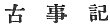

  
[Intangible Textual Heritage](../../index)  [Shinto](../index.md) 
[Index](index)  [Next](kj001.md) 

------------------------------------------------------------------------

[Buy this Book at
Amazon.com](https://www.amazon.com/exec/obidos/ASIN/B0028Y4SZY/internetsacredte.md)

------------------------------------------------------------------------

  
*The Kojiki*, translated by Basil Hall Chamberlain, \[1919\], at
Intangible Textual Heritage

------------------------------------------------------------------------

p. i

# A Translation of the "Ko-ji-ki,"

OR

#### "RECORDS OF ANCIENT MATTERS."

( )

By BASIL HALL CHAMBERLAIN.

\[*Read before the Asiatic Society of Japan April 12th, May 10th, and
June 21st, 1882*.\]*  
*\[*Reprinted, May, 1919.*\]

\[1919\]

Scanned at ith.oarc.science July 2000-June 2005, by J. B. Hare. This
text is in the public domain in the United States because it was
published prior to 1923.

------------------------------------------------------------------------

[Next: Introduction](kj001.md)
