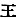
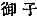
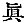
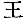
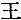
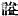

  
[Intangible Textual Heritage](../../index)  [Shinto](../index.md) 
[Index](index)  [Previous](kj002)  [Next](kj004.md) 

------------------------------------------------------------------------

[Buy this Book at
Amazon.com](https://www.amazon.com/exec/obidos/ASIN/B0028Y4SZY/internetsacredte.md)

------------------------------------------------------------------------

  
*The Kojiki*, translated by Basil Hall Chamberlain, \[1919\], at
Intangible Textual Heritage

------------------------------------------------------------------------

### II.

#### METHODS OF TRANSLATION.

To the translator the question above mooted is not one of great
importance. The text itself must form the basis of his version, and not
any one's,—not even Motowori's—private and particular reading of it. For
this reason none of the Honorifics, which Motowori inserts as prefixes
to nouns and terminations to verbs have been taken any notice of, but
the original has been followed, character by character, with as great
fidelity as was attainable. The author too has his Honorifics; but he
does not use them so plentifully or so regularly as it pleases Motowori
to represent him as having intended to do. On the other hand, Motowori's
occasional emendations of the text may generally be accepted. They
rarely extend to more than single words; and the errors in the earlier
editions may frequently be shown to have arisen from careless copying of
characters originally written, not in the square, but in the cursive
form. The translator has separately considered each case where various
readings

p. xvii

occur, and has mentioned them in the Notes when they seemed of
sufficient importance. In some few cases he has preferred a reading not
approved by Motowori, but he always mentions Motowori's reading in a
Foot-note.

The main body of the text contains but little to perplex any one who has
made a special study of the early Japanese writings, and it has already
been noticed that there is an admirable exegetical literature at the
student's command. With the Songs embedded in the prose text the case is
different, as some of them are among the most difficult things in the
language, and the commentators frequently arrive at most discordant
interpretations of the obscurer passages. In the present version
particulars concerning each Song have, except in a very few cases where
comment appeared superfluous, been given \[13\] in a Foot-note, the
general sense being usually first indicated, the meaning of particular
expressions then explained, and various opinions mentioned when they
seemed worthy of notice. Besides one or two terms of Japanese grammar,
the only technical knowledge with which the readers of the Notes are
necessarily credited is that of the use by the Japanese poets of what
have been styled Pillow-Words, Pivots, and Prefaces; and those
Pillow-Words which are founded on a *jeu-de-mots* or are of doubtful
signification form, with the one exception mentioned below, the only
case where anything contained in the original is omitted from the
English version. [8](#fn_7.md) After some
consideration, it has been deemed

p. xviii

advisable to print in an Appendix the Japanese text of all the Songs,
transliterated into Roman. Students will thus find it easier to form
their own opinion on the interpretation of doubtful passages. The
importance likewise of these Songs, as the most ancient specimens of
Altaic speech, makes it right to give them as much publicity as
possible.

The text of the "Records" is, like many other Japanese texts, completely
devoid of breaks corresponding to the chapters and paragraphs into which
European works are divided. With the occasional exception of a pause
after a catalogue of gods or princes, and of notes inserted in smaller
type and generally containing genealogies or indicating the
pronunciation of certain words, the whole story, prose and verse, runs
on from beginning to end with no interruptions other than those marked
by the conclusion of Vol. I and by the death of each emperor in Vols. II
and III. Faithfulness however scarcely seems to demand more than this
statement; for a similarly continuous printing of the English version
would attain no end but that of making a very dry piece of reading more
arduous still. Moreover there are certain traditional names by which the
various episodes of the so-called "Divine Age" are known to the native
scholars, and according to which the text of Vol. I may naturally be
divided. The reigns of the emperors form a similar foundation for the
analysis of Vols. II and III, which contain the account of the "Human
Age." It has been thought that it would be well to mark such natural
\[14\] divisions by the use of numbered Sections with marginal headings.
The titles proposed by Motowori in the Prolegomena to his Commentary
have been adopted with

p. xix

scarcely any alteration in the case of Vol. I. In Vols. II and III,
where his sections mostly embrace the whole reign of an emperor, and the
title given by him to each Section consists only of the name of the
palace where each emperor is said to have resided, there is less
advantage in following him; for those Sections are often inordinately
long, and their titles occasionally misleading and always inconvenient
for purposes of reference, as the Japanese emperors are commonly known,
not by the names of their places of residence, but by their "canonical
names." Motowori, as an ardent nationalist, of course rejected these
"canonical names," because they were first applied to the Japanese
emperors at a comparatively late date in imitation of Chinese usage. But
to a foreigner this need be no sufficient reason for discarding them.
The Sections in the translation of Vols. II and III have therefore been
obtained by breaking up the longer reigns into appropriate portions; and
in such Sections, as also in the Foot-notes, the emperors are always
mentioned by their "canonical names." [9](#fn_8.md)
The Vol. mentioned in brackets on every right-hand page is that of
Motowori's Commentary which treats of the Section contained in that
page.

The Notes translated from the original are indented, and are printed
small when they are in small type in

p. xx

the Japanese text. Those only which give directions for pronouncing
certain characters phonetically have been omitted, as they have no
significance when the original tongue and method of writing are
exchanged for foreign vehicles of thought and expression. The songs have
likewise been indented for the sake of clearness, and each one printed
as a separate paragraph. The occasionally unavoidable insertion in the
translation of important words not occurring in the Japanese text has
been indicated by \[15\] printing such words within square brackets. The
translator's Notes, which figure at the bottom of each page, do not aim
at anything more than the exegesis of the actual text. To illustrate its
subject-matter from other sources, as Motowori does, and to enlarge on
all the subjects connected with Japanese antiquity which are sometimes
merely alluded to in a single phrase, would require several more volumes
the size of this one, many years of labour on the part of the
investigator, and an unusually large stock of patience on the reader's
part. The Notes terminate with the death of the Emperor Kenzō, after
which the text ceases to offer any interest, except as a comment on the
genealogies given in the "Chronicles of Japan.'

Without forgetting the fact that so-called equivalent terms in two
languages rarely quite cover each other, and that it may therefore be
necessary in some cases to render one Japanese word by two or three
different English words according to the context, the translator has
striven to keep such diversity within the narrowest limits, as it tends
to give a false impression of the original, implying that it possesses a
versatility of thought which is indeed characteristic of Modern Europe,
but not

p. xxi

at all of Early Japan. With reference to this point a certain class of
words must be mentioned, as the English translation is unavoidably
defective in their case, owing to the fact of our language not
possessing sufficiently close synonyms for them. They are chiefly the
names of titles, and are the following:—

|                                                             |         |          |     |                          |
|-------------------------------------------------------------|---------|----------|-----|--------------------------|
| *Agata-no-atahe*                                            | Roughly | rendered | by: | *Departmental Suzerain.* |
| *Agata-nushi*                                               | "       | "        | "   | *Departmental Lord.*     |
| *Asomi* (*Ason*)                                            | "       | "        | "   | *Court Noble.*           |
| *Atahe*                                                     | "       | "        | "   | *Suzerain.*              |
| *Hiko*                                                      | "       | "        | "   | *Prince.*                |
| *Hime*                                                      | "       | "        | "   | *Princess.*              |
| *Inaki*                                                     | "       | "        | "   | *Territorial Lord.*      |
| *Iratsuko*                                                  | "       | "        | "   | *Lord.*                  |
| *Iratsume*                                                  | "       | "        | "   | *Lady.*                  |
| *Kami*                                                      | "       | "        | "   | *Deity.*                 |
| *Kimi*                                                      | "       | "        | "   | *Duke.*                  |
| *Ma*                                                        | "       | "        | "   | *True.*                  |
| *Miko* ( )  | "       | "        | "   | *King.*                  |
| *Mi Ko* ( ) | "       | "        | "   | *August Child.*\[16\]    |
| *Mikoto*                                                    | "       | "        | "   | *Augustness.*            |
| *Miyatsuko*                                                 | "       | "        | "   | *Ruler.*                 |
| *Murazhi*                                                   | "       | "        | "   | *Chief.*                 |
| *Omi*                                                       | "       | "        | "   | *Grandee.*               |
| *Sukune*                                                    | "       | "        | "   | *Noble.*                 |
| *Wake* (in the names of human beings)                       | "       | "        | "   | *Lord.*                  |

It must be understood that no special significance is to be attached to
the use of such words as "Duke," "Suzerain" etc. They are merely, so to
speak, labels by which titles that are distinct in the original are
sought to be kept distinct in the translation. Many of them also are
used as that species of hereditary titular designation which the
translator has ventured to call the "gentile name." [10](#fn_9.md) Where possible, indeed, the etymological

p. xxii

meaning of the Japanese word has been preserved. Thus *omi* seems to be
rightly derived by Motowori from *ohomi*, "great body"; and "grandee" is
therefore the nearest English equivalent. Similarly *murazhi*, "chief,"
is a corruption of two words signifying "master of a tribe." On the
other hand, both the etymology and the precise import of the title of
*wake* are extremely doubtful. *Hiko* and *hime* again, if they really
come from *hi ko*, "sun-child" and *hi me*, "sun-female" (or "fire
child" and "fire female"), have wandered so far from their origin as,
even in Archaic times, to have been nothing more than Honorific
appellations, corresponding in a loose fashion to the English words
"prince and princess," or "lord and lady,"—in some cases perhaps meaning
scarcely more than "youth and maiden."

The four words *kami*, *ma*, *miko* and *mikoto* alone call for special
notice; and *ma* may be disposed of first. It is of uncertain origin,
but identified by the native philologists with the perpetually recurring
honorific *mi*, rendered "august." As, when written ideographically, it
is always represented by the Chinese character  , the translator renders it
in English by "true"; but it must be understood that this word has no
force beyond that of an Honorific.

*Mikoto*, rendered "Augustness," is properly a \[17\] compound, *mi
koto*, "august thing." It is used as a title, somewhat after the fashion
of our words "Majesty" and "Highness," being suffixed to the names of
exalted human personages, and also of gods and goddesses. For the sake
of clearness in the English translation this title is prefixed and used
with the possessive pronoun, thus: *Yamato-Take-no-Mikoto*, His
Augustness Yamato-Take.

p. xxiii

With regard to the title read *miko* by the native commentators, it is
represented in two ways in the Chinese text. When a *young* prince is
denoted by it, we find the characters 
, "august child," reminding us of the Spanish title
of *infante*. But in other cases it is written with the single character
  "King," and it may be
questioned whether the reading of it as *miko* is not arbitrary. Many
indications lead us to suppose that in Early Japan something similar to
the feudal system, which again obtained during the Middle Ages, was in
force; and if so, then some of these "kings" may have been kings indeed
after a fashion; and to degrade their title, as do the modern
commentators, to that of "prince" is an anachronism. In any case the
safest plan, if we would not help to obscure this interesting political
question, is to adhere to the proper signification of the character in
the text, and that character is 
, "King." [11](#fn_10.md)

Of all the words for which it is hard to find a suitable English
equivalent, *Kami* is the hardest. Indeed there is no English word which
renders it with any near approach to exactness. If therefore it is here
rendered by the word "deity" ("deity" being preferred to "god" because
it includes superior beings of both sexes), it must be clearly
understood that the word "deity" is taken in a sense not sanctioned by
any English dictionary; for *kami*, and "deity" or "god," only
correspond to each other in a very rough manner. The proper meaning of
the word "*kami*" is "top," or "above"; and it is still constantly so
used. For this reason it has the secondary sense of "hair of the head;"
and only the hair on the *top* 

p. xxiv

of the head,—not the hair on the face,—is so designated. Similarly the
Government, in popular phraseology, is *O Kami*, literally "the
honorably above"; and down to a few years ago *Kami* was the name of a
certain titular \[11\] provincial rank. Thus it may be understood how
the word was naturally applied to superiors in general, and especially
to those more than human superiors whom we call "gods." A Japanese, to
whom the origin of the word is patent, and who uses it every day in
contexts by no means divine, does not receive from the word *Kami* the
same impression of awe which is produced on the more earnest European
mind by the words "deity" and "god," with their very different
associations. In using the word "deity," therefore; to translate the
Japanese term *Kami* we must, so to speak, bring it down from the
heights to which Western thought has raised it. In fact *Kami* does not
mean much more than "superior." This subject will be noticed again in
Section V of the present Introduction; but so far as the word *Kami*
itself is concerned, these remarks may suffice.

To conclude this Section, the translator must advert to his treatment of
Proper Names, and he feels that he must plead guilty to a certain amount
of inconsistency on this head. Indeed the treatment of Proper Names is
always an embarrassment, partly because it is often difficult to
determine what is a Proper Name, and partly because in translating a
text into a foreign tongue Proper Names, whose meanings are evident in
the original and perhaps have a bearing on the story, lose their
significance; and the translator has therefore first of all to decide
whether the name is really a Proper Name at all or simply a description
of the personage or place,

p. xxv

and next whether he will sacrifice the meaning because the word is used
as a name; or preserve the original name and thus fail to render the
meaning,—a meaning which may be of importance as revealing the channels
in which ancient thought flowed. For instance
"*Oho-kuni-nushi-no-kami*," the "Deity Master of the Great Land," is
clearly nothing more than a description of the god in question, who had
several other names, and the reason of whose adoption of this special
one was that the sovereignty of the "Great Land," *i.e.* of Japan (or
rather of Idzumo and the neighbouring provinces in north-western Japan),
was ceded to him by another god, whom he deceived and whose daughter he
ran away with. [12](#fn_11.md) Again
*Toyo-ashi-hara-no-chi-aki-no-naga-i-ho-aki-no-midzu-ho-no-kuni*, which
signifies "the Luxuriant Reed-Moor, the Land of Fresh Rice-ears,—of a
Thousand \[19\] Autumns,—of Long Five Hundred Autumns" cannot possibly
be regarded as more than an honorific *description* of Japan. Such a
catalogue of words could never have been used as a name. On the other
hand it is plain that *Tema* was simply the proper name of a certain
mountain, because there is no known word in Archaic Japanese to which it
can with certainty be traced. The difficulty is with the intermediate
cases,—the cases of those names which are but partly comprehensible or
partly applicable to their bearers; and the difficulty is one of which
there would seem to be no satisfactory solution possible. The translator
may therefore merely state that in Vol. I of these "Records," where an
unusual number of the Proper Names have a bearing on the legends related
in the text, he has, wherever feasible, translated all those which

p. xxvi

are borne by persons, whether human or divine. In the succeeding Volumes
he has not done so, nor has he, except in a very small number of
instances, translated the Proper Names of places in any of the three
volumes. In order, however, to convey all the needful information both
as to sound and as to sense, the Japanese original is always indicated
in a Foot-note when the translation has the name in English, and *vice
versâ*, while all doubtful etymologies are discussed.

------------------------------------------------------------------------

### Footnotes

[xvii:8](kj003.htm#fr_7.md) For a special account of
the Pillow-Words, etc., see a paper by the present writer in Vol. V, Pt.
I, pp. 79 *et seq.* of these "Transactions," and for a briefer notice,
his "Classical Poetry of the Japanese," pp. 5 and 6.

[xix:9](kj003.htm#fr_8.md) The practice of bestowing
a canonical name (*okurina* 
) on an emperor after his decease dates from the
latter part of the eighth century of our era when, at the command of the
emperor Kuwam-mu, a scholar named Mifune-no-Mahito selected suitable
"canonical names" for all the previous sovereigns, from Jim-mu down to
Kuwan-mu's immediate predecessor. From that time forward every emperor
has received his "canonical name" soon after death, and it is generally
by it alone that he is known to history.

[xxi:10](kj003.htm#fr_9.md) See Sect IV. of this
Introduction and Sect. XIV, Note 5 of the Translation.

[xxiii:11](kj003.htm#fr_10.md) *Conf*. Section LVI,
Note 7.

[xxv:12](kj003.htm#fr_11.md) See the legend in
Sect. XXIII.

------------------------------------------------------------------------

[Next: III. The Chronicles of Japan](kj004.md)
