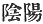
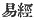
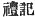
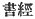

  
[Intangible Textual Heritage](../../index)  [Shinto](../index.md) 
[Index](index)  [Previous](kj003)  [Next](kj005.md) 

------------------------------------------------------------------------

[Buy this Book at
Amazon.com](https://www.amazon.com/exec/obidos/ASIN/B0028Y4SZY/internetsacredte.md)

------------------------------------------------------------------------

  
*The Kojiki*, translated by Basil Hall Chamberlain, \[1919\], at
Intangible Textual Heritage

------------------------------------------------------------------------

### III.

#### THE "CHRONICLES OF JAPAN."

It will have been gathered from what has been already said, and it is
indeed generally known, that the "Records of Ancient Matters" do not
stand alone. To say nothing of the "Chronicles of Old Matters of Former
Age" whose genuineness is disputed, there is another undoubtedly
authentic work with which no student of Japanese antiquity can dispense.
It is entitled *Nihon-Gi*, *i.e.*, "Chronicles of Japan," and is second
only in value to the "Records," which it has always excelled in popular
favour. It was completed in A.D. 720, eight years after the 'Records of
Ancient Matters" had been presented to the Empress Gem-miyo.

The scope of the two histories is the same; but the language of the
later one and its manner of treating the national traditions stand in
notable contrast to the unpretending simplicity \[20\] of the elder
word. Not only is the style (excepting in the Songs, which had to be
left as they were or sacrificed altogether) completely Chinese,—in fact
to a great extent a cento of well-worn Chinese

p. xxvii

phrases,—but the subject-matter is touched up, re-arranged, and
polished, so as to make the work resemble a Chinese history so far as
that was possible. Chinese philosophical speculations and moral precepts
are intermingled with the cruder traditions that had descended from
Japanese antiquity. Thus the naturalistic Japanese account of the
creation is ushered in by a few sentences which trace the origin of all
things to *Yin* and *Yang* (
), the Passive and Active Essences of Chinese
philosophy. The legendary Emperor Jim-mu is credited with speeches made
up of quotations from the "*Yi Ching*," [13](#fn_12.md) the "*Li Chi*," [14](#fn_13.md) and other standard Chinese works. A few
of the most childish of the national traditions are omitted, for
instance the story of the "White Hare of Inaba," that of the gods
obtaining counsel of a toad, and that of the hospitality which a
speaking mouse extended to the deity Master-of-the Great-Land. [15](#fn_14.md) Sometimes the original tradition is
simply softened down or explained away. A notable instance of this
occurs in the account of the visit of the deity Izanagi [16](#fn_15.md) to Hades, whither he goes in quest of his
dead wife, and among other things has to scale the "Even Pass (or Hill)
of Hades." [17](#fn_16.md) In the tradition
preserved in the "Records" and indeed even in the "Chronicles," this
pass or hill is mentioned as a literal geographical fact. But the
compiler of the latter work, whose object it was to appear and to make
his forefathers appear, as reasonable as a learned Chinese, acids a
gloss to the effect that "One account

p. xxviii

says that the Even Hill of Hades is no distinct place, but simply the
moment when breathing ceases at the time of death";—not a happy guess
certainly, for this pass is mentioned in connection with Izanagi's
return to the land of the living. In short we may say of this work what
was said of the Septuagint,—that it *rationalizes*.

Perhaps it will be asked, how can it have come to pass \[21\] that a
book in which the national traditions are thus unmistakably tampered
with, and which is moreover written in Chinese instead of in the native
tongue, has enjoyed such a much greater share of popularity than the
more genuine work?

The answer lies on the surface: the concessions made to Chinese notions
went far towards satisfying minds trained on Chinese models, while at
the same time the reader had his respect for the old native emperors
increased, and was enabled to preserve some sort of belief in the native
gods. People are rarely quite logical in such matters, particularly in
an early stage of society; and difficulties are glossed over rather than
insisted upon. The beginning of the world, for instance, or, to use
Japanese phraseology. the "separation of heaven and earth" took place a
long time ago; and perhaps, although there could of course be no
philosophical doubt as to the course of this event having been the
interaction of the Passive and Active Essences, it might also somehow be
true that Izanagi and Izanami (the "Male-Who-Invites" and the
"Female-Who-Invites") were the progenitor and progenitrix of Japan. Who
knows but what in them the formative principles may not have been
embodied, represented, or figured forth after a fashion not quite
determined, but none the less real? As a matter of fact, the

p. xxix

two deities in question have often been spoken of in Japanese books
under such designations as the "*Yin* Deity" and the "*Yang* Deity," and
in his Chinese Preface the very compiler of these "Records" lends his
sanction to the use of such phraseology, though, if we look closely at
the part taken by the gods in the legend narrated in Sect. IV, it would
seem but imperfectly applicable. If again early sovereigns, such as the
Empress Jin-gō, address their troops in sentences cribbed from the "*Shu
Ching*," [18](#fn_17.md) or, like the Emperor
Kei-kō, describe the Ainos in terms that would only suit the pages of a
Chinese topographer,—both these personages being supposed to have lived
prior to the opening up of intercourse with the continent of Asia,—the
anachronism was partly hidden by the fact of the work which thus
recorded their doings being itself written in the Chinese language,
where such phrases only sounded natural. In some instances, too, the
Chinese usage had so completely superseded the native \[22\] one as to
cause the latter to have been almost forgotten excepting by the members
of the Shintō priesthood. This happened in the case of the Chinese
method of divination by means of a tortoise-shell, whose introduction
caused the elder native custom of divination through the shoulder-blade
of a deer to fall into desuetude. Whether indeed this native custom
itself may not perhaps be traced back to still earlier continental
influence is another question. So far as any documentary information
reaches, divination through the shoulder-blade of a deer was the most
ancient Japanese method of ascertaining the will of the gods. The use of
the Chinese sexagenary cycle for counting years, months, and days is
another instance of the imported

p. xxx

usage having become so thoroughly incorporated with native habits of
mind as to make the anachronism of employing it when speaking of a
period confessedly anterior to the introduction of continental
civilization pass unnoticed. As for the (to a modern European) grotesque
notion of pretending to give the precise months and days of events
supposed to have occurred a thousand years before the date assigned to
the introduction of astronomical instruments, of observatories, and even
of the art of writing, that is another of those inconsistencies which,
while lying on the very surface, yet so easily escape the uncritical
Oriental mind. [19](#fn_18.md) Semi-civilized
people tire of asking questions, and to question antiquity, which fills
so great a place in their thoughts, is the last thing that would occur
to any of their learned men, whose mental attitude is characteristically
represented by Confucius when he calls himself "A transmitter and not a
maker, believing in and loving the ancients." [20](#fn_19.md) As regards the question of language,
standard Chinese soon became easier to understand than Archaic Japanese,
as the former \[23\] alone was taught in the schools and the native
language changed rapidly during the century or two that followed the
diffusion of the foreign tongue and civilization. We

p. xxxi

have only to call to mind the relative facility to most of ourselves of
a Latin book and of one written in Early English. Of course, as soon as
the principles of the Japanese *Renaissance* had taken hold of men's
minds in the eighteenth century, the more genuine, more national work
assumed its proper place in the estimation of students. But the
uncouthness of the style according to modern ideas, and the greater
amount of explanation of all sorts that is required in order to make the
"Records of Ancient Matters" intelligible, must always prevent them from
attaining to the popularity of the sister history. Thus, though
published almost simultaneously, the tendencies of the two works were
very different, and their fate has differed accordingly.

To the European student the chief value of the "Chronicles of Japan"
lies in the fact that their author, in treating of the so-called "Divine
Age," often gives a number of various forms of the same legend under the
heading of 'One account says," suffixed in the form of a note to the
main text. No phrase is more commonly met with in later treatises on
Japanese history than this,—"One account in the 'Chronicles of Japan'
says," and it will be met with occasionally in the Foot-notes to the
present translation. There are likewise instances of the author of the
"Chronicles" having preserved, either in the text or in "One account,"
traditions omitted by the compiler of the "Records." Such are, for
instance, the quaint legend invented to explain the fact that the sun
and moon do not shine simultaneously, [21](#fn_20.md) and the curious development of the legend
of the expulsion of the deity \[24\]

p. xxxii

\[paragraph continues\] *Susa-no-wo*
("Impetuous Male"), telling us of the hospitality which was refused to
him by the other gods when he appeared before them to beg for shelter.
Many of the Songs, too, in the "Chronicles" are different from those in
the "Records," and make a precious addition to our vocabulary of Archaic
Japanese. The prose text, likewise, contains in the shape of notes,
numbers of readings by which the pronunciation of words written
ideographically, or the meaning of words written phonetically in the
"Records" may be ascertained. Finally the "Chronicles" give us the
annals of seventy-two years not comprised in the plan of the "Records,"
by carrying down to A.D. 700 the history which in the "Records" stops at
the year 628. Although therefore it is a mistake

p. xxxiii

to assert, as some have done, that the "Chronicles of Japan" must be
placed at the head of all the Japanese historical works, their
assistance can in no wise be dispensed with by the student of Japanese
mythology and of the Japanese language. [22](#fn_21.md)

------------------------------------------------------------------------

### Footnotes

[xxvii:13](kj004.htm#fr_12.md)  .

[xxvii:14](kj004.htm#fr_13.md)  .

[xxvii:15](kj004.htm#fr_14.md) See Sects. XXI.,
XXVII and XXIII.

[xxvii:16](kj004.htm#fr_15.md) Rendered in the
English translation by "the Male-Who-Invites."

[xxvii:17](kj004.htm#fr_16.md) *Yomo tsu
Hira-Saka*.

[xxix:18](kj004.htm#fr_17.md)  .

[xxx:19](kj004.htm#fr_18.md) Details as to the
adoption by the Japanese of the Chinese system of computing time will be
found in the late Mr. Bramsen's "Japanese Chronological Tables," where
that lamented scholar brands "the whole system of fictitious dates
applied in the first histories of Japan," as one of the greatest
literary frauds over perpetrated, from which we may infer how little
trust can be placed in the early Japanese historical works. See also
Motowori's "Inquiry into the True Chronology," pp. 33-36, and his second
work on the same subject entitled "Discussion of the Objections to the
Inquiry into the True Chronology," pp. 46 *et seq.*

[xxx:20](kj004.htm#fr_19.md) "Confucian Analects,"
Book VII. Chap. I. Dr. Legge's translation.

[xxxi:21](kj004.htm#fr_20.md) It may perhaps be
worth while to quote this legend in full. It is as follows: p. xxxii

"One account says that the Heaven-Shining Great Deity, being in Heaven
said: 'I hear that in the Central Land of Reed-Plains (*i.e.* Japan)
there is a Food-Possessing Deity. Do, thou, Thine Augustness Moon-Night
Possessor, go and see.' His Augustness the Moon-Night Possessor, having
received these orders, descended \[to earth\], and arrived at the place
where the Food-Possessing Deity was. The Food-Possessing Deity
forthwith, on turning her head towards the land, produced rice from her
mouth; again, on turning to the sea, she also produced from her mouth
things broad of fin and things narrow of fin; again, on turning to the
mountains, she also produced from her mouth things rough of hair and
things soft of hair. Having collected together all these things, she
offered them \[to the Moon-God\] as a feast on a hundred tables. At this
time His Augustness the Moon-Night-Possessor, being angry and colouring
up, said: 'How filthy! how vulgar! What! shalt thou dare to feed me with
things spat out from thy mouth?' \[and with these words\], he drew his
sabre and slew her. Afterwards he made his report \[to the
Sun-Goddess\]. When he told her all the particulars, the Heaven-Shining
Great Deity was very angry, and said: 'Thou art a wicked Deity, whom it
is not right for me to see;'—and forthwith she and His Augustness the
Moon-Night-Possessor dwelt separately day and night." The partly
Parallel legend given in these "Records" forms the subject of Sect. XVII
of the Translation.

[xxxiii:22](kj004.htm#fr_21.md) Compare Mr. Satow's
remarks on this subject in Vol. III, Pt. I, pp. 21-23 of these
"Transactions."

------------------------------------------------------------------------

[Next: IV. Manners and Customs of the Early Japanese](kj005.md)
