  
[Intangible Textual Heritage](../../index)  [Shinto](../index.md) 
[Index](index)  [Previous](kj004)  [Next](kj006.md) 

------------------------------------------------------------------------

[Buy this Book at
Amazon.com](https://www.amazon.com/exec/obidos/ASIN/B0028Y4SZY/internetsacredte.md)

------------------------------------------------------------------------

  
*The Kojiki*, translated by Basil Hall Chamberlain, \[1919\], at
Intangible Textual Heritage

------------------------------------------------------------------------

### IV.

#### MANNERS AND CUSTOMS OF THE EARLY JAPANESE.

The Japanese of the mythical period, as pictured in the legends
preserved by the compiler of the "Records of Ancient Matters," were a
race who had long emerged from the savage state, and had attained to a
high level of barbaric skill. The Stone Age was forgotten by them—or
nearly so,—and the evidence points to their never having passed through
a genuine Bronze Age, though the knowledge of bronze was at a later
period introduced from the neighbouring continent. They used iron for
\[25\] manufacturing spears, swords, and knives of various shapes, and
likewise for the more peaceful purpose of making hooks wherewith to
angle, or to fasten the doors of their huts. Their other warlike and
hunting implements (besides traps and gins, which appear to have been
used equally for catching beasts and birds and for destroying human
enemies) were bows and elbow-pads,—the latter seemingly of skin, while
special allusion is made to the fact that the arrows were feathered.
Perhaps clubs should be added to the list. Of the bows and arrows,
swords and knives, there is perpetual mention; but nowhere do we hear of
the tools

p. xxxiv

with which they were manufactured, and there is the same remarkable
silence regarding such widely spread domestic implements as the saw and
the axe, We hear, however, of the pestle and fire-drill, of the wedge,
of the sickle, and of the shuttle used in weaving.

Navigation seems to have been in a very elementary stage. Indeed the art
of sailing was, as we know from the classical literature of the country,
but little practised in Japan even so late as the middle of the tenth
century of our era subsequent to the general diffusion of Chinese
civilization, though rowing and punting are often mentioned by the early
poets. In one passage of the "Records" and in another of the
"Chronicles," mention is made of a "two-forked boat" used on inland
pools or lakes; but, as a rule, in the earlier portions of those works,
we read only of people going to sea or being sent down from heaven in
water-proof baskets without oars, and reaching their destination not
through any efforts of their own, but through supernatural
inter-position. [23](#fn_22.md)

To what we should call towns or villages very little
\[[26](errata.htm#1.md)\] reference is made anywhere in the "Records" or in
that portion of the "Chronicles" which contains the account of the
so-called "Divine Age." But from what

p. xxxv

we learn incidentally, it would seem that the scanty population was
chiefly distributed in small hamlets and isolated dwellings along the
coast and up the course of the larger streams. Of house-building there
is frequent mention,—especially of the building of palaces or temples
for sovereigns or gods,—the words "palace" and "temple" being (it should
be mentioned) represented in Japanese by the same term. Sometimes, in
describing the construction of such a sacred dwelling, the author of the
"Records," abandoning his usual fiat and monotonous style, soars away on
poetic wings, as when, for instance, he tells how the monarch of Idzumo,
on abdicating in favour of the Sun-Goddess's descendant, covenanted that
the latter should "make stout his temple pillars on the nethermost
rock-bottom, and make high the cross-beams to the plain of High
Heaven." [24](#fn_23.md) It must not, however, be
inferred from such language that these so-called palaces and temples
were of very gorgeous and imposing aspect. The more exact notices to be
culled from the ancient Shintō Rituals (which are but little posterior
to the "Records" and in no wise contradict the inferences to be drawn
from the latter) having been already summarized by Mr. Satow, it may be
as well to quote that gentleman's words. He says: [25](#fn_24.md) "The palace of the Japanese sovereign was
a wooden hut, with its pillars planted in the ground, instead of being
erected upon broad fiat stories as in modern buildings. The whole
frame-work, consisting of posts, beams, rafters, door-posts and
window-frames, was tied together with cords made by twisting the long
fibrous stems of climbing plants, such as Pueraria

p. xxxvi

\[paragraph continues\] Thunbergiana
(*kuzu*) and Wistaria Sinensis (*fuji*), The floor must have been low
down, so that the occupants of the building, as they squatted or lay on
their mats, were exposed to the stealthy attacks of venomous snakes,
which were probably far more numerous in the earliest ages when the
country was for the most part uncultivated, than at the present day . .
. There seems some reason to think that the *yuka*, here translated
floor, was originally nothing but a couch which ran round the sides of
the hut, the rest \[27\] of the space being simply a mud-floor, and that
the size of the couch was gradually increased until it occupied the
whole interior. The rafters projected upward beyond the ridge-pole,
crossing each other as is seen in the roofs of modem Shin-tau temples,
whether their architecture be in conformity with early traditions (in
which case all the rafters are so crossed) or modified in accordance
with more advanced principles of construction, and the crossed rafters
retained only as ornaments at the two ends of the ridge. The roof was
thatched, and perhaps had a gable at each end, with a hole to allow the
smoke of the wood-fire to escape, so that it was possible for birds
flying in and perching on the beams overhead, to defile the food, or the
fire with which it was cooked." To this description it need only be
added that fences were in use, and that the wooden doors, sometimes
fastened by means of hooks, resembled those with which we are familiar
in Europe rather than the sliding, screen-like doors of modem Japan. The
windows seem to have been mere holes. Rugs of skins and rush matting
were occasionally brought in to sit upon, and we even hear once or twice
of "silk rugs" being used for the same purpose by the noble and wealthy.

p. xxxvii

The habits of personal cleanliness which so pleasantly distinguish the
modern Japanese from their neighbours, in continental Asia, though less
fully developed than at present, would seem to have existed in the germ
in early times, as we read more than once of bathing in rivers, and are
told of bathing-women being specially attached to the person of a
certain imperial infant. Lustrations, too, formed part of the religious
practices of the race. Latrines are mentioned several times. They would
appear to have been situated away from the houses and to have generally
been placed over a running stream, whence doubtless the name for latrine
in the Archaic Dialect, *kaha-ya* *i.e.* "river house." A well-known
Japanese classic of the tenth century. the "Yamato Tales," [26](#fn_25.md) tells us indeed that "in older days the
people dwelt in houses raised on platforms built out on the river
Ikuta," and goes on to relate a story which presupposes such a method of
architecture. [27](#fn_26.md) A passage in the
account of the reign of the Emperor Jim-mu which occurs both in the
"Records" and in the "Chronicles," and another in the reign of the
Emperor Sui-nin occurring in the "Records" only, might be interpreted so
as to support this statement. [28](#fn_27.md) But
both are extremely obscure, and beyond the fact that people who
habitually lived near the water may have built their houses after the
aquatic fashion practised in different parts of the world by certain
savage tribes both ancient and modem, the present writer is not aware of
any authority for the assertion that they actually

p. xxxviii

did so except the isolated passage in the "Yamato Tales" just quoted.

A peculiar sort of dwelling-place which the two old histories bring
prominently under our notice, is the so called "Parturition-house,"—a
one-roomed hut without windows which a woman was expected to build and
retire into for the purpose of being delivered unseen. [29](#fn_28.md) It would also appear to be not unlikely
that newly-married couples retired into a specially built hut for the
purpose \[29\] of consummating the marriage, and it is certain that

p. xxxix

for each sovereign a new palace was erected on his accession.

Castles are not distinctly spoken of till a period which, though still
mythical in the opinion of the present writer, coincides according to
the received chronology with the first century B. C. We then first meet
with the curious term "rice-castle," whose precise signification is a
matter of dispute among the native commentators, but which, on
comparison with Chinese descriptions of the Early Japanese, should
probably be understood to mean a kind of palisade serving the purpose of
a redoubt, behind which the warriors could ensconce themselves. [30](#fn_29.md) If this conjecture be correct, we have
here a good instance of a word, so to speak, moving upward with the
march of civilization, the term, which formerly denoted something not
much better than a fence, having later come to convey the idea of a
stone castle.

To conclude the subject of dwelling-places, it should be stated that
cave-dwellers are sometimes alluded to. The legend of the retirement of
the Sun-Goddess into a cavern may possibly suggest to some the idea of
an early period when such habitations were the normal abodes of the
ancestors of the Japanese race. [31](#fn_30.md) But
at the time when the national traditions assumed their present shape,
such a state of things had certainly quite passed away, if it ever
existed, and only barbarous Ainos and rough bands of robbers are
credited with the construction of such primitive retreats. Natural caves

p. xl

\[paragraph continues\] (it may be well to
state) are rare in Japan, and the caves that are alluded to were mostly
artificial, as may be gathered from the context.

The food of the Early Japanese consisted of fish and of the flesh of the
wild creatures which fell by the hunter's arrow or were taken in the
trapper's snare,—an animal diet with which Buddhist prohibitions had not
yet interfered, as they began to do in early historical times. Rice is
the only cereal of which there is such mention made as to place it
beyond a doubt that its \[30\] cultivation dates back to time
immemorial. Beans, millet, and barley are indeed named once, together
with silkworms, in the account of the "Divine Age." [32](#fn_31.md) But the passage has every aspect of an
interpolation in the legend, perhaps not dating back long before the
time of the eighth century compiler. A few unimportant vegetables and
fruits, of most of which there is but a single mention, will be found in
the list of plants given below. The intoxicating liquor called *sake*
was known in Japan during the mythical period [33](#fn_32.md) and so were chopsticks for eating the
food with. Cooking-pots and cups and dishes—the latter both of
earthenware and of leaves of trees,—are also mentioned; but of the use
of fire for warming purposes we hear nothing. Tables are named several
times, but never in connection with food. They would seem to have been
exclusively used for the purpose of presenting offerings on, and were
probably quite small and low,—in fact rather trays than tables according
to European ideas.

In the use of clothing and the specialization of garments

p. xli

the Early Japanese had reached a high level. We read in the most ancient
legends of upper garments, skirts, trowsers, girdles, veils, and hats,
while both sexes adorned themselves with necklaces, bracelets, and
head-ornaments of stones considered precious,—in this respect offering a
striking contrast to their descendants in modern times, of whose attire
jewelry forms no part. The material of their clothes was hempen cloth
and paper-mulberry bark, coloured by being rubbed with madder, and
probably with woad and other tinctorial plants. All the garments, so far
as we may judge, were woven, sewing being nowhere mentioned, and it
being expressly stated by the Chinese commentator on the "*Shan Hai
Ching*," [34](#fn_33.md) who wrote early in the
fourth century, that the Japanese had no needles. [35](#fn_34.md) From the great place which the chase
occupied in daily life we are led to suppose that skins also were used
to make garments of. There is in the "Records" at least one passage
which favours this supposition, [36](#fn_35.md) and
the "Chronicles" in one place mention the straw rain-coat and
broad-brimmed hat, which still form the \[31\] Japanese peasant's
effectual protection against the inclemencies of the weather. The
tendrils of creeping plants served the purposes of string, and bound the
warrior's sword round his waist. Combs are mentioned, and it is evident
that much attention was devoted to the dressing of the hair. The men
seem to have bound up their hair in two bunches, one on each side of the
head, whilst the young boys tied theirs into a topknot, the unmarried
girls let their locks hang down over their necks, and the

p. xlii

married women dressed theirs after a fashion which apparently combined
the two last-named methods. There is no mention in any of the old books
of cutting the hair or beard except in token of disgrace; neither do we
gather that the sexes, but for this matter of the headdress, were
distinguished by a diversity of apparel and ornamentation.

With regard to the precious stones mentioned above as having been used
as ornaments for the head, neck, and arms, the texts themselves give us
little or no information as to the identity of the stones meant to be
referred to. Indeed it is plain (and the native commentators admit the
fact) that a variety of Chinese characters properly denoting different
sort of jewels were used indiscriminately by the early Japanese writers
to represent the single native word *tama* which is the only one the
language contains to denote any hard substance on which a special value
is set, and which often refers chiefly to the rounded shape, so that it
might in fact be translated by the word "bead" as fittingly as by the
word "jewel." We know, however, from the specimens which have rewarded
the labours of archaeological research in Japan that agate, crystal,
glass, jade, serpentine, and steatite are the most usual materials, and
carved and pierced cylindrical shapes (*maga-tama* and *kuda-tama*), the
commonest forms. [37](#fn_36.md)

The horse (which was ridden, but not driven), the

p. xliii

barn-door fowl, and the cormorant used for fishing) are the only
domesticated creatures mentioned in the earlier traditions, with the
doubtful exception of the silkworm, to \[32\] which reference has
already been made. [38](#fn_37.md) In the later
portions of the "Records" and "Chronicles," dogs and cattle are alluded
to; but sheep, swine, and even cats were apparently not yet introduced.
Indeed sheep were scarcely to be seen in Japan until a few years ago,
goats are still almost unknown, and swine and all poultry excepting the
barn-door fowl extremely uncommon.

The following enumeration of the animals and plants mentioned in the
earlier portion [39](#fn_38.md) of the "Records"
may be of interest. The Japanese equivalents, some few of which are
obsolete, are put in parenthesis, together with the Chinese characters
used to write them:

### MAMMALS.

Bear, (*kuma*  ).  
Boar, (*wi*  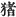).  
Deer, (*shika*  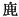).  
Hare, (*usagi*  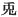).  
Horse, (uma  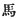 and *koma*
 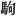).  
Mouse or Rat (*nedzumi* 
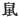).  
"Sea-ass" \[Seal or Sea-lion?\] (*michi* 
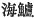).  
Whale, (*kujira*  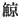).

p. xliv

### BIRDS.

Barndoor-fowl, (*kake* 
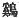).  
Cormorant, (*u*  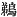).  
Crow or Raven, (*karasu* 
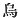).  
Dotterel *or* Plover *or* Sand-piper, (*chidori*  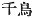).  
Heron *or* Egret (*sagi* 
).  
Kingfisher (*soni-dori* 
), *Nuye* (
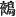). [40](#fn_39.md)  
Pheasant (*kigishi* 
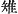).  
Snipe, (*shigi*  ).  
Swan, (*shiro-tori*  )  
Wild-duck, (*kamo*  ).  
Wild-goose, (*kari*  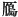).

### REPTILES.

Crocodile, (*wani* 
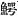). [41](#fn_40.md)  
Tortoise (*kame*  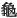).  
Toad *or* Frog, (*taniguku*, written phonetically).  
Serpent, (*worochi* 
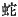).  
Snake \[smaller than the preceding\], (*hemi*  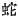).

### INSECTS.

Centipede, (*mukade* 
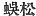).  
Dragon-fly, (*akidzu* 
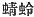).  
Fly, (*hahi*  ).  
Louse, (*shirami*  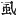).  
Silk-worm, (*kahiko* 
).  
Wasp *or* Bee, (*hachi* 
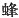).

### FISHES, ETC.

*Pagrus cardinalis* \[probably\], (*aka-dahi*  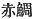) \[or perhaps the *Pagrus
cardinalis* (*tai*  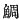) is
intended.\]  
Perch \[*Percalabrax japonicus*\] (*su-dzuki*  ).  
Beche-de-mer \[genus *Pentacta*\] (*ko* 
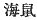).  
Medusa, (*kurage*, written phonetically).

p. xlv

### SHELLS.

*Arca Subcrenata* \[?\] (*hirabu-kahi*, written phonetically).  
Cockle \[*Arca Inflata*\] (*kisa-gahi* 
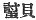).  
*Turbinidæ* \[a shell of the family\] (*shitadami*  ).

### PLANTS.

*Ampelopsis serianæfolia* \[?\] (*kaga-mi* 
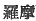).  
*Aphanarthe aspera*, (*muku*, written phonetically).  
*Aucuba japonica* \[probably\] *aha-gi*, written phonetically).  
Bamboo, (*take*  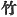).  
Bamboo-grass \[*Bambusa chino*\], (*sasa* 
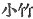).  
Barley \[or wheat?\], (*mugi* 
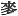).  
Beans \[two kinds, viz., *Soja glycine* and *Phaselus radiatus* (the
general name is *mame* 
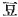, that of the latter species in particular *adzuki*
 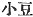).  
Bulrush \[*Typha japonica*\] (*kama* 
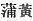).  
Bush-clover \[*Lespedeza* of various species\], (*hagi*  ).  
*Camellia japonica* (*tsuba-ki* 
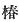).  
Cassia \[Chinese mythical; or perhaps the native *Cercidiphyllum
japonica*\], (*katsura*, variously written).  
*Chamæcyparis obtusa*, (*hi-no-ki* 
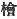)  
*Cleyera japonica* \[and another allied but undetermined species)
(*saka-ki*  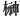).  
Clubmoss, (*hi-koge* 
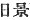).  
*Cocculus thunbergi* \[probably\] (*tsu-dzura*  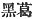).  
*Cryptomeria japonica*, (*sugi* 
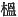).  
*Eulalia japonica* (*kaya* 
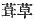).  
*Evonymus japonica*, (*masa-ki* 
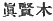).  
Ginger, \[or perhaps the *Xanthoxylon* is intended\] (*hazhikami*  ).  
*Halocholoa macrantha* \[but it is not certain that this is the sea-weed
intended\] (*komo*  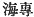).  
Holly \[or rather the *Olea aquifolium*, which closely resembles
holly\], (*hihira-gi* 
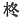).  
Knot-grass \[*Polygonum tinctorium*\] *(awi*  ).  
Lily, (*sawi* written phonetically, *yamayuri-gusa*  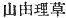, and *saki-kusa*  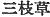).  
Madder. (*akane*  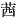).  
Millet \[*Panicum italicum*\], (*aha* 
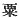).  
Moss, (*koke*  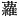).  
Oak (two species, one evergreen and one deciduous,—*Quercus
myrsinæfolia*, *Q. dentata* (*kashi* 
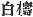, *kashiwa* 
).  
Peach, (*momo*  ).  
*Photinia glabra* \[?\], (*soba*, written phonetically).  
Pine-tree, (*matsu* 
).  
*Pueraria thumbergiana*, (*kudzu* 
).  
Reed, (*ashi*  ).  
Rice, (*ine*  ).  
Sea-weed \[or the original term may designate a particular species\],
(*me*  ).  
Sedge \[*Scriptus marintimus*\], (*suge* 
).  
Spindle-tree \[*Evonymus radians*\], (*masaki no kadzura*  ).  
Vegetable Wax-tree \[*Rhus succedanea*\], (*hazhi*  ).  
Vine, (*yebi-kadsura* 
). p. xliv  
Wild cherry \[or birch?\], (*hahaka* 
).  
Wild chive \[or rather the *allium* and *odorum*, which closely
resembles it\], (*ka-mira* 
).  
Winter-cherry \[*Physalis alkekengi*\] *aka-kagachi* written
phonetically, also (*hohodzuki* 
).

The later portions of the work furnish in addition the following:—

### ANIMALS.

Cow (*ushi*  ).  
Dog, (*inu*  ).  
Crane, \[genus *Grus*\] (*tadzu* 
).  
\[35\] Dove *or* Pigeon, (*hato* 
).  
Grebe, (*niho-dori* 
).  
Lark, (*hibari*  ).  
Peregrine falcon, (*hayabusa* 
).  
Red-throated quail (*udzura* 
)  
Tree-sparrow (*susume* 
).  
Wag-tail, \[probably\] (*mana-bashira*), written phonetically.  
Wren, (*sazaki*  ).  
Dolphin, (*iruka*  ).  
Trout, \[*Plecoglossus altivelis*\] (*ayu* 
).  
Tunny, \[a kind of, viz. *Thynnus sibi*\] (*shibi*  ).  
Crab, (*kani*  ).  
Horse-fly (*amu*  ).  
Oyster (*kaki*)  .

### PLANTS.

Alder \[*Alnus maritima*\] (*hari-no-ki* 
).  
Aralia (*mi-tsuna gashiwa* 
).  
*Brasenia peltata* (*nunaha*) 
.  
Cabbage \[*brassica*\] (*aona* 
).  
*Catalpa Kaempfri* \[but some say the cherry is meant (*adzusa*  ).  
Chestnut (*kuri*  ).  
*Dioscorea quinqueloba* (*tokoro-dzura* 
).  
*Evonymus sieboldianus* *mayumi* 
)  
Gourd (*hisago*  ).  
*Hedysarum esculentum* (*wogi* 
).  
*Hydropyrum latifolium* (*komo* 
).  
*Kadzura japonica* (*sen kadzura* 
).  
*Livistona sinensis* (*aji-masa* 
).  
Lotus \[*nelumbium*\] (*hachisu* 
).  
Musk-melon (*hozoahi* 
).  
Oak, \[three species, *Quercus serrata* (*kunugi*  ) and *Q. glandifera* (*nara*
 ), both deciduous; *Q.
gilva* (*ichihi*  )
\[evergreen\].  
Orange (*tachibana* 
).  
*Podocarpus macrophylla* (*maki* 
).  
Radish, \[*Raphanus sativus*\] (*oho-ne* 
).  
*Sashibu* (written phonetically) \[not identified\].  
Water caltrop, \[*Trapa bispinosa*\] (*hishi*  ).  
Wild garlic \[*Allium nipponicum*\] (*nubiru*  ).  
*Zelkowa keaki* \[probably\] (*tsuki* 
).

p. xlvii

A few more are probably preserved in the names of places. Thus in
Shinano, the name of a province, we seem to have the *shina* (*Tilia
cordata*), and in Tadetsu the *tade* (*Polygonum japonicum*). But the
identification in these cases is mostly uncertain. It must also be
remembered that, as in the case of all non-scientific nomenclatures,
several species, and occasionally even more than one genus, are included
in a single Japanese term. The *chi-dori* (here always rendered
"dotterel") is the name of any kind of sand-piper, plover or dotterel.
*Kari* is a general name applied to geese, but not to all the species,
and also to the great bustard. Again it should not be forgotten that
there may have been, and probably were, in the application of some of
these terms, differences of usage between the present day and eleven or
twelve centuries ago. Absolute precision is therefore not
attainable. [42](#fn_41.md)

Noticeable in the above lists is the abundant mention of plant-names in
a work which is in no ways occupied with botany. Equally noticeable is
the absence of some of those which are most common at the present day,
such as the tea-plant and the plum-tree, while of the orange we are
specially informed that it was introduced from abroad. [43](#fn_42.md) The difference between the various stones
and metals seems, on the other hand, to have attracted \[36\] very
little attention from the Early Japanese. In late

p. xlviii

times the chief metals were named mostly according to their colour, as
follows:

|                           |           |
|---------------------------|-----------|
| Yellow metal              | (gold).   |
| White metal               | (silver). |
| Red metal                 | (copper). |
| Black metal               | (iron).   |
| Chinese (or Korean) metal | (bronze). |

But in the "Records" the only metal of which it is implied that it was
in use from time immemorial is iron, while "various treasures dazzling
to the eye, from gold and silver downwards," are only referred to once
as existing in the far-western land of Korea. Red clay is the sole kind
of earth specially named.

Black.  
Blue (including Green).  
Red.  
Piebald (of horses).  
White.

Yellow is not mentioned (except in the foreign Chinese phrase "the
Yellow Stream," signifying Hades, and not to be counted in this
context), neither are any of the numerous terms which in Modem Japanese
serve to distinguish delicate shades of colour. We hear of the "blue (or
green) (*i.e.* black [44](#fn_43).md) clouds" and
also of the "blue (or green), sea"; but the "blue sky" is conspicuous by
its absence here as in so many other early literatures, though strangely
enough it does occur in the oldest written monuments of the Chinese.

With regard to the subject of names for the different degrees of
relationship,—a subject of sufficient interest

p. xlix

to the student of sociology to warrant its being discussed at some
length,—it may be stated that in modern Japanese parlance the categories
according to which relationship is conceived of do not materially differ
from those that are current in Europe. Thus we find father, grandfather,
great-grandfather, uncle, nephew. stepfather, stepson, father-in-law,
and the corresponding terms for females,—mother, grandmother etc.,—as
well as such vaguer designations as parents, ancestors, cousins, and
kinsmen, The only striking difference is that brothers and sisters,
instead of being considered as all mutually related in the same manner,
are divided into two categories, viz:

|          |                                                   |                     |
|----------|---------------------------------------------------|---------------------|
| *Ani*    |   | elder brother(s),   |
| *Otouto* |   | younger brother(s), |
| *Ane*    |   | elder sister(s),    |
| *Imouto* |   | younger sister(s).  |

in exact accordance with Chinese usage.

Now in Archaic times there seems to have been a different and more
complicated system, somewhat resembling that which still obtains among
the natives of Korea, and which the introduction of Chinese ideas and
especially the use of the Chinese written characters must have caused to
be afterwards abandoned. There are indications of it in some of the
phonetically written fragments of the "Records." But they are not of
themselves sufficient to furnish a satisfactory explanation, and the
subject has puzzled the native *literati* themselves. Moreover the
English language fails us at this point, and elder and younger brother,
elder and younger sister are the only terms at the translator's command.
It may therefore be as well to quote *in extenso* Motowori's elucidation
of the Archaic usage to be found

p. l

in vol. XIII, p. 63-4 of his "Exposition of the Records of Ancient
Matters." [45](#fn_44.md) He says: "Anciently, when
brothers and sisters were spoken of, the elder brother was called *se*
or *ani* in contradistinction to the younger brothers and younger
sisters, and the younger brother also was called *se* in
contradistinction to the elder sister. The elder sister was called *ane*
in contradistinction to the younger sister, and the younger brother also
would use the word *ane* in speaking of his elder sister himself. The
younger brother was called *oto* in contradistinction to the elder
brother, and the younger sister also was called *oto* in
contradistinction to the elder sister. The younger sister was called
*imo* in contradistinction to the elder brother, and the elder sister
also was called *imo* in \[38\] contradistinction to the younger
brother. It was also the custom among brothers and sisters to use the
words *iro-se* for *se*, *iro-ne* for *ane*, and *iro-do* for *oto*, and
analogy forces us to conclude that *iro-mo* was used for *imo*."
(Motowori elsewhere explains *iro* as a term of endearment identical
with the word *iro*, "love"; but we may hesitate to accept this view.)
It will be observed that the foundation of this system of nomenclature
was a subordination of the younger to the elder-born modified by a
subordination of the females to the males. In the East, especially in
primitive times, it is not "*Place aux dames*," but "*Place aux
messieurs*."

Another important point to notice is that, though in a few passages of
the "Records" we find a distinction drawn between the chief and the
secondary wives, perhaps nothing more than the favorite or better-born,

p. li

and the less well-born, are meant to be thus designated,—yet not only is
this distinction not drawn throughout, but the wife is constantly spoken
of as *imo*, *i.e.* "younger sister." It fact sister and wife were
convertible terms and ideas; and what in a later stage of Japanese, as
of Western, civilization is abhorred as incest was in Archaic Japanese
times the common practice. We also hear of marriages with half-sisters,
with stepmothers, and with aunts; and to wed two or three sisters at the
same time was a recognized usage. Most such unions were naturally so
contrary to Chinese ethical ideas, that one of the first traces of the
influence of the latter in Japan was the stigmatizing of them as incest;
and the conflict between the old native custom and the imported moral
code is seen to have resulted in political troubles. [46](#fn_45.md) Marriage with sisters was naturally the
first to disappear, and indeed it is only mentioned in the legends of
the gods; but unions with half-sisters, aunts, etc., lasted on into the
historic epoch. Of exogamy, such as obtains in China, there is no trace
in any Japanese document, nor do any other artificial impediments seem
to have stood in the way of the free choice of the Early Japanese man,
who also (in some cases at least) received a dowry with his bride or
brides.

\*          \*          \*

If, taking as our guides the incidental notices which are scattered up
and down the pages of the earlier \[39\] portion of the "Records" we
endeavour to follow an Archaic Japanese through the chief events of his
life

p. lii

from the cradle to the tomb, it will be necessary to begin by recalling
what has already been alluded to as the 'parturition-house' built by the
mother, and in which, as we are specially told that it was made
windowless, it would perhaps be contradictory to say that the infant
first saw the light. Soon after birth a name was given to it,—given to
it by the mother,—such name generally containing some appropriate
personal reference. In the most ancient times each person (so far as we
can judge) bore but one name, or rather one string of words compounded
together into a sort of personal designation. But already at the dawn of
the historical epoch we are met by the mention of surnames and of what,
in the absence of a more fitting word, the translator has ventured to
call "gentile names," bestowed by the sovereign as a recompense for some
noteworthy deed. [47](#fn_46.md)

It may be gathered from our text that the idea of calling in the
services of wet-nurses in exceptional case had already suggested itself
to the minds of the ruling class, whose infants were likewise sometimes
attended by special bathing-women. To what we should call education,
whether mental or physical, there is absolutely no reference made in the
histories. All that can be inferred is that, when old enough to do so,
the boys began to follow one of the callings of hunter or fisherman,

p. liii

while the girls staid at home weaving the garments of the family. There
was also a great deal of fighting, generally of a treacherous kind, in
the intervals of which the warriors occupied themselves in cultivating
patches of ground. The very little which is to be gathered concerning
the treatment of old people would seem to indicate that they were well
cared for.

We are nowhere told of any wedding ceremonies except the giving of
presents by the bride or her father, the probable reason being that no
such ceremonies \[40\] existed. Indeed late on into the Middle Age
cohabitation alone constituted matrimony,—cohabitation often secret at
first, but afterwards acknowledged, when, instead of going round under
cover of night to visit his mistress, the young man brought her back
publicly to his parents' house. Mistress, wife, and concubine were thus
terms which were not distinguished, and the woman could naturally be
discarded at any moment. She indeed was expected to remain faithful to
the man with whom she had had more than a passing intimacy, but no
reciprocal obligation bound him to her. Thus the wife of one of the gods
is made to address her husband in a poem which says:

"Thou . . . indeed, being a man, probably hast on the various
island-headlands that thou seest, and on every beach-headland that thou
lookest on, a wife like the young herbs. But I, alas! being a woman,
have no spouse except thee," etc., etc. [48](#fn_47.md)

In this sombre picture the only graceful touch is the custom which
lovers or spouses had of tieing each other's girdles when about to part
for a time,—a ceremony by

p. liv

which they implied that they would be constant to each other during the
period of absence. [49](#fn_48.md) What became of
the children in cases of conjugal separation does not clearly appear. In
the only instance which is related at length, we find the child left
with the father; but this instance is not a normal one. [50](#fn_49.md) Adoption is not mentioned in the earliest
traditions; so that when we meet with it later on we shall probably be
justified in tracing its introduction to Chinese sources.

Of death-bed scenes and dying speeches we hear but little, and that
little need not detain us. The burial rites are more important. The
various ceremonies observed on such an occasion are indeed not
explicitly detailed. But we gather thus much: that the hut tenanted by
the deceased was abandoned,—an ancient custom to whose former existence
the removal of the capital at the commencement of each reign long \[41\]
continued to bear witness,—and that the body was first deposited for
some days in a "mourning-house," during which interval the survivors
(though their tears and lamentations are also mentioned) held a
carousal, feasting perhaps on the food which was specially prepared as
an offering to the dead person. Afterwards, the corpse was interred,
presumably in a wooden bier, as the introduction of stone tombs is
specially noted by the historian as having taken place at the end of the
reign of the Emperor Sui-nin, and was therefore believed by those who
handed down the legendary history to have been a comparatively recent
innovation, the date assigned to this monarch by the author of the
"Chronicles" coinciding

p. lv

with the latter part of our first, and the first half of our second
centuries. To a time not long anterior is attributed the abolition of a
custom previously observed at the interments of royal personages. This
custom was the burying alive of some of their retainers in the
neighbourhood of the tomb. We know also, both from other early literary
sources and from the finds which have recently rewarded the labours of
archaeologists, that articles of Clothing, ornaments, etc., were buried
with the corpse. it is all the more curious that the "Records" should
nowhere make any reference to such a custom, and is a proof (if any be
needed) of the necessity of not relying exclusively on any single
authority, however respectable, if the full and true picture of Japanese
antiquity is to be restored. A few details as to the abolition of the
custom of burying retainers alive round their master's tomb, and of the
substitution for this cruel holocaust of images in clay will be found in
Sect. LXIII, Note 23, and in Sect. LXXV, Note 4, of the following
translation. [51](#fn_50.md) If the custom be one
which is properly included under the heading of human sacrifices, it is
the only form of such sacrifices of which the earliest recorded Japanese
social state retained any trace. The absence of slavery is another
honourable feature. On the other hand, the most cruel punishments were
dealt out to enemies and wrongdoers. Their nails were extracted, the
sinews of their knees were cut, they were buried up to the neck so that
their eyes burst, etc. Death, too, was inflicted for the \[42\]

p. lvi

most trivial offences. Of branding, or rather tattooing, the face as a
punishment there are one or two incidental mentions. But as no tattooing
or other marking or painting of the body for any other purpose is ever
alluded to, with the solitary exception in one passage of the painting
of her eyebrows by a woman, it is possible that the penal use of
tattooing may have been borrowed from the Chinese, to whom it was not
unknown.

The shocking obscenity of word and act to which the "Records" bear
witness is another ugly feature which must not quite be passed over in
silence. It is true that decency, as we understand it, is a very modern
product, and is not to be looked for in any society in the barbarous
stage. At the same time, the whole range of literature might perhaps be
ransacked in vain for a parallel to the naïve filthiness of the passage
forming Sect. IV of the following translation, or to the extraordinary
topic which the hero Yamato-Take and his mistress Miyazu are made to
select as the theme of poetical repartee. [52](#fn_51.md) One passage likewise would lead us to
suppose that the most beastly crimes were commonly committed. [53](#fn_52.md)

To conclude this portion of the subject, it may be useful for the sake
of comparison to call attention to a few arts and products with which
the early Japanese were *not* acquainted, Thus they had no tea, no fans,
no porcelain, no lacquer,—none of the things, in fact, by which in later
times they have been chiefly known. They did not yet use vehicles of any
kind. They had no accurate method of computing time, no money, scarcely
any

p. lvii

knowledge of medicine. Neither, though they possessed some sort of
music, and poems a few of which at least are not without merit, [54](#fn_53.md) do we hear anything of the art of
drawing. But the most important art of which they were ignorant is that
of writing. As some misapprehension has existed on this head, and
scholars in \[43\] Europe have been misled by the inventions of zealous
champions of the Shintō religion into a belief in the so-called "Divine
Characters," by them alleged to have been invented by the Japanese gods
and to have been used by the Japanese people prior to the introduction
of the Chinese ideographic writing, it must be stated precisely that all
the traditions of the "Divine Age," and of the reigns of the earlier
Emperors down to the third century of our era according to the received
chronology, maintain a complete silence on the subject of writing
materials, and records of every kind. Books are nowhere mentioned till a
period confessedly posterior to the opening up of intercourse with the
Asiatic continent, and the first books whose names occur are the "Lun
Yü" and the "Ch'ien Tzŭ Wên," [55](#fn_54.md) which
are said to have been brought over to Japan during the reign of the
Emperor Ō-jin,—according to the same chronology in the year 284 after
Christ. That even

p. lviii

this statement is antedated, is shown by the fact that the "Ch'ien Tzŭ
Wên," was not written till more than two centuries later,—a fact which
is worthy the attention of those who have been disposed simply to take
on trust the assertions of the Japanese historians. It should likewise
be mentioned that, as has already been pointed out by Mr. Aston, the
Japanese terms *fumi* "written document," and *fude* "pen," are probably
corruptions of foreign words. [56](#fn_55.md) The
present, indeed, is not the \[44\] place to discuss the whole question
of the so-called "Divine Characters" which Motowori, the most patriotic
as well as the most learned of the Japanese literati, dismisses in a
note to the Prolegomena of his "Exposition of the Records of Ancient
Matters" with the remark that they "are a late forgery over which no
words need be wasted." But as this mare's nest has been imported into
the discussion of the Early Japanese social state, and as the point is
one on which the absolute silence of the early traditions bears such
clear testimony, it was impossible to pass it by without some brief
allusion.

------------------------------------------------------------------------

### Footnotes

[xxxiv:23](kj005.htm#fr_22.md) A curious scrap of
the history of Japanese civilization is preserved in the word *kaji*,
whose exclusive acceptation in the modern tongue is "rudder." In archaic
Japanese it meant "oar," a signification which is now expressed by the
term *ro*, which has been borrowed from the Chinese. It is a matter of
debate whether the ancient Japanese boats possessed such an appliance as
a *rudder*, and the word *tagishi* or *iaishi* has been credited with
that meaning. The more likely opinion seems to be that both the thing
and the word were specialized in later times, the early Japanese boatmen
having made any oar do duty for a rudder when circumstances necessitated
the use of one.

[xxxv:24](kj005.htm#fr_23.md) See the end of Sect.
XXXII.

[xxxv:25](kj005.htm#fr_24.md) See Vol. IX, Pt. II,
pp. 191-192, of these "Transactions."

[xxxvii:26](kj005.htm#fr_25.md) *Yamato
Monogatari*.

[xxxvii:27](kj005.htm#fr_26.md) For a translation
of this story see the present writer's "Classical Poetry of the
Japanese," pp. 42, 44.

[xxxvii:28](kj005.htm#fr_27.md) See Sect. XLIV,
Note 12 and Sect. LXXII, Note 29.

[xxxviii:29](kj005.htm#fr_28.md) Mr. Ernest Satow,
who in 1898 visited the island of Hachijo, gives the following detail
concerning the observance down to modern times in that remote corner of
the Japanese Empire of the custom mentioned in the text: "in Hachijo
women, when about to become mothers, were formerly driven out to the
huts on the mountain-side, and according to the accounts of native
writers, left to shift for themselves, the result not unfrequently being
the death of the newborn infant, or if it survived the rude
circumstances under which it first saw the light, the seeds of disease
were sown which clung to it throughout its after life. The rule of
non-intercourse was so strictly enforced, that the woman was not allowed
to leave the hut even to visit her own parents at the point of death,
and besides the injurious effects that this solitary confinement must
have had on the wives themselves, their prolonged absence was a serious
loss to households, where there were elder children and large
establishments to be superintended. The rigour of the custom was so far
relaxed in modern times, that the huts were no longer built on the
hills, but were constructed inside the homestead. It was a subject of
wonder to people from other parts of Japan that the senseless practice
should still be kept up, and its abolition was often recommended, but
the administration of the Shoguns was not animated by a reforming
spirit, and it remained for the Government of the Mikado to exhort the
islanders to abandon this and the previously mentioned custom. They are
therefore no longer sanctioned by official authority and the force of
social opinion against them is increasing, so that before long these
relics of ancient ceremonial religion will in all probability have
disappeared from the group of islands." (Trans. of the Asiat. Soc. of
Japan, Vol. VI, Part III,, pp. 455-6.)

[xxxix:30](kj005.htm#fr_29.md) See Sect. LXX, Note
6. The Japanese term is *ina-ki*, *ki* being an Archaic term for
"castle."

[xxxix:31](kj005.htm#fr_30.md) See Sect. XVI.
Mention of cave-dwellers will also be found in Sects. XLVIII, and LXXX.

[xl:32](kj005.htm#fr_31.md) See the latter part of
Sect. XVII.

[xl:33](kj005.htm#fr_32.md) See Sect. XVIII, Note
16.

[xli:34](kj005.htm#fr_33.md)  .

[xli:35](kj005.htm#fr_34.md) See, however, the
legend in Sect. LXV.

[xli:36](kj005.htm#fr_35.md) See beginning of Sect
XXVII.

[xlii:37](kj005.htm#fr_36.md) For details on this
subject and illustrations, see Mr. Henry von Siebold's "Notes on
Japanese Archaeology," p. 15 and Table XI, and a paper by Professor
Milne on the "Stone Age in Japan," read before the Anthropological
Society of Great Britain on the 25th May, 1880, pp. 10 and 11.

[xliii:38](kj005.htm#fr_37.md) The tradition
preserved in Sect. CXXIV, shows that in times almost, if not quite,
historical (the 4th century of our era) the silkworm was a curious
novelty, apparently imported from Korea. It is not only possible, but
probable, that silken fabrics were occasionally imported into Japan from
the mainland at an earlier period, which would account for the mention
of "silk rugs" in Sects XL and LXXXIV.

[xliii:39](kj005.htm#fr_38.md) The (necessarily
somewhat arbitrary) line between earlier and later times has been drawn
at the epoch of the traditional conquest of Korea by the Empress Jin-go
at the commencement of the third century of our era, it being then,
according to the received opinions, that the Japanese first came in
contact with their continental neighbours, and began to borrow from
them. (See however the concluding Section of this Introduction for a
demonstration of the untrustworthiness of all the so-called history of
Japan down to the commencement of the fifth century of the Christian
era).

[xliv:40](kj005.htm#fr_39.md) See Sect. XXIV, Note
4.

[xliv:41](kj005.htm#fr_40.md) Mr. Satow, in his
translation of a passage of the "Records of Ancient Matters" forming
part of a note to his third paper on the "Rituals" in Vol. IX, Pt. II of
these "Transactions," renders *wani* by "shark." There is perhaps some
want of clearness in the old historical books in the details concerning
the creature in question, and its *fin* is mentioned in the
"Chronicles." But the accounts point rather to an amphibious creature,
conceived of as being somewhat similar to the serpent, than to a fish,
and the Chinese descriptions quoted by the Japanese commentators
unmistakably refer to the crocodile. The translator therefore sees no
sufficient reason for abandoning the usually accepted interpretation of
*wani* ( ) as
"crocodile." It should be noticed that the *wani* is never introduced
into any but patently fabulous stories, and that the example of other
nations, and indeed of Japan itself, shows that myth-makers have no
objection to embellish their tales by the mention of wonders supposed to
exist in foreign lands.

[xlvii:42](kj005.htm#fr_41.md) Sect. CXXVIII
preserves a very early ornithological observation in the shape of the
Songs composed by the Emperor Nin-toku and his Minister Take-Uchi on the
subject of a wild-goose laying eggs in Central Japan. These birds are
not known to breed even so far South as the island of Yezo.

[xlvii:43](kj005.htm#fr_42.md) See the legend in
Sect. LXXIV.

[xlviii:44](kj005.htm#fr_43.md) Mr. Satow suggests
that *awo* ("blue" or "green") means property any colour derived from
the *awi* plant (*Polygonum tinctorium*.)

[l:45](kj005.htm#fr_44.md) Only the foot-notes of
the original are omitted, as not being essential.

[li:46](kj005.htm#fr_45.md) See the story of Prince
Karu, which is probably historical, in Sects. CXLI *et seq.*

[lii:47](kj005.htm#fr_46.md) The custom of using
surnames was certainly borrowed from China, although the Japanese have
not, like the Koreans, gone so far as to adopt the actual surnames in
use in that country. The "gentile names" may have sprung up more
naturally, though they too show traces of Chinese influence. Those most
frequently met with are *Agata-nushi*, *Ason*, *Atahe*, *Kimi*,
*Miyatsuko*, *Murazhi*, *Omi*, *Sukune*, and *Wake*. See above, pp.
[xv](kj002.htm#page_xv.md)-xvi.

[liii:48](kj005.htm#fr_47.md) See Sect. XXV (the
second Song in that Section).

[liv:49](kj005.htm#fr_48.md) See Sect LXXI, Note
12.

[liv:50](kj005.htm#fr_49.md) See Sect. XLII.

[lv:51](kj005.htm#fr_50.md) Representations of
these clay images (*Tsuchi-nin-giyō*) will be found in Table XII of Mr.
Henry von Siebold's "Notes on Japanese Archaeology," and in Mr. Satow's
paper on "Ancient Sepulchral Mounds in Kaudzuke" published in Vol. VII,
Pt. III, pp. 313 *et seq.* of these "Transactions."

[lvi:52](kj005.htm#fr_51.md) See Sect. LXXXVII.

[lvi:53](kj005.htm#fr_52.md) See Sect. XCVII.

[lvii:54](kj005.htm#fr_53.md) A
translation,—especially a literal prose translation,—is not calculated
to show off to best advantage the poetry of an alien race. But even
subject to this drawback, the present writer would be surprised if it
were not granted that poetic fire and grace are displayed in some of the
Love-Songs (for instance the third Song in Sect. XXIV and both Songs
Yamato-Take's address to his "elder brother the pine-tree," and in his
Death-Songs contained in Sect. LXXXIX).

[lvii:55](kj005.htm#fr_54.md)   and  .

[lviii:56](kj005.htm#fr_55.md) Viz. of the Chinese
  and   (in the modern Mandarin
pronunciation *wên* and *pi*). Mr. Aston would seem to derive both the
Japanese term *fude* and the Korean *put* independently from the Chinese
 . The present writer
thinks it more likely that the Japanese *fude* was borrowed mediately
through the Korean *put*. In any case, as it regularly corresponds with
the latter according to the laws of letter-change subsisting between the
two languages, it will be observed that the Japanese term would still
have to be considered borrowed, even if the derivation of *put* from
  had to be abandoned;
for we can hardly suppose Korean and Japanese to have independently
selected the same root to denote such a thing as a "pen." As to the
correctness of the derivation of *fumi* from  , there can be little doubt,
and it had long ago struck even the Japanese themselves, who are not
prompt to acknowledge such loans. They usually derive *fude* from
*fumi-te*, "document hand," and thus again we are brought bark to the
Chinese   as the origin
of the Japanese word for "pen."

------------------------------------------------------------------------

[Next: V. Religious And Political Ideas of the Early Japanese,
Beginnings of the Japanese Nation, and Credibility of the National
Records](kj006.md)
