  
[Intangible Textual Heritage](../../index)  [Shinto](../index) 
[Index](index)  [Previous](kj006)  [Next](kj008) 

------------------------------------------------------------------------

[Buy this Book at
Amazon.com](https://www.amazon.com/exec/obidos/ASIN/B0028Y4SZY/internetsacredte)

------------------------------------------------------------------------

  
*The Kojiki*, translated by Basil Hall Chamberlain, \[1919\], at
Intangible Textual Heritage

------------------------------------------------------------------------

p. 1

# RECORDS OF ANCIENT MATTERS

## VOL. I. [1](#fn_81)

### PREFACE. [2](#fn_82)

I [3](#fn_83) Yasumaro [4](#fn_84) say: [5](#fn_85)

Now when chaos had begun to condense, but force and \[4\] form were not
yet manifest, and there was nought named, nought done, who could know
its shape? [6](#fn_86) Nevertheless Heaven and
Earth first parted, and the Three Deities performed the commencement of
creation; the Passive and Active Essences then developed, and the Two
Spirits became the ancestors of all things. [7](#fn_87) Therefore [8](#fn_88) did he enter obscurity and emerge into
light, and the Sun and Moon were revealed by the washing of his eyes; he
floated on and plunged into the sea-water, and Heavenly and Earthly
Deities appeared through the ablutions of his person? [9](#fn_89) So in the dimness of the great
commencement, we, by relying on the original teaching, learn the time of
the conception of the earth and of the birth of islands; in the
remoteness of the original beginning, we, by trusting the former sages,
perceive the era of the genesis of Deities and of the establishment of
men. [10](#fn_90) Truly do we know that a mirror
was hung up, that \[5\] jewels were spat out, and that then an Hundred
Kings succeeded each other; that a blade was bitten, and a serpent cut
in pieces, so that a Myriad Deities did flourish. [11](#fn_91) By deliberations in the Tranquil River
the

p. 2

\[paragraph continues\] Empire was
pacified; by discussions on the Little Shore the land was
purified. [12](#fn_92) Wherefore His Augustness
Ho-no-ni-ni-gi [13](#fn_93) first descended to
the Peak of Takachi, [14](#fn_94) and the
Heavenly Sovereign Kamu-Yamato [15](#fn_95) did
traverse the \[6\] Island of the Dragon-Fly. [16](#fn_96) A weird bear put forth its claws, and a
heavenly sabre was obtained at Takakura. [17](#fn_97) They with tails obstructed the path, and
a great crow guided him to Yeshinu. [18](#fn_98)
Dancing in rows they destroyed the brigands, and listening to a song
they vanquished the foemen. [19](#fn_99) Being
instructed in a dream, he was reverent to the Heavenly and Earthly
Deities, and was therefore styled the Wise Monarch, [20](#fn_100) having gazed on the smoke, he was
benevolent to the black-haired people, and is therefore remembered as
the Emperor-Sage. [21](#fn_101) Determining the
frontiers and civilising the country, he issued laws from the Nearer
Afumi; [22](#fn_102) reforming the \[7\]
surnames and selecting the gentile names, he held sway at the Further
Asuka. [23](#fn_103) Though each differed in
caution and in ardour, though all were unlike in accomplishments and in
intrinsic worth, yet was there none who did not by contemplating
antiquity correct manners that had fallen to ruin, and by illumining
modern times repair laws that were approaching dissolution. [24](#fn_104)

In the august reign of the Heavenly Sovereign who governed the Eight
Great Islands from the Great Palace of Kiyomihara at Asuka, [25](#fn_105) the Hidden Dragon put on perfection,
the Reiterated Thunder came at the appointed moment. Having heard a song
in a dream, he felt that he should continue the succession; having
reached the water at night, he knew that he should receive the
inheritance. Nevertheless Heaven's time was not yet, and he escaped like
the cicada to the Southern Mountains;

p. 3

both men and matters were favourable, and he marched like the tiger to
the Eastern Land. Suddenly riding in the Imperial Palanquin, he forced
his way across mountains and rivers: the Six Divisions rolled like
thunder, the Three Hosts sped like lightning. The erect spears lifted up
their might, and the bold warriors arose like smoke: the crimson flags
glistened among the weapons, and the ill-omened crew were shattered like
tiles. Or ere a day had elapsed, the evil influences were purified:
forthwith were the cattle let loose and the horses given repose, as with
shouts of victory they returned to the Flowery Summer; the flags were
rolled up and the javelins put away, as with dances and chants they came
to rest in the capital city. The year was that of the Cock, and it was
in the Second Moon [26](#fn_106) At the Great
Palace of Kiyomihara did he ascend to \[9\] the Heavenly seat: in
morality he outstripped Ken-Kō, in virtue he surpassed Shiū-Ō. Having
grasped the celestial seals, he was paramount over the Six Cardinal
Points; having obtained the heavenly supremacy, he annexed the Eight
Wildernesses. He held the mean between the Two Essences, [27](#fn_107) and regulated the order of the Five
Elements. He established divine reason herewith to advance good customs;
he disseminated brilliant usages wherewith to make the land great.
Moreover the ocean of his wisdom, in its vastness, profoundly
investigated the highest antiquity; the mirror of his heart, in its
fervour, clearly observed former ages.

Hereupon the Heavenly Sovereign commanded, saying: "I hear that the
chronicles of the emperors and likewise the original words in the
possession of the various families deviate from exact truth, and are
mostly amplified by

p. 4

empty falsehoods. If at the present time these imperfections be not
amended, ere many years shall have elapsed, the purport of this, the
great basis [28](#fn_108) of the country, the
grand foundation of the monarchy, will be destroyed. So now I desire to
have the chronicles of the emperors selected and recorded, and the old
words examined and ascertained, falsehoods being erased and the truth
deter. mined, in order to transmit \[the latter\] to after ages." [29](#fn_109) At that time there was a retainer whose
surname was Hiyeda and his personal name Are. He was twenty-eight years
old, and of so intelligent a disposition that \[10\] he could repeat
with his mouth whatever met his eyes, and record in his heart whatever
struck his ears. [30](#fn_110) Forthwith Are
was commanded to learn by heart the genealogies of the emperors, and
likewise the words of former ages. Nevertheless time elapsed and the age
changed, and the thing was not yet carried out. [31](#fn_111)

Prostrate I consider how Her Majesty the Empress, having obtained Unity,
illumines the empire,—being versed in the Triad, nourishes the
people. [32](#fn_112) Ruling from the Purple
Palace, Her virtue reaches to the utmost limits of the horse's
hoof-marks: dwelling amid the Sombre Retinue, Her influence illumines
the furthest distance attained to by vessels' prows. The sun rises, and
the brightness is increased; the clouds disperse, neither is there
smoke. Never cease the historiographers from recording the good omens of
connected stalks and double rice-ears; never for a single moon is the
treasury without the tribute of continuous beacon-fires and repeated
interpretations. In fame She must be pronounced superior to Bum-Mei, in
virtue more eminent than Ten-Itsu. [33](#fn_113) Hereupon, [34](#fn_114) regretting the errors in the old words,
and

p. 5

wishing to correct the misstatements in; the former chronicles, She, on
the eighteenth day of the ninth month of the fourth year of Wa-do [35](#fn_115) commanded me Yasumaro to select and
record the old words learnt by heart by Hiyeda no Are according to the
Imperial Decree, and dutifully to lift them up to Her. [36](#fn_116)

In reverent obedience to the contents of the Decree, I have made a
careful choice. But in high antiquity both speech and thought were so
simple, that it would be difficult to arrange phrases and compose
periods in the characters. [37](#fn_117) To
relate everything in an ideographic transcription would entail an
inadequate expression of the meaning; to write altogether according to
the phonetic method would make the story of events unduly lengthy. [38](#fn_118) For this reason have I sometimes in the
same sentence used the phonetic \[12\] and ideographic systems
conjointly, and have sometimes in one matter used the ideographic record
exclusively. Moreover where the drift of the words was obscure, I have
by comments elucidated their signification; but need it be said that I
have nowhere commented on what was easy? [39](#fn_119) Again, in such cases as calling the
surname  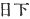 *Kusaka*, and
the personal name written with the character  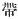 *Tarashi*, I have followed
usage without alteration. [40](#fn_120)
Altogether the things recorded commence with the separation of Heaven
and Earth, and conclude with the august reign at Woharida. [41](#fn_121) So from the \[13\] Deity
Master-of-the-August-Centre-of-Heaven down to His Augustness
Prince-Wave-Limit-Brave-Cormorant-Thatch-Meeting-Incompletely makes the
First Volume; from the Heavenly Sovereign Kamu-Yamato-Ihare-Biko down to
the august reign of Homuda makes the Second Volume; from the Emperor
Oho-Sazaki down to the

p. 6

great palace of Woharida makes the Third Volume. [42](#fn_122) Altogether I have written Three
Volumes, which I reverently and respectfully present. [43](#fn_123) I Yasumaro, with true trembling and
true fear, bow my head, bow my head.

Reverently presented by the Court Noble Futo no Yasumaro, an Officer of
the Upper Division of the Fifth Rank and of the Fifth Order of Merit, on
the 28th day of the first moon of the fifth year of Wa-dō. [44](#fn_124)

p. 7 p. 8 p. 9 p. 10 p. 11 p. 12 p. 13 p. 14

------------------------------------------------------------------------

### Footnotes

[1:1](kj007.htm#fr_81) p.
6 Literally "Upper Volumes," there being three in all, and it
being the common Japanese practice (borrowed from the Chinese) to use
the words Upper, Middle, and Lower to denote the First, Second and Third
Volumes of a work respectively.

[1:2](kj007.htm#fr_82) The peculiar nature of
this Preface, which is but a *tour de force* meant to show that, the
writer could compose in the Chinese style if he chose to do so, has been
already hinted at in the Introduction. It is indeed a laboured little
composition, and, but for the facts stated in its latter portion, has no
value except perhaps as a specimen of the manner in which the legends of
one country may be made to change aspect by being presented through the
medium of the philosophical terminology and set phrases of another. It
may be divided into five parts. In the first the writer, in a succession
of brief allusions antithetically balanced, summarizes the most striking
of the legends that are detailed in the pages of his "Records," and in a
few words paints the exploits of some of the early emperors. In the
second the troubles that ushered in the reign of the Emperor Tem-mu and
his triumph over Prince Ohotomo are related at greater length in
high-flown allusive phrases borrowed from the Chinese-historians. The
third division gives us the Emperor Temmu's decree ordering the
compilation of the "Records," and the fourth tells how the execution of
that decree was delayed till the reign of the Empress Gemmiyō (A.D.
703-715), on whom likewise a panegyric is pronounced. In the fifth and
last the compiler enters into some details concerning the style and
method he has adopted.

[1:3](kj007.htm#fr_83) The First Personal
Pronoun is here represented by the humble character  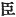, "vassal," used in China by a
subject when addressing his sovereign in writing.

[1:4](kj007.htm#fr_84) p.
7 This is the compiler's personal name. His full name and titles,
as given at the end of this preface, were 
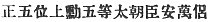 *i.e.*, the Court Noble Futo no Yasumaro, an Officer
of the Upper Division of the First Class of the Fifth Rank and of the
Fifth Order of Merit. The family of Futo claimed to descend from His
Augustness Kamu-yawi-mimi, second son of the Emperor Jim-mu. Yasumaro's
death is recorded in the "Chronicles of Japan Continued," under date of
30th August, A.D. 723.

[1:5](kj007.htm#fr_85) *I.e.*, I report as
follows to Her Majesty the Empress.

[1:6](kj007.htm#fr_86) *I.e.*, in the primeval
void which preceded all phenomena there was neither form nor movement,
and it was therefore unnamed and unknowable.

[1:7](kj007.htm#fr_87) This sentence summarizes
the first eight Sections of the text of the "Records." The "three
Deities" are the Deity Master-of-the August-Centre-of-Heaven, the
High-August-Producing-Wondrous-Deity (see Sect. I, Notes 4, 5, and 6.)
The two Spirits representing the "Passive and Active Elements" are the
creatrix and creator Izanami and Izanagi (the "Female-Who-Invites" and
the "Male-Who-Invites,"—see Sect. II, Note 8), the procreation by whom
of the islands of the Japanese archipelago and of a large number of gods
and goddesses forms the subject of Sections III-VII.

[1:8](kj007.htm#fr_88) The word "therefore" is
not appropriate in this place, and Motowori accordingly warns the reader
to lay no stress upon it.

[1:9](kj007.htm#fr_89) This sentence alludes to
Izanagi's visit to Hades, and to the purification of his person on his
return to the Upper World (see Sects. IX and X). It also refers to the
birth of the Sun-Goddess and of the Moon-God from his left and from his
right eye respectively, and to that of a large number of lesser gods and
goddesses, who were produced from every article of his wearing apparel
and from every part of his person on the occasion of his performing
those ablutions (see Sect. X.)

[1:10](kj007.htm#fr_90) The "original teaching"
here mentioned means the original traditions of Japanese antiquity, The
"former sages,"—a term which in China fitly designates such philosophers
as Confucius, and Mencius, but which it is difficult to invest with any
particular sense here in Japan where no sages, have ever arisen,—may be
best taken to mean those unknown persons who transmitted the legends of
the gods and early emperors. The "establishment of men" probably alludes
to the investiture of the p. 8 sovereignty of
Japan in the human descendants of the Sun-Goddess. The expression is
however obscure, and Motowori himself has nothing satisfactory to tell
us about it.

[1:11](kj007.htm#fr_91) The mirror here
mentioned is that by means of which the Sun-Goddess was allured out of
the cave (see Sect. XVI); the jewels are those which Susa-no-Wo (the
"Impetuous Male Deity") begged of his sister the Sun-Goddess, and
crunched into fragments (see Sect. XIII); the blade that was bitten to
pieces by the Sun-Goddess figures in the same legend; the serpent is
that slain by Susa-no-Wo after his banishment from Heaven (see Sect.
XVIII); the "Myriad Deities" are supposed by Motowori to be this same
god's numerous descendants (see Sect. XX). who ruled in Idzumo. There
remains the phrase "an Hundred Kings," which is lacking in clearness.
The only rational interpretation of it is as designating the Japanese
imperial line, and yet the reference seems to have no special
appropriateness in this context.

[2:12](kj007.htm#fr_92) For the Tranquil River
of Heaven, in whose stony bed the gods were wont to meet in council, see
Sect. XIII, Note 12. The divine deliberations here referred to are those
which resulted in the investiture of the sovereignty of Japan in the
grandson of the Sun-Goddess (see Sects. XXX-XXXIII). The "discussions on
the Little Shore" allude to the parleys on the beach of Inasa in Idzumo
which preceded the abdication of the Deity who had held sway over that
part of the country prior to the descent of the Sun-Goddess's grandson
(see Sect. XXXII).

[2:13](kj007.htm#fr_93) The abbreviated form of
the name of the Sun-Goddess's grandson (see Sect. XXXIII, Notes 5 and
10).

[2:14](kj007.htm#fr_94) *I.e.*, Mount Takachiho
(see Sect. XXXIV, Note 5). The final syllable is here apocopated, in
order to preserve the rhythmical balance of the sentence by using only
three Chinese characters to write this name, the "Island of the
Dragon-Fly" being likewise written with three characters.

[2:15](kj007.htm#fr_95) *I.e.*, the first "human
Emperor" Jim-mu, whose full native Japanese name is
Kamu-Yamato-Ihare-Biko. For the account of his reign see Sects.
XLIV-LII.

[2:16](kj007.htm#fr_96) *I.e.*, Japan. For the
traditional origin of this poetical synonym of Japan see Sect. V. Note
26 and also the legend in Sect. CLVI. The word "traverse" in this
sentence alludes to the Emperor Jim-mu's victorious progress from
Western Japan to Yamato in the centre of the country, which he is said
to have subdued, and where it is related that he established his capital
(see Sect. XLIV-L).

[2:17](kj007.htm#fr_97) p.
9 For the mention of the bear, whose appearance caused the
Emperor Jim-mu and his army to faint away, see commencement of Sect.
XLV. Motowori thinks that the character 
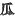, "claws," is a copyist's error for  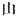, "mountain" or  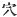, "hole," (*Conf*. Sect. XLV,
Note 2). For the curious legend of the sabre see the same Section, and
for the name of Takakura see more especially Note 3 to that Section.

[2:18](kj007.htm#fr_98) For the Gods with tails
who met and conversed with the Emperor Jim-mu in Yamato, see the latter
part of Sect. XLVI, a perusal of which will however show that the phrase
"obstructed the path," which is here used of them, is not exactly
applicable. The miraculous crow which was sent down from Heaven to
assist Jim-mu in his conquests, is mentioned at the commencement of the
same Section and again at the commencement of Sect. XLVII. For Yeshinu
(modern Yoshino) see Sect. XLVI, Note 3.

[2:19](kj007.htm#fr_99) The word "dancing" in
this sentence must not be too closely pressed, as it is used simply to
balance the word "song in the parallel clause,—which clause itself does
but echo the sense of that which precedes it. The reference is to the
song which Jim-mu sang as a signal to his followers to destroy the
"earth-spiders" (see Sect. XLVIII), and perhaps also to the songs in
Sect. XLIX.

[2:20](kj007.htm#fr_100) "The Emperor Su-jin"
must be mentally supplied as the logical subject of this clause. For the
story of his dream see Sect. LXIV, and for the origin of the laudatory
designation here mentioned see the end of Sect. LXVII, which is however
obscure.

[2:21](kj007.htm#fr_101) "The Emperor Nin-toku"
must be supplied as the logical subject of this clause. The allusion to
the smoke and the laudatory designation here mentioned will be
understood by reference to Sect. CXXI. The "black-haired people" is a
common Chinese phrase for the peasantry or the people in general.

[2:22](kj007.htm#fr_102) "The Emperor Sei-mu"
must be supplied as the logical subject of this clause. His labours are
briefly recapitulated in Sect. XCIV. For the province called Nearer
Afumi (*Chika-tsu-Afumi*), see Sect. XXIX, Note 20. Its name is here
rhythmically balanced against "Further Asuka" in the following clause.

[2:23](kj007.htm#fr_103) "The Emperor In-giyō"
must be supplied as the logical subject of this sentence. This
Sovereign's rectification of the names forms the subject of Sect. CXXXIX
For Further Asuka (*Toho-tsu-Asuka*) see Sect. CXXXIII, Notes 13 and 11.

[2:24](kj007.htm#fr_104) *I.e.*, though unlike
in character, some of the ancient emperors excelling in caution and
others in ardour, some being remarkable for their p.
10 attainments others for their native worth, yet was there not
one without a claim to greatness, not one who did not regard antiquity
as the standard by which modern times should be judged, and repair the
deviations from antique perfection that successively arose during the
lapse of ages.—How marvellously inapplicable is this rodomontade to the
early monarchs of Japan the student of Japanese history need scarcely be
told, and Motowori himself allows that "it is not completely
appropriate." Here the first part of the Preface terminates.

[2:25](kj007.htm#fr_105) Viz., the Emperor
Tem-mu, whose struggle for the crown in the latter part of the seventh
century of our era against the contending claims of Prince Ohotomo is
related at great length in the pages of the "Chronicles," though
naturally beyond the scope of these "Records," which close in A.D. 628.
The "Eight Great Islands" is one of the synonyms of Japan (see Sect. V.
Note 27). The reason for the specially laudatory mention in this place
of the Emperor Tem-mu is the fact that it was with him that the idea of
compiling these Records originated, as is indeed stated a little further
on. He is here alluded to by the expressions Hidden Dragon and
Reiterated Thunder, metaphorical names borrowed from the "*Yi Ching*"
and denoting the heir apparent Temmu not having ascended the throne till
some time after his predecessor's, death, as Prince Ohotomo disputed by
force of arms his right to the succession. The phrases "put on
perfection" and "came at the appointed moment" are attempts at
representing the original 
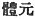 and  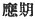.
The meaning is that the Emperor Tem-mu was the man for the age, and that
he took his proper and exalted place in it. In the following sentences
we have a flowery *résumé* of the story of the successful war by which
he obtained the crown. The reference to the "song in a dream" is indeed
obscure; but the "water at night" is the River Yoko, which we read of in
the "Chronicles" as having been crossed by him. The characters somewhat
freely rendered by the English words "succession" and "inheritance" are
 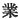 and  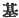, which approximate to that
sense in this context. The "Southern Mountains" are the Mountains of
Yoshino. whither he escaped for a season as a cicada escapes from its
cast-off shell; the "Eastern Land" denotes the eastern provinces of
Japan where he organized his army. The "Six Divisions" and the "Three
Hosts" are Chinese designations of the Imperial troops, while the
"ill-omened crew" of course refers to Tem-mu's enemies.—Prince Ohotomo,
and his followers. In the ensuing sentence we see peace restored: Tem-mu
has returned to the capital (for which the words "Flowery Summer" are a
Chinese periphrasis), he has taken in his hands the insignia of office,
and reigns p. 11 supreme over the Six Cardinal
Points (North, South, East, West, Above, and Below) and over the "Eight
Wildernesses" (*i.e.*, the barbarous regions on all sides). The writer
concludes this division of his Preface by a glowing panegyric of the
Monarch, who was, he says, superior to Hsüan Hou ( 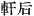 Jap. Ken-Kō), and Chou Wang
( 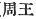 Jap. Shiū-O), famous
Chinese sovereigns of the legendary period. So intelligent were his
efforts, so perfect was his conformity with the ways of Heaven as
displayed in the workings of the Active and Passive Essences, that the
Five Elements (Water Fire, Wood, Metal and Earth) all interacted with
due regularity, and laudable usages alone prevailed throughout the land.
Up to this point the preface may be said to be purely ornamental.

[3:26](kj007.htm#fr_106) *I.e.*, March (20th as
the "Chronicles" tell us), A. D. 673. The original, to denote the year
and the month mentioned, uses the periphrases  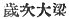 and  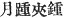 but doubtless without any
reference to the original proper meaning of those terms.

[3:27](kj007.htm#fr_107) The text literally
reads thus: "He rode in the exactness of the Two Essences." But the
author's intention is to tell us that Tem-mu acted according to the
golden mean, keeping the balance even, and not inclining unduly either
to the Active or the Passive side.

[4:28](kj007.htm#fr_108) Literally "warp and
woof," *i.e.*, cannon, standard, mainspring, first necessity.

[4:29](kj007.htm#fr_109) This is the imperial
decree ordering the compilation of the "Records of Ancient matters." The
expressions "original words" (
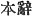) and "old words" (
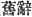) are curious, and Motowori is probably right in
arguing from the emphatic manner in which they are repeated that the
Emperor Tem-mu attached special importance to the actual archaic
phraseology in which some at least of the early documents or traditions
had been handed down.

[4:30](kj007.htm#fr_110) *I.e.*, he could
repeat the contents of any document that he had once seen and remember
all that he had ever heard.

[4:31](kj007.htm#fr_111) *I.e.*, the Emperor
Tem-mu died before the plan of the compilation of these "Records" had
been carried into execution. Viz.. it may be presumed, before a
selection from the various original documents committed to memory by Are
had been reduced to writing.

[4:32](kj007.htm#fr_112)  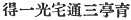. For the phrase "obtaining
Unity," which is borrowed from Lao Tzū, the student should consult
Stanislas Judien's "Livre de la Voie et de le Vertu," pp. 144-149. The
"Triad" is the threefold intelligence of Heaven, Earth, and Man. The
general meaning of the sentence is that the Empress's perfect virtue,
which is in complete p. 12 accord with the
heavenly ordinances, is spread abroad throughout the empire, and that
with her all-penetrating insight she nourishes and sustains her people.

[4:33](kj007.htm#fr_113) In the above four
sentences the compiler expresses his respectful admiration of the
Empress Gem-miyo, who was on the throne at the time when he wrote, and
tells us how wide was her rule and how prosperous her reign. The "Purple
Palace" is one of the ornamental names borrowed from the Chinese to
denote the imperial residence. The "Sombre Retinue" (if such indeed is
the correct rendering of the original expression  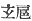) is a phrase on which no
authority consulted by the translator throws any light. The "utmost
limits of the horses' hoof-marks" and the "furthest distance attained to
by vessels' prows" are favourite phrases in the old literature of Japan
to express extreme distance (see, for instance, Mr. Satow's translations
of the "Ritual of the Praying for Harvest," Vol. VII, Pt. II, p. 111 of
these "Transactions" and the present writer's "Classical Poetry of the
Japanese," p. 111. Such unusual phenomena as connected stalks, *i.e.*,
trunks springing from the same root and uniting again higher up and
"joint rice-ears," *i.e.*, two rice-ears growing on a single stem, are
considered lucky omens by the Chinese, and their appearance is duly
chronicled in those Japanese histories that are composed after the
Chinese model. The "continuous beacon-fires" and the "repeated
interpretations" are phrases alluding to the foreign lands (*i.e.*, the
various small Korean states) speaking strange languages, whence tribute
was sent to Japan, The text, as it stands, gives the impression that the
arrival of the tribute-ships was announced by beacon-fires being
lighted. Motowori however wishes us to understand the author's meaning
to be that foreign states which, in the natural course of events, would
be inimical, and the approach of whose ships would be signalized by the
lighting of beacon-fires, now peacefully sent gifts to the Japanese
monarch. It may be added that the whole sentence is borrowed scarcely
without alteration from the "*Wên Hsüan*" (
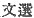). Bum-mei is the Japanese pronunciation of the
characters  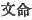, the original
name of Yü ( 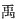) a
celebrated legendary emperor of China. Ten-Itsu is the Japanese
pronunciation of the characters 
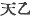, the original name of the ancient emperor T’ang
( 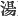), who is said to have
founded the Shang dynasty in the eighteenth century B.C.

[4:34](kj007.htm#fr_114) This word is here used
as an initial particle without special significance.

[5:35](kj007.htm#fr_115) *I.e.*, 3rd November
A. D. 711. Wa-dō ( 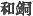) is
the name of a Japanese "year-period" which lasted from A.D. 708 to 714.

[5:36](kj007.htm#fr_116) p.
13 *I.e.*, present them to her. With this sentence ends the
fourth division of the preface.

[5:37](kj007.htm#fr_117) *I.e.,* the simplicity
of speech and thought in Early Japan renders it too hard a task to
rearrange the old documents committed to memory by Are in such a manner
as to make them conform to the rules of Chinese style.

[5:38](kj007.htm#fr_118) *I.e.,* if I adopted
in its entirety the Chinese ideographic method of writing, I should
often fail of giving a true impression of the nature of the original
documents (*conf*. the preceding Note). If, on the other hand, I
consistently used the Chinese characters, syllable by syllable, as
phonetic symbols for Japanese sounds, this work would attain to
inordinate proportions, on account of the great length of the
polysyllabic Japanese as compared with the monosyllabic Chinese. The
author's meaning may be illustrated by referring to the first clause of
the "Records,"  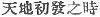 ("when
Heaven and Earth began"), which is thus written ideographically with six
Chinese characters, whereas it would require no less than eleven to
write it phonetically so as to represent the sound of the Japanese words
*ame tsuchi no hazhime no toki*, viz., 
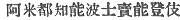. It should be noticed that in this passage the author
employs the technical expressions *on* and *kun* ( 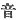 and  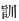) in a manner which is the
precise reverse of that sanctioned by modern usage, *on* being with him
the phonetic, and *kun* the ideographic, acceptation of the Chinese
characters.

[5:39](kj007.htm#fr_119) It will be seen by
perusing the following translation that the author can scarcely be said
to have vouchsafed as much exegetical matter as this statement would
lead us to expect. Indeed his "comments" are mostly confined to
information concerning the pronunciation of certain characters. See
however Motowori's remarks on this sentence in Vol. II. pp. 19-20 of
this Commentary.

[5:40](kj007.htm#fr_120) The author here refers
to a certain class of Japanese words which offer peculiar difficulties
because written neither ideographically nor phonetically. but in a
completely arbitrary manner, the result of a freak of usage. His manner
of expressing himself is, however, ambiguous. What he meant to say is,
as Motowori points out: "Again in such cases as writing the surname
*Kusaka*, with the characters 
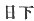, and the personal name *Tarashi* with the character
 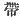, I have followed usage
without alteration." It is his imperfect mastery over the Chinese
construction that makes him fall into such errors,—errors easily
rectifiable, however, by the more widely read modern Japanese
*literati*.

[5:41](kj007.htm#fr_121) *I.e.,* commence with
the creation, and end with the death of the Empress Sui-ko (A. D. 628),
who resided at Woharida.

[6:42](kj007.htm#fr_122) p.
14 For the Deity Master-of-the-August-Centre-of-Heaven see Sect.
I, Note 4, and for Prince-Wave-Limit, etc., see Sect. XLII, Note 15.
Kamu-Yamato-Ihare-Biko is the proper native Japanese name of the emperor
commonly known by the Chinese "canonical name" of Jim-mu. Homuda is part
of the native Japanese name of the Emperor Ojin (see Sects. XCIV to
CXVIII). Oho-Sazaki is the native Japanese name of the Emperor Nin-toku
(see Sects. CXIX to CXXX.)

[6:43](kj007.htm#fr_123) *Q.d.*, to the
Empress.

[6:44](kj007.htm#fr_124) *I.e.,* 10th March, A.
D. 712.

------------------------------------------------------------------------

[Next: Section I.—The Beginning of Heaven and Earth](kj008)
