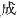
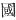
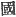

  
[Intangible Textual Heritage](../../index)  [Shinto](../index) 
[Index](index)  [Previous](kj007)  [Next](kj009) 

------------------------------------------------------------------------

[Buy this Book at
Amazon.com](https://www.amazon.com/exec/obidos/ASIN/B0028Y4SZY/internetsacredte)

------------------------------------------------------------------------

  
*The Kojiki*, translated by Basil Hall Chamberlain, \[1919\], at
Intangible Textual Heritage

------------------------------------------------------------------------

p. 15

# RECORDS OF ANCIENT MATTERS

### \[SECT. I.—THE BEGINNING OF HEAVEN AND EARTH.\]

The names of the Deities [1](#fn_125) that were
born [2](#fn_126) in the Plain of High
Heaven [3](#fn_127) when the Heaven and Earth
began were the Deity Master-of-the-August-Centre-of-Heaven, [4](#fn_128) next the High-August-Producing-Wondrous
Deity, [5](#fn_129) next the
Divine-Producing-Wondrous-Deity. [6](#fn_130)
These three Deities were all Deities born alone, and hid their
persons. [7](#fn_131) The names of the Deities
that were born next from a thing that sprouted up like unto a reed-shoot
when the earth, [8](#fn_132) young and like
unto floating oil, drifted about medusa-like, were the
Pleasant-Reed-Shoot-Prince-Elder Deity, [9](#fn_133) next the
Heavenly-Eternally-Standing-Deity. [10](#fn_134) \[16\] These two Deities were likewise
born alone, and hid their persons.

The five Deities in the above list are separate Heavenly Deities. [11](#fn_135)

p. 16

------------------------------------------------------------------------

### Footnotes

[15:1](kj008.htm#fr_125) p.
15 For this rendering of the Japanese word *kami* see
Introduction, pp. [xvii](kj003.htm#page_xvii)-xviii.

[15:2](kj008.htm#fr_126) Literally, "that
became" ( ). Such
"becoming" is concisely defined by Motowori as "the birth of that which
did not exist before."

[15:3](kj008.htm#fr_127) In Japanese
*Takama-no-hara*.

[15:4](kj008.htm#fr_128)
*Ame-no-mi-naka-nushi-no-kami*.

[15:5](kj008.htm#fr_129)
*Taka-mi-musu-bi-no-kami*. It is open to doubt whether the syllable
*bi*, instead of signifying "wondrous," may not simply be a verbal
termination, in which case the three syllables *musubi* would mean, not
"wondrous producing," but simple "producing," *i.e.*, if we adopt the
interpretation of the Verb *musubu* as "to produce" in the Active sense
of the word, an interpretation as to whose propriety there is some room
for doubt. In the absence of certainty the translator has followed the
view expressed by Motowori and adopted by Hirata. The same remark
applies to the following and other similar names.

[15:6](kj008.htm#fr_130) p.
16 *Kami-musu-bi-no-kami*. This name reappears in later Sections
under the lengthened form of *ami-musu-bi-mi-oya-no-mikoto*, *i.e.*, His
Augustness the Deity-Producing-Wondrous-August-Ancestor, and also in
abbreviated forms.

[15:7](kj008.htm#fr_131) *I.e.* they all came
into existence without being procreated. in the manner usual with both
gods and men, and afterwards disappeared, *i.e.*, died.

[15:8](kj008.htm#fr_132) Here and elsewhere the
character  , properly
"country" (*regio*), is used where "earth" (*tellus*) better suits the
sense. Apparently in the old language the word *kuni* (written  ), which is now restricted to
the former meaning, was used ambiguously somewhat like our word "land."

[15:9](kj008.htm#fr_133)
*Umashi-ashi-kabi-hiko-ji-no-kami.* For *hiko* here and elsewhere
rendered "prince" see Introduction [p. xvi](kj002.htm#page_xvi); *ji* is
rendered "elder" in accordance with the opinion expressed by Motowori
and Hirata, who say that it is "an Honorific designation of males
identical with the *ji* meaning old man."

[15:10](kj008.htm#fr_134) Or, the
Deity-Standing-Eternally-in-Heaven, *Ame-no-toko-tachi-no-kami*. The
translation of the name here given follows the natural meaning of the
characters composing it, and has the sanction of Tanigaha Shisai.
Motowori and Hirata take *toko* to stand for *soko*, "bottom," and
interpret accordingly; but this is probably but one of the many
instances in which the Japanese philologists allow themselves to be led
by the boldness of their etymological speculations into identifying
words radically distinct.

[15:11](kj008.htm#fr_135) This is a note in the
original, where such notes are indented, as has also been clone In the
translation. The author's obscure phrase is explained by Motowori to
mean that these Heavenly Deities were separate from those who came into
existence afterwards, and especially from the
Earthly-Eternally-Standing-Deity (*Kuni-no-toko-tachi-no-kami*) who in
the "Chronicles" is the first divine being of whom mention is made.
These five were, he says, "separate" and had nothing to do with the
creation of the world. It should be stated that the sentence will also
bear the interpretation "The five Deities in the above list are Deities
who divided Heaven" (presumably from Earth;) but this rendering has
against it the authority of all the native editors. As the expressions
"Heavenly Deity" and "Earthly Deity" (lit., "Country Deity" are of
frequent occurrence in these "Records," it may be as well to state that.
according to Motowori, the "Heavenly Deities" were such as either dwelt
in Heaven or had originally descended to Earth from Heaven, whereas the
Earthly Deities were those born and dwelling in Japan.

------------------------------------------------------------------------

[Next: Section II.—The Seven Divine Generations](kj009)
