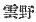

  
[Intangible Textual Heritage](../../index)  [Shinto](../index.md) 
[Index](index)  [Previous](kj008)  [Next](kj010.md) 

------------------------------------------------------------------------

[Buy this Book at
Amazon.com](https://www.amazon.com/exec/obidos/ASIN/B0028Y4SZY/internetsacredte.md)

------------------------------------------------------------------------

  
*The Kojiki*, translated by Basil Hall Chamberlain, \[1919\], at
Intangible Textual Heritage

------------------------------------------------------------------------

p. 17

### \[SECT. II.—THE SEVEN DIVINE GENERATIONS.\]

The names of the Deities that were born next were the
Earthly-Eternally-Standing-Deity, [1](#fn_136.md)
next the Luxuriant-Integrating-Master-Deity. [2](#fn_137.md) These two Deities were likewise \[17\]
Deities born alone, and hid their persons. The names of the Deities that
were born next were the Deity Mud-Earth-Lord next his younger sister the
Deity Mud-Earth-Lady; [3](#fn_138.md) next the
Germ-Integrating-Deity, next his younger sister the
Life-Integrating-Deity; [4](#fn_139.md) next the
Deity Elder-of-the-Great-Place, next his younger sister the Deity
Elder-Lady-of-the-Great-Place; [5](#fn_140.md)
next the Deity Perfect-Exterior, [6](#fn_141.md)
\[18\] next his younger sister the Deity Oh-Awful-Lady; [7](#fn_142.md) next the Deity the Male-Who-Invites,
next his younger sister the Deity the Female-Who-Invites. [8](#fn_143.md)

From the Earthly-Eternally-Standing Deity down to the Deity the
Female-Who-Invites in the previous list are what are termed the Seven
Divine Generations.

(The two solitary Deities above \[-mentioned\] are
each called one generation. Of the succeeding ten Deities each pair of
deities is called a generation.) [9](#fn_144.md)

 

p. 18

------------------------------------------------------------------------

### Footnotes

[17:1](kj009.htm#fr_136.md) p.
17 Or, the Deity-Standing-Eternally-on-Earth,
*Kuni-no-toko-tachi-no-kami*, *Conf*. Note 10 to Sect. I.

[17:2](kj009.htm#fr_137.md)
*Toyo-kumo-nu-no-kami*. There is much doubt as to the proper
interpretation of this name. The characters 
 ("cloud-moor"), with which the syllables read
*kumo-nu* are written, are almost certainly phonetic, and the translator
has followed Motowori's view as corrected by Hirata, according to which
*kumo* is taken to stand for *kumu*, "integrating," and *nu* is
considered to be an apocopated form of *nushi*, "master" (or more
vaguely "the person who presides at or does a thing"). Mabuchi in his
"Dictionary of Pillow-words," Article *Sasutake*, argues that the
syllables in question should be interpreted in the sense of "coagulated
mud"; out this is less satisfactory.

[17:3](kj009.htm#fr_138.md) p.
18 *U-hiji-no-kami* and *Su-hiji-ni-no-kami*. The names of this
pair tend themselves to a variety of interpretations. Motowori's view of
the meaning of the first three syllables in each seems best, if it is
founded on the Chinese characters with which they are written in the
parallel passage of the "Chronicles," and it has therefore been adopted
here. Hirata interprets the names thus: First-Mud-Lord and
First-Sand-Lady, and takes *ni* to be an alternative form of the
Honorific *ne* found in so many proper names. This view of the meaning
of *ni* has been followed by the translator. On the other hand Mabuchi
explains the names to mean respectively Floating-Mud-Earth and
Sinking-Mud-Earth. The only thing therefore that is granted by all is
that the names in question refer to the mud or slime out of which the
world was afterwards made. The reader will bear in mind that
"younger-sister" and "wife" are convertible names in Archaic Japanese.
(See Introduction p. XXXVIII.)

[17:4](kj009.htm#fr_139.md) *Tsunu-guhi-no-kami*
and *Iku-guhi-no-kami*. The interpretation given is one in which the
commentators agree, and which has some probability in its favour. It
must however only be accepted with reservation.

[17:5](kj009.htm#fr_140.md) *Oho-to-no ji-no-kami*
and *Oho-to-no-be-no-kami*.

[17:6](kj009.htm#fr_141.md) *Omo-daru-no-kami*. We
might also render *omo-daru* by "perfect-face," *i.e.*, perfectly
beautiful."

[17:7](kj009.htm#fr_142.md)
*Aya-kashiko-ne-no-kami*. For "awful" we might substitute "venerable."
Hirata, commentating on this name and the seven which precede it, says:
*U-hiji-ui* and *Su-hiji-ni* are so named from their having contained
the germs of what was to become the earth. *Oho-to-no-ji* and
*Oho-to-no-be* are so called from the appearance of the incipient earth.
*Tsunu-guhi* and *Iku-guhi* are so called from the united appearance of
the earth and the Deities as they came into existence. *Omo-daru* and
*Kashiko-ne* are so called from the completion of the august persons of
the Deities. Thus their names were given to them from the gradual
progress \[of creation\]."

[17:8](kj009.htm#fr_143.md) *Izana-gi-no-kami* and
*Izana-mi-no-kami*. There is some slight diversity of opinion as to the
literal signification of the component parts of the names of these the
best-known of the Deities hitherto mentioned, though the gist of the
meaning remains unchanged. Motowori would prefer to read *Iza-na-gi* and
*Iza-a-mi*, taking the syllable *na* as the Second Personal Pronoun
"thou," and understanding the names thus: "the Prince-Who-Invites-Thee"
and the "Princess-Who-Invites-Thee." It seems however more natural to
look on *izana* as forming but one word, viz., the Root of the Verb
*Izanafu*, "to invite." The older native commentators p. 19 mean the same thing when they tell us that
*na* is an Expletive. The syllables *gi* and *mi* are of uncertain
etymology, but occur in other Archaic words to denote the female and
male of a pair. The appropriateness of the names of these deities will
be seen by referring to Sect. IV.

[17:9](kj009.htm#fr_144.md) For explanatory notes
which are printed in small type in the original, small type is likewise
used in this translation.

------------------------------------------------------------------------

[Next: Section III.—The Island of Onogoro](kj010.md)
