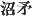
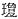
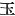
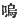
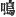

  
[Intangible Textual Heritage](../../index)  [Shinto](../index.md) 
[Index](index)  [Previous](kj009)  [Next](kj011.md) 

------------------------------------------------------------------------

[Buy this Book at
Amazon.com](https://www.amazon.com/exec/obidos/ASIN/B0028Y4SZY/internetsacredte.md)

------------------------------------------------------------------------

  
*The Kojiki*, translated by Basil Hall Chamberlain, \[1919\], at
Intangible Textual Heritage

------------------------------------------------------------------------

p. 19

### \[SECT. III.—THE ISLAND OF ONOGORO\]

Hereupon all the Heavenly Deities commanded the two Deities His
Augustness the Male-Who-Invites and Her Augustness [1](#fn_145.md) the Female-Who-Invites, ordering them to
"make, consolidate, and give birth to this drifting land." Granting to
them an heavenly jewelled spear, [2](#fn_146.md)
they \[thus\] deigned to charge them. So the two Deities, standing upon
the Floating Bridge of Heaven, [3](#fn_147.md)
pushed \[19\] down the jewelled spear and stirred with it, whereupon,
when they had stiffed the brine till it went curdle-curdle, [4](#fn_148.md) and drew \[the spear\] up, the brine
that dripped down from the end of the spear was piled up and became an
island. This is the Island of Onogoro. [5](#fn_149.md)

------------------------------------------------------------------------

### Footnotes

[19:1](kj010.htm#fr_145.md) p.
19 For this rendering of the Japanese title *Mikoto* see
Introduction, p. xvi, last paragraph.

[19:2](kj010.htm#fr_146.md) The characters
translated "jewelled spear" are 
, whose proper Chinese signification would be quite
different. But the first of the two almost certainly stands phonetically
for   or  ,—the syllable *nu*, which is
its sound, having apparently been an ancient word for "jewel" or "head,"
the better-known Japanese term being *tama*. In many places the word
"jewel" (or "jewelled") seems to be used simply as an adjective
expressive of beauty. But Motowori and Hirata credit it in this instance
with its proper signification, and the translator always renders it
literally, leaving the reader to consider it to be used metaphorically
if and where he pleases.

[19:3](kj010.htm#fr_147.md) p.
20 *Ama-no-uki-hashi or Ame-no-uki-hashi*. The best authorities
are at variance as to the nature of this bridge uniting Heaven with
Earth. Hirata identifies it with the Heavenly-Rock-Boat
(*Ame-no-iha-fune*) mentioned in some ancient writings, whereas Motowori
takes it to have been a real bridge, and finds traces of it and of
similar bridges in the so-called "Heavenly Stairs" (*Ama-no-hashi-date*)
which are found on several points of the coast, forming a kind of
natural breakwater just above water-level.

[19:4](kj010.htm#fr_148.md) *I.e.,* "till it
became thick and glutinous." It is not easy to find in English a word
which will aptly render the original Japanese onomatopoeia
*koworokoworo*. The meaning may also be "till it made a curdling sound."
But though the character 
, "to make a noise," sanctions this view, it is not
the view approved by the commentators, and 
 is probably only written phonetically for a
homonymous word signifying "to become," which we find in the parallel
passage of the "Chronicles."

[19:5](kj010.htm#fr_149.md) *I.e.*,
"Self-Curdling," "Self-Condensed." It is supposed to have been one of
the islets off the coast of the larger island of Ahaji.

------------------------------------------------------------------------

[Next: Section IV.—Courtship of the Deities The Male-Who-Invites and the
Female Who-Invites](kj011.md)
