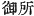
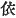
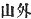
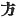
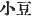
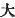

  
[Intangible Textual Heritage](../../index)  [Shinto](../index) 
[Index](index)  [Previous](kj011)  [Next](kj013) 

------------------------------------------------------------------------

[Buy this Book at
Amazon.com](https://www.amazon.com/exec/obidos/ASIN/B0028Y4SZY/internetsacredte)

------------------------------------------------------------------------

  
*The Kojiki*, translated by Basil Hall Chamberlain, \[1919\], at
Intangible Textual Heritage

------------------------------------------------------------------------

p. 22

### \[SECT. V.—BIRTH OF THE EIGHT ISLANDS.\]

Hereupon the two Deities took counsel, saying: "The children to whom we
have now given birth are not good. It will be best to announce this in
the august \[21\] place [1](#fn_156) of the
Heavenly Deities." They ascended forthwith to Heaven and enquired of
Their Augustnesses the Heavenly Deities. Then the Heavenly Deities
commanded and found out by grand divination, [2](#fn_157) and ordered them, saying: "They were not
good because the woman spoke first. Descend back again and amend your
words." So thereupon descending back, they again went round the heavenly
august pillar as before. Thereupon his Augustness the Male-Who-Invites
spoke first: "Ah! what a fair and lovely maiden! Afterwards his younger
sister Her Augustness the Female-Who-Invites spoke: "Ah! what a fair and
lovely youth!" Tali modo quun orationi finem fecerant, auguste coierunt
et pepererunt a child the Island of Ahaji, Ho-no-sa-wake. [3](#fn_158) Next they gave birth to the Island of
Futa-no in Iyo. [4](#fn_159) This island has
one body and four faces, and each face has a name. So the Land of Iyo is
called Lovely-Princess; [5](#fn_160) the Land
of Sanuki [6](#fn_161) is called
Prince-Good-Boiled-Rice; [7](#fn_162) the Land
of Aha is called the Princess-of-Great-Food; [8](#fn_163) the Land of Tosa [9](#fn_164) is called Brave-Good-Youth. [10](#fn_165) Next they gave birth to the Islands of
Mitsu-go [11](#fn_166) near Oki, [12](#fn_167) another name for which \[islands\] is
Heavenly-Great-Heart-Youth. [13](#fn_168) [14](#fn_169)

p. 23

\[paragraph continues\] This island
likewise has one body and four faces [15](#fn_171) and each face has a name. So the land
of Tsukushi is called White-Sun-Youth; [16](#fn_172) the Land of Toyo [17](#fn_173) is called Luxuriant-Sun-Youth; [18](#fn_174) the Land of Hi is called Brave
Sun-Confronting-Luxuriant-Wondrous-Lord-Youth; [19](#fn_175) the Land of Kumaso is called
Brave-Sun-Youth. [20](#fn_176) Next they gave
birth to the Island of Iki, [21](#fn_177)
another name for which is Heaven's One-Pillar. [22](#fn_178) Next they gave birth to the Island of
Tsu, [23](#fn_179) another name for which is
Heavenly-Hand-net-Good-Princess. [24](#fn_180)
Next they gave birth to the Island of Sado. [25](#fn_181) Next they gave birth to
Great-Yamato-the-Luxuriant-Island-of-the-Dragon-Fly, [26](#fn_182) another name for which is
Heavenly-August-Sky-Luxuriant-Dragon-fly-Lord-Youth. \[24\] The name of
"Land-of -the- Eight-Great-Islands" [27](#fn_183) therefore originated in these eight
islands having been born first. After that, when they had
returned, [28](#fn_184) they gave birth to the
Island of Ko\[-shima\] [29](#fn_185) in
Kibi, [30](#fn_186) another name for which
\[island\] is Brave-Sun [9](#fn_170)
Direction-Youth. Next they gave birth to the Island of Adzuki, [31](#fn_187) another name for which is
Oho-Nu-De-Hime. Next they gave birth to the Island of Oho
\[-shima\], [32](#fn_188) another name for
which is Oho-Tamaru-Wake. Next they gave birth to the Island of
Hime, [33](#fn_189) another name for which is
Heaven's-One-Root. Next they gave birth to the Island of Chika, [34](#fn_190) another name for which is
Heavenly-Great-Male. Next they gave birth to the Island\[s\] of
Futa-go, [35](#fn_191) another name for which
is Heaven's-Two-Houses, (Six islands in all from the Island of Ko, in
Kibi to the Island of Heaven's-Two-Houses).

p. 24 p. 25 p. 26 p. 27

------------------------------------------------------------------------

### Footnotes

[22:1](kj012.htm#fr_156) p.
23 The characters  
here translated "august place" (the proper Chinese signification is
"imperial place") are those still in common use to denote the Mikado's
palace.

[22:2](kj012.htm#fr_157) p.
24 For an elaborate account of the various methods of divination
practised by the Ancient Japanese see Note 5 to Mr. Satow's translation
of the "Service of the Gods of Wind at Tatsuta" in the "Transactions of
the Asiatic Society of Japan," Vol. VII, Pt. IV, p. 425 *et seq.* "The
most important mode of divination practised by the primitive Japanese
was that of scorching the shoulder-blade of a deer over a clear fire,
and finding, omens in the cracks produced by the heat."

[22:3](kj012.htm#fr_158) *Aha-ji* signifies
"foam-way," *i.e.*, "the way to Foam (Aha)-Island," on account, it is
said, of its intermediate position between the mainland and the province
of Aha in what is in modern parlance the Island of Shikoku. The author
of the "Chronicles of Old Affairs" fancifully derives the name from *a
hoji* "my shame." The etymology of Ho-no-sa-wake is disputed; but
Hirata, who in the body of Vol. III of his "Exposition of the Ancient
Histories" had already expended much ingenuity in discussing it, gives
the most satisfactory interpretation that has yet been proposed in a
postscript to that volume, where he explains it to signify
"Rice-ear-True-Youth." *Wake* (sometimes *wake* or *waku*) is a word of
frequent occurrence in the names of gods and heroes. Whether it really
signifies "youth," as Hirata believes and as it is most natural to
suppose, or whether Motowori's guess that it is an Honorific title
corrupted from *waga kimi ye* (lit. "my prince elder brother," more
freely "lord") remains undecided. When it is used as a "gentile name,"
the translator renders it by "lord," as that in such cases is its import
apart from the question of derivation. *Sa*, rendered "true," may almost
be considered to have dwindled down to a simple Honorific.—It is this
little island which is said by the author of the "Chronicles" to have
been the caul with which the great island of Yamato was born. Ahaji and
Ho-no-sa-wake must be understood to be alternative names, the latter
being what in other cases is prefaced by the phrase "another name for
whom."

[22:4](kj012.htm#fr_159) *Futa-na* is written
with characters signifying "two names," and Motowori's derivation from
*futa-narabi*, "two abreast," does not carry conviction. The etymology
of Iyo is quite uncertain. It is here taken as the name of the whole
island called in modern times Shikoku; but immediately below we find it
in its usual modern acceptation of one of the four provinces into which
that island is divided. A similar remark applies to Tsukushi a little
further on.

[22:5](kj012.htm#fr_160) *Ye-hime*. For the
rendering of *hiko* and *hime* as "prince" and "princess" see
introduction, p. xvi.

[22:6](kj012.htm#fr_161) Probably derived, as
Hirata shows, from *saho-ki*, "pole-trees," a p.
25 tribute of poles having anciently been paid by that province.
Motowori adopts the unusual reading of the name given in the "Japanese
Words Classified and Explained," viz. Sanugi, with the last syllable
*nigori’ed*.

[22:7](kj012.htm#fr_162) *Ihi-yori-hiko*. The
translator, though with some hesitation, follows Motowori in looking on
*yori* as a contraction of *yorishi*, "good." The character used for it
in the original is  .

[22:8](kj012.htm#fr_163) *Oho-ge-tsu-hime*.
Remember that *aha* signifies not only "foam" but "millet" so that we
need not be astonished to find that the alternative designation of the
island so designated is that of a food-goddess.

[22:9](kj012.htm#fr_164) Etymology uncertain,
only fanciful derivations being proposed by the native philologists.

[22:10](kj012.htm#fr_165) *Take-yori-wake*.

[22:11](kj012.htm#fr_166) *Mitsu-go* signifies
"triplets," lit., "three children." The three islets intended are
*Ama-ma-shima*, *Mukafu-no-shima* and *Chiburi-no-shima*.

[22:12](kj012.htm#fr_167) *Oki* probably here
signifies "offing," which is its usual acceptation.

[22:13](kj012.htm#fr_168)
*Ame-no-oshi-koro-wake*. The syllables *oshi*, which recur in the names
of many gods and heroes, are rendered "great" in accordance with
Motowori's plausible conjecture that they are an abbreviation of
*ohoshi* ("great," not "many" as in the later language). The translation
of *koro* by "heart" follows a conjecture of Hirata's (Motowori
acknowledged that he could make nothing of the word), according to which
it is taken to be an abbreviated form of *kokoro*, "heart."

[22:14](kj012.htm#fr_169) None but fanciful
derivations of this word are suggested by the native philologists.

[23:9](kj012.htm#fr_186) Etymology uncertain,
only fanciful derivations being proposed by the native philologists.

[23:15](kj012.htm#fr_170) A note to the edition
of 1687 says: "Should the word 'four' be changed to 'five?'" For most
texts enumerate five countries in this passage with slight variations in
the names, Himuka, (Hiuga), which it certainly seems strange to omit,
being the fourth on the list with the alternative name of
Toyokuzhi-hine-wake, while the alternative name of Hi is Haya-hi-wake,
Motowori argues that an enumeration of four agrees better with the
context, while Moribe in his Critique on Motowori's Commentary decides
in favour of the five. There are thus texts and authorities in favour of
both views.

[23:16](kj012.htm#fr_171) *Shira-bi-wake*.

[23:17](kj012.htm#fr_172) *Toyo* means
"luxuriant" or "fertile." *Hi* appears to signify "fire" or "sun."
*Kumaso* is properly a compound, *Kuma-so*, as the district is often
mentioned by the simple name of *So*. *Kuma* signifies "bear," and
Motowori suggests that the use of the name of this the fiercest of p. 26 beasts as a prefix may be traced to the evil
reputation of that part of the country for robbers and outlaws. He
quotes similar compounds with *kuma* in support of this view.

[23:18](kj012.htm#fr_173) *Toyo-bi-wake*.

[23:19](kj012.htm#fr_174)
*Take-hi-mukahi-toyo-kuzhi-hine-wake*. The interpretation of this name
follows Motowori.

[23:20](kj012.htm#fr_175) *Take-bi-wake*.

[23:21](kj012.htm#fr_176) Etymology uncertain,
but there seems reason to suppose that the name was originally
pronounced Yiki or Yuki.

[23:22](kj012.htm#fr_177)
*Ame-hito-tsu-bashira*.

[23:23](kj012.htm#fr_178) *Tsu* (Tsu-shima)
means "port," "anchorage," a name probably given to this island on
account of its being the midway halting-place for junks plying between
Japan and Korea.

[23:24](kj012.htm#fr_179)
*Ame-no-sade-yori-hime*. The interpretation of *sade* (rendered
"hand-net") is uncertain. The translator has followed that sanctioned by
an ode in Vol. I of the "Collection of a Myriad Leaves" and by a passage
in the "Japanese Words Classified and Explained." Hirata takes *sa* to
be an Honorific and *te* to be the usual word for "hand," while Motowori
gives up the name in despair.

[23:25](kj012.htm#fr_180) Etymology uncertain.

[23:26](kj012.htm#fr_181)
*Oho-yamato-toyo-aki-dzu-shima* (the original of the alternative
personal name is *Ame-no-mi-sora-toyo-aki-dzu-ne-wake*). The etymology
of Yamato is much disputed. Mabuchi, in his "Addenda to the
[Commentary](errata.htm#7) on the Collection of a Myriad Leaves,"
derives the name from *yama-to*, "mountain-gate." Motowori, in a learned
discussion to be found in his "Examination of the Synonyms of Japan,"
pp. 24-27, proposes three other possible derivations, viz. *yama-to*,
"mountain-place," *yama-to* (supposed to stand for *yama-tsubo* and to
mean "mountain-secluded"), and *yama-utsu* (*utsu* being a
supposititious Archaic form of *uchi*,) "within the mountains." Other
derivations are *yama-to* (
), "without the mountains," *yama-ato*,
"mountain-traces" and *yama-todomi*, "mountains stopping," *i.e.* (as
Moribe, who proposes it, explains), "far as the mountains can be seen."
Another disputed point is whether the name of Yamato which here
designates the Main Island of the Archipelago, but which in the common
parlance of both ancient and modern times is the denomination on the one
hand of the single province of Yamato and on the other of the whole
Empire of Japan, originally had the wider application or the more
restricted one. Motowori and the author of the "Exposition of the
Foreign Notices of Japan" seem to the present writer to make p. 27 out the case in favour of the latter view.
Motowori supposes the name to have denoted first a village and then a
district, before being applied to a large province and finally to the
entire country. The "Island of the Dragon-fly" is a favourite name for
Japan in the language of the Japanese poets. It is traced to a remark of
the Emperor Jim-mu, who is said to have compared the shape of the
country round Mountain Hohoma to "a dragon-fly drinking with its tail."
*Conf*. also the tradition forming the subject of Sec. CLVI of the
present translation.

[23:27](kj012.htm#fr_182) *Oho-ya-shima-huni*.
A perhaps still more literal English rendering of this name would be
"Land of the Grand Eight Islands" or "Grand Land of the Eight Islands,"
for the word *oho* must be regarded rather as an Honorific than as
actually meant to convey an idea of size.

[23:28](kj012.htm#fr_183) "To the Island of
Onogoro," says Motowori; but we are not told that the god and goddess
had ever left it.

[23:29](kj012.htm#fr_184) *Ko* means "infant"
or "small." The original of the alternative personal name is
*Take-hi-gata-wake*. *Gata* (or, without the *nigori*, *Kata*) here and
in other names offers some difficulty. The translator renders it by the
equivalent of the usual Japanese signification of the character  , "direction," with which it is
written.

[23:30](kj012.htm#fr_185) Etymology uncertain.

[23:31](kj012.htm#fr_187) *Adzuki* is written
with the characters  ,
which signify a kind of bean (the *Phaseolus radiatus*); but it is
possible that they represent the sound, and not the sense, of the name.
In the alternative personal name *oho* signifies "great," and *hime*
"princess," while the syllables *nu-de* are of altogether uncertain
interpretation. Motowori suggests that *mu* may mean "moor" and *de*
(for te) "clapper-bell."

[23:32](kj012.htm#fr_188) *I.e.,* Great Island.
The word *tamaru* in the alternative personal name is so obscure that
not even any plausible conjecture concerning it has been ventured and
the name is therefore of necessity left untranslated.

[23:33](kj012.htm#fr_189) *Hime* signifies
"princess" or "maiden." The original of the alternative personal name is
*Ame-hito-tsu-ne*.

[23:34](kj012.htm#fr_190) Etymology uncertain.
Motowori would take the name in a plural sense as standing for the
modern islands of Hirado and Go-tō (Goto). The original of the
alternative personal name is *Ame-no-oshi-wo*; in which as usual, *oshi*
is supposed to represent *ohoshi* (
), "great."

[23:35](kj012.htm#fr_191) *Futa-go* means
"twins." The original of the alternative personal name is *Ame-futa-ya*.

------------------------------------------------------------------------

[Next: Section VI.—Birth of the Various Deities](kj013)
