  
[Intangible Textual Heritage](../../index)  [Shinto](../index) 
[Index](index)  [Previous](kj013)  [Next](kj015) 

------------------------------------------------------------------------

[Buy this Book at
Amazon.com](https://www.amazon.com/exec/obidos/ASIN/B0028Y4SZY/internetsacredte)

------------------------------------------------------------------------

  
*The Kojiki*, translated by Basil Hall Chamberlain, \[1919\], at
Intangible Textual Heritage

------------------------------------------------------------------------

p. 32

## \[SECT. VII.—RETIREMENT OF HER AUGUSTNESS THE PRINCESS-WHO-INVITES.\]

Through giving birth to this child her august private parts were burnt,
and she sickened and lay down. [1](#fn_218) The
names of the Deities born from her vomit were the Deity
Metal-Mountain-Prince and next the Deity Metal-Mountain-Princess. [2](#fn_219) The names of the Deities that were born
from her faeces were the Deity Clay-Viscid-Prince and next the Deity
Clay-Viscid-Princess. [3](#fn_220) The names of
the Deities that were next born from her urine were the Deity
Mitsuhanome [4](#fn_221) and next the
Young-Wondrous-Producing-Deity. [5](#fn_222)
The child of this Deity was called

p. 33

the Deity Luxuriant-Food-Princess. [6](#fn_223)
So the Deity \[30\] the Female-Who-Invites, through giving birth to the
Deity-of-Fire, at length divinely retired. [7](#fn_224) (Eight Deities in
all from the Heavenly-Bird-Boat to the Deity
Luxuriant-Food-Princess. [8](#fn_225))

The total number of islands given birth to jointly by the two Deities
the Male-Who-Invites and the Female-Who-Invites was fourteen, and of
Deities thirty-five. (These are such as were given
birth to before the Deity Princess-Who-Invites divinely retired. Only
the Island of Onogoro, was not given birth to. [9](#fn_226) and moreover the Leech-Child [10](#fn_227) and the Island of Aha are not reckoned
among the children).

So then His Augustness the Male-Who-Invites said: Oh! Thine Augustness
my lovely younger sister! Oh that I should have exchanged thee for this
single child!" [11](#fn_228) And as he crept
round her august pillow, and \[31\] as he crept round her august feet
and wept, there was born from his august tears the Deity that dwells at
Konomoto near Unewo on Mount Kagu, [12](#fn_229) and whose name is the
Crying-Weeping-Female-Deity. [13](#fn_230) So
he buried the divinely retired [14](#fn_231)
Deity the Female-Who-Invites on Mount Hiba [15](#fn_232) at the boundary of the Land of
Idzumo [16](#fn_233) and the Land of
Hahaki. [17](#fn_234)

p. 34

------------------------------------------------------------------------

### Footnotes

[32:1](kj014.htm#fr_218) p.
33 "Lying down" (*koyasu*) is a term often used in the Archaic
language in the sense of "dying." But here it must be taken literally,
the death ("divine retirement") of the goddess being narrated a few
fines further on.

[32:2](kj014.htm#fr_219)
*Kana-yama-biko-no-kami* and *Kana-yama-bime-no-kami*. The translation
of this pair of names follows the plain sense of the characters  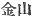 with which they are written,
and which seems appropriate enough, coming as they do between the deity
of fire and deities of clay. Motowori however, declaring both characters
to be merely phonetic, derives *kana-yama* from *korena-yamasu*, "to
cause to wither and suffer." And interprets the names accordingly. This
is at any rate ingenious.

[32:3](kj014.htm#fr_220)
*Hani-yasu-biko-no-kami* and *Hani-yasu-bime-no-kami*.

[32:4](kj014.htm#fr_221) p.
34 The signification of this name is not to be ascertained. In
the text it is written phonetically 
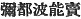, and two passages in the "Chronicles," where this
deity is mentioned as  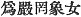
and  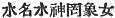 with directions in
each case to read the name with the sounds here given to it, do not help
us much, except in so far as they show that Mitsuhanome was conceived of
as the deity of water and as a female.

[32:5](kj014.htm#fr_222)
*Waku-musu-bi-no-kami*.

[33:6](kj014.htm#fr_223)
*Toyo-uke-bime-no-kami*.

[33:7](kj014.htm#fr_224) *I.e.*, "died."

[33:8](kj014.htm#fr_225) There is here an error
in the computation, as *nine* deities are mentioned. The total of
thirty-five deities given immediately below is still more erroneous, as
no less than *forty* are named in the preceding passage. Motowori makes
an ingenious effort to reconcile arithmetic and revelation by supposing
the five pairs of brothers and sisters with parallel names to have been
considered as each forming but one day.

[33:9](kj014.htm#fr_226) See Sect. III. This
island was not *born*, but arose, spontaneously from drops of brine.

[33:10](kj014.htm#fr_227) *Hiru-go*. See the
latter part of Sect. IV for these two names, Hiru-go was not counted
among the children of these Deities for the reason that the latter
abandoned him as soon as he was born, he being a failure. The reason for
omitting Aha from the computation is not so clear.

[33:11](kj014.htm#fr_228) The text here is very
peculiar, the characters  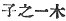
rendered "single child" being where we should expect  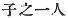 or  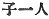. Hirata proposes to consider
 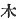, "tree," while most
scholars agree in reading *ke* instead of *ki* in this place, as
phonetic for *ke* ( 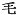)
"hair," and to interpret the god's words to signify that he values the
child no more than a single hair in comparison with the wife whom that
child's birth has lost for him. Moribe, in his "Examination of Difficult
Words." s.v. *Ko no hito-tsu ki* (Vol. I. p. 8 *et seq.*), ingeniously
argues that *ki* was an old native Japanese "Auxiliary Numeral" for
animals, afterwards driven out by the somewhat like-sounding Chinese
word *hiki* ( 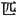) which is
now in common use, and that the god employs this degrading Auxiliary
Numeral in speaking of his child on account of the resentment which he
feels against him. On the other hand we gather from the "Chronicles of
Japan Explained" that  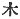
was used in its natural sense as an "Auxiliary Numeral" for gods and for
men of exalted rank. This seems to the translator the better view to
follow, and it is supported by the use of p.
35  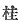 *hashira*, as
the regular "Auxiliary Numeral" for divine personages. The parallel
passage in the "Chronicles" has simply 
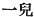 "one infant."

[33:12](kj014.htm#fr_229) This rendering is but
tentative; for it is not certain that Hirata, whose view has been
adopted, is right in regarding Konomoto and Unewo as names of places. If
we followed the older authorities, we should have to translate thus:
"The Deity that dwells at the foot of the trees on the slope of the spur
of Mount Kagu." The etymology of the name of this celebrated mountain
(known also as *Ame-no-kagu-yama* or *Ama-no-kagu-yama*, *i.e.*
"Heavenly Mount Kagu") is disputed. But Hirata's view, according to
which it should be connected with *kago*, "deer," is the most plausible.
If it were established, we should be tempted to follow him in rendering
by "deer-possessor" the name of the deity *Kagu-tsu-chi*, of whom were
born the eight gods of mountains, and whose slaying forms the title of
the next section. That the fire-deity should be connected with the
mountain-deities, and thereby with the deer who roam about the mountains
and furnish the hunter with a motive for penetrating into their
recesses, is of course but natural. The character  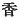 with which Kagu is written
signifies "fragrant"; but it has been suggested that the Japanese word
may be connected with an [expression](errata.htm#10) signifying
"heaven-descended," in allusion to the supposed origin of the mountain
as related in an old geographical work (now lost) treating of the
Province of Iyo.

[33:13](kj014.htm#fr_230)
*Naki-saha-me-no-kami*. The sense of the second word of the compound is
"marsh" or "stream but Motowori seems right in considering the character
 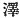 to be here used
phonetically as an abbreviation of *isaha* from *isatsu*, "to weep."

[33:14](kj014.htm#fr_231) *I.e.*, dead.

[33:15](kj014.htm#fr_232) Etymology uncertain.

[33:16](kj014.htm#fr_233) For this name see
Sect. XIX, Note 6.

[33:17](kj014.htm#fr_234) Etymology uncertain.

------------------------------------------------------------------------

[Next: Section VIII.—The Slaying of the Fire-Deity](kj015)
