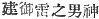
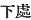

  
[Intangible Textual Heritage](../../index)  [Shinto](../index) 
[Index](index)  [Previous](kj014)  [Next](kj016) 

------------------------------------------------------------------------

[Buy this Book at
Amazon.com](https://www.amazon.com/exec/obidos/ASIN/B0028Y4SZY/internetsacredte)

------------------------------------------------------------------------

  
*The Kojiki*, translated by Basil Hall Chamberlain, \[1919\], at
Intangible Textual Heritage

------------------------------------------------------------------------

p. 35

## \[SECT. VIII.—THE SLAYING OF THE FIRE-DEITY.\]

Then His Augustness the Male-Who-invites, drawing the ten-grasp
sabre [1](#fn_235) that was augustly girded on
him, \[32\] cut off the head of his child the Deity Shining-Elder.
Hereupon the names of the Deities that were born from the blood that
stuck to the point of the august sword

p. 36

and bespattered the multitudinous rock-misses were: the Deity
Rock-Splitter, [2](#fn_236) next the Deity
Root-Splitter, next the Rock-Possessing-Male-Deity. [3](#fn_237) The names of the Deities that were next
born from the blood that stuck to the upper part [4](#fn_238) of the august sword and again
bespattered the multitudinous rock-masses were: the
Awfully-Swift-Deity, [5](#fn_239) next the
Fire-Swift-Deity, [6](#fn_240) next the
Brave-Awful-Possessing-Male-Deity, [7](#fn_241)
another name for whom is the Brave-Snapping-Deity, [8](#fn_242) and another name is the
Luxuriant-Snapping Deity. The names of the Deities that were next born
from the blood that collected \[33\] on the hilt of the august sword and
leaked out between his fingers were: the Deity *Kura-okami* and next the
Deity *Kura-mitsuha*. [9](#fn_243)

All the eight Deities in the above list, from the Deity Rock-Splitter to
the Deity *Kura-mitsuha*, are Deities that were born from the august
sword.

The name of the Deity that was born from the head of the Deity
Shining-Elder, who had been slain was the Deity
Possessor-of-the-True-Pass-Mountains. [10](#fn_244) The name of the Deity that
[was](errata.htm#11) next born from his chest was the Deity
Possessor-of-Descent-Mountains. [11](#fn_245)
The name of the Deity that was next born from his belly was the Deity
Possessor-of-the-Innermost-Mountains. [12](#fn_246) The name of the Deity that was next
born from his private parts was the Deity
Possessor-of-the-Dark-Mountains. The name of the Deity that was next
born from his left hand [13](#fn_247) was the
Deity Possessor-of-the-Dense\[ly-Wooded\]-Mountains. The name of the
Deity that was next born from his right hand [13](#fn_247) was the Deity
Possessor-of-the-Outlying, Mountains. The name of the Deity that was
next born from his left foot [14](#fn_248) was
the Deity Possessor-of-the-Moorland-Mountains.

p. 37

\[paragraph continues\] The name of the
Deity that was next born from his right foot [14](#fn_249) was the Deity
Possessor-of-the-Outer-Mountains. (Eight Deities in
all from the Deity Possessor-of-the-True-Pass-Mountains to the Deity
Possessor-of-the-Outer-Mountains). So the name of the sword with
which \[the Male-Who-Invites\] cut off \[his son's head\] was
Heavenly-Point-Blade-Extended, and another name was Majestic
Point-Blade-Extended. [15](#fn_250)

------------------------------------------------------------------------

### Footnotes

[35:1](kj015.htm#fr_235) p.
37 One "grasp" is defined as "the breadth of four fingers when
the hand is clenched," so that the meaning intended to be conveyed is of
a big sabre ten hand-breadths long. The length of sabres and of beards
was measured by such "grasps" or "hand-breadths."

[36:2](kj015.htm#fr_236) The original names of
this deity and the next are *Iha-saku-no-kami* and *Ne-saki-no-kami*.

[36:3](kj015.htm#fr_237) Or the Rock-Elder,
*i.e.*, the Male Deity the Elder of the Rocks, if with Motowori we
regard the second *tsu* of the original name *Iha-tsutsu-no-wo-no-kami*
as being equivalent to *chi* or *ji*, supposed to be "the honorific
appellation of males" elsewhere rendered "elder." The translation in the
text proceeds on the assumption that this *tsu* represents *mochi*: The
purport of the name remains much the same whichever of these two views
be adopted.

[36:4](kj015.htm#fr_238) Explained by reference
to the parallel passage of the "Chronicles" through a character
signifying "the knob at the end of the guard of the sword.'—(Williams'
"Syllabic Dictionary.")

[36:5](kj015.htm#fr_239)
*Mika-haya-bi-no-kami*. Motowori seems to be right in regarding *mika*
as equivalent to *ika*, the root of *ikameshiki*, "stern," "awful," and
*bi* as the root of *buru*, a verbalising suffix.

[36:6](kj015.htm#fr_240) *Hi-haya-bi-no-kami*.

[36:7](kj015.htm#fr_241)
*Take-mika-dzu-chi-no-wo-no-kami*, written with the characters  . The translator has without
much hesitation followed Motowori's interpretation.

[36:8](kj015.htm#fr_242) *Take-futsu-no-kami*.
The text name is *Toyo-futsu-no-kami*. *Futsu* is interpreted in the
sense of "the sound of snapping" by reference to a Passage in the
"Chronicles" where it occurs written both ideographically and
phonetically in the name of the deity *Futsu-no-mi-tama*.

[36:9](kj015.htm#fr_243) The etymology of both
these name is obscure. *Kura*, the first element of each compound,
signifies "dark."

[36:10](kj015.htm#fr_244) p.
38 This is the explanation of the original name
*Ma-saka-yama-tsu-mi-no-kami* which is given in the "Secret of the
Chronicles of Japan," and is approved by the later commentators.

[36:11](kj015.htm#fr_245)
*Odo-yama-tsu-mi-no-kami*. The English rendering is uncertain, as it
rests only on a conjecture of Motowori's, deriving *odo* from *ori do*
( ), "descending place,"
"way down."

[36:12](kj015.htm#fr_246) The original names of
this and the following five deities are: *Oku-yama-tsumi-no-kami*,
*Kura-yama-tsu-mi-no-kami*, *Shigi-yama-tsu-mi-no-kami*,
*Ha-yama-tsu-mi-no-kami*, *Hayama-tsu-mi-no-kami* and
*To-yama-tsumi-no-kami*. *Shigi*, here translated "dense," seems to be
almost certainly a contraction of *Shigeki*, which has that
signification. *Ha-yama* is a term for which it is hard to find an exact
English equivalent. It denotes the lesser hills or first visibly rising
ground forming the approach to an actual mountain-range. The
signification of *to* in the last name of the set is disputed. Mabuchi
takes it in the sense of "gate." The translator prefers Motowori's view:
but after all, the difference in meaning does not amount to much. A
third derivation proposed by Motowori is *tawa-yama*, *i.e.* "mountains
with folds."

[36:13](kj015.htm#fr_248) Or "arm."

[36:14](kj015.htm#fr_249) Or "leg."

[37:14](kj015.htm#fr_250) Or "leg."

[37:15](kj015.htm#fr_251) These two names are
in the original *Ame-no-wo-ha-bori* and *Itsu-no-wo-ha-bori*. Their
import is not absolutely clear, but they seem to designate a weapon
broad towards the point, such as is represented in the illustrations
given in Vol. I, pp. 19-20 and Vol. II, pp. 4-5 of the "*Tokiha-Gusa*."

------------------------------------------------------------------------

[Next: Section IX.—The Land of Hades](kj016)
