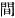
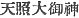
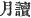
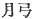
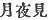

  
[Intangible Textual Heritage](../../index)  [Shinto](../index.md) 
[Index](index)  [Previous](kj016)  [Next](kj018.md) 

------------------------------------------------------------------------

[Buy this Book at
Amazon.com](https://www.amazon.com/exec/obidos/ASIN/B0028Y4SZY/internetsacredte.md)

------------------------------------------------------------------------

  
*The Kojiki*, translated by Basil Hall Chamberlain, \[1919\], at
Intangible Textual Heritage

------------------------------------------------------------------------

p. 44

## \[SECT. X.—THE PURIFICATION OF THE AUGUST PERSON.\]

Therefore the Great Deity the Male-Who-Invites said: "Nay! hideous! I
have come to a hideous and polluted land,—I have! [1](#fn_278.md) So I will perform the purification of my
august person." So he went out to a plain \[covered with\] *ahagi* [2](#fn_279.md) at a small river-mouth near
Tachibana [3](#fn_280.md) in Himuka [4](#fn_281.md) in \[the island of\] Tsukushi, and
purified and cleansed himself. So the name of the Deity that was born
from the august staff which he threw down was the Deity
Thrust-Erect-Come-Not-Place. [5](#fn_282.md) The
name of \[40\] the Deity that was born from the august girdle which he
next threw down was the Deity Road-Long-Space. [6](#fn_283.md)

p. 45

\[paragraph continues\] The name of the
Deity that was born from the august skirt which he next threw down was
the Deity Loosen-Put. [7](#fn_284.md) The name of
the Deity that was born from the august upper garment which he next
threw down was the Deity Master-of-Trouble. [8](#fn_285.md) The name of the Deity that was born from
the august trousers which he next threw down was the
Road-Fork-Deity. [9](#fn_286.md) The name of the
Deity that was born from the august hat which he next threw down was the
Deity Master-of-the-Open-Mouth. [10](#fn_287.md)
The names of the Deities that were born from the bracelet of his august
left hand [11](#fn_288.md) which he next threw
down were the Deities Offing-Distant, [12](#fn_289.md) next the Deity
Wash-Prince-of-the-Offing, next the Deity
Intermediate-Direction-of-the-Offing. The names of the Deities that were
born from the bracelet of his august right hand \[41\] which he next
threw down were: the Deity Shore-Distant, next the Deity
Wash-Prince-of-the-Shore, next the Deity
Intermediate-Direction-of-the-Shore.

The twelve Deities mentioned in the foregoing [13](#fn_290.md) list from the Deity Come-Not-Place down
to the Deity Intermediate-Direction-of-the-Shore are Deities that were
born from his taking off the things that were on his person.

Thereupon saying: "The water in the upper reach is \[too\] rapid; the
water in the lower reach is \[too\] sluggish," he went down and plunged
in the middle reach; and, as he washed, there was first born the
Wondrous-Deity-of-Eighty-Evils, and next the
Wondrous-Deity-of-Great-Evils. [14](#fn_291.md)
These two Deities are the Deities that were born from the filth \[he
contracted\] when he went to that polluted, hideous land. [15](#fn_292.md) The names of the Deities that were next
born to rectify those evils were:

p. 46

the Divine-Rectifying-Wondrous Deity, next the
Great-Rectifying-Wondrous-Deity, [16](#fn_293.md)
next the Female-Deity-Idzu. [17](#fn_294.md) The
names of the Deities that were next born, as he bathed at the bottom of
the water, were: the Deity Possessor-of-the-Ocean-Bottom, [18](#fn_295.md) and next His Augustness
Elder-Male-of-the-Bottom. The names of the Deities that were born as he
bathed in the middle \[of the water\] were: the Deity
Possessor-of-the-Ocean-Middle, and next His Augustness
Elder-Male-of-the-Middle. The names of the Deities that were born as he
bathed at the top of the water were the Deity
Possessor-of-the-Ocean-Surface, and next His Augustness
Elder-Male-of-the-Surface. These three Ocean-Possessing Deities are the
Deities held in reverence as their ancestral Deities by the Chiefs of
Adzumi. [19](#fn_296.md) So the Chiefs of Adzumi
are the descendants of His Augustness *Utsushi-hi-gana-saku*, [20](#fn_297.md) a child of these Ocean-Possessing
Deities. [21](#fn_298.md) These three Deities His
Augustness Elder-Male-of-the-Bottom, His Augustness
Elder-Male-of-the-Middle, and His Augustness Elder-Male-of-the-Surface
are the three Great Deities of the Inlet of Sumi. [22](#fn_299.md) The name of the Deity that was born as
he thereupon washed his left august eye was the
Heaven-Shining-Great-August-Deity. [23](#fn_300.md) The name of the Deity that was next
born as he washed his right august eye was His Augustness, Moon-Night
Possessor. [24](#fn_301.md) The name of the Deity
that was next born as he washed his august nose was His
Brave-Swift-impetuous-Male-Augustness. [25](#fn_302.md)

The fourteen Deities in the foregoing list from the
Wondrous-Deity-of-Eighty-Evils down to His
Swift-Impetuous-Male-Augustness are Deities born from the bathing of his
august person.

 

p. 47 p. 48 p. 49

------------------------------------------------------------------------

### Footnotes

[44:1](kj017.htm#fr_281.md) p.
47 The words "I have" thus repeated are an attempt to render the
concluding words *ari keri* of the sentence in the original, by which,
though they have no particular sense, the author evidently set great
store, as he writes them syllabically. They may be considered to
emphasize what goes before and, says Motowori, "convey the idea of
lamentation." The idiom occurs some half-dozen times in the course of
the present work.

[44:2](kj017.htm#fr_282.md) This botanical name is
identified by Arawi Hakuseki and Hirata with the modern *hagi*, or
"bushclover" (*lespdeza* of various species). The received opinion used
to be that the *awoki* (*Aucuba Japonica*) was here intended.

[44:3](kj017.htm#fr_283.md) Tachibana is
understood to be the general designation of trees of the orange tribe.
(See however Sect. LXXIV, Note 7). Here it is used as a proper name.

[44:4](kj017.htm#fr_284.md) This name, which
signifies "sun-confronting," was not unnaturally bestowed on a province
in the eastern part of the westernmost of the larger Japanese islands,
as it might well be conceived as lying "opposite the sun." It has,
however, been [supposed](errata.htm#12.md) to have originally denoted the
whole of the island in question. In any case the name is not
inappropriate, as the island has a long eastern sea-board.

[44:5](kj017.htm#fr_285.md) In our text
*Tsuki-tatsu-funa-do*. But *funa* should almost certainly be *ku-na*,
and the name (which has here been translated accordingly) is then
illustrated by the more extended version of this myth which is given in
the "Chronicles," where we read that the god (probably addressing his
sister) threw down his staff with the words: "Come no further." "Stand"
must be understood in a Transitive sense: the god *stood* his staff up
by thrusting it into the sand.

[44:6](kj017.htm#fr_286.md) This is Moribe's
explanation ("*Idzu-no-Chi-waki*." Vol. IV, p. 44) of the meaning of the
original name *Michi-no-naga-chiha-no-kami*, the syllable *ha* of which
is considered by him to be an alternative form of *ma* ( , "space"). It is however a
great crux, and Motowori confesses his inability to explain it
satisfactorily. Other views as to the import of the syllable in question
will be found in the "*Jin-dai no maki Mo-shiho-gusa*." Vol. II. p. 29.

[45:7](kj017.htm#fr_287.md) This seems to be the
meaning of the original name, if we retain the reading
*Toki-okashi-no-kami*. See however Motowori's remarks *in loco*.

[45:8](kj017.htm#fr_288.md)
*Wadzurahi-no-ushi-no-kami*.

[45:9](kj017.htm#fr_289.md) *Chi-mata-no-kami*.

[45:10](kj017.htm#fr_290.md) p.
48 *Aki-guhi-no-ushi-no-kami*. The English rendering of this
obscure name proceeds on the assumption that Motowori is correct when he
proposes to consider *kuhi* as equivalent in this place to *kuchi*,
"mouth." The gaping trousers no longer filled by the deity's legs would
perhaps suggest the idea of an open mouth, though it is true that this
is not the deity said to have been actually born from that portion of
the attire.

[45:11](kj017.htm#fr_291.md) or "arm."

[45:12](kj017.htm#fr_292.md) The names of this
deity and the five who follow are in the original *Oki-zakaru-no-kami*,
*Oki-tsu-nagisa-biko-no-kami*, *Oki-tsu-kahi-bera-no-kami*,
*He-zakaru-no-kami*, *He-tsu-nagisa-biko-no-kami* and
*He-tsu-kahi-bera-no-kami*. The word "wash," by which for want of a
better one the Substantive *nagisa* has been rendered, must be
understood to signify the part nearest to the strand o the sea or of a
river,—the boundary of the waves. The third and sixth of this set of
names, in which the syllables *kahi-bera* (here represented by
"Intermediate Direction") offer a good deal of difficulty, have been
translated in accordance with Motowori's explanation of their probable
meaning.

[45:13](kj017.htm#fr_293.md) Lit. "right." In
Chinese and Japanese compositions the lines follow each other from right
to left instead of from top to bottom as with us. "Right" therefore
signifies "foregoing," and "left," "following."

[45:14](kj017.htm#fr_294.md) The names of these
two deities in the original are *Ya-so-maga-tsu-bi-no-kami* and
*Oho-maga-tsu-bi-no-kami*.

[45:15](kj017.htm#fr_295.md) Viv. to Hades.

[46:16](kj017.htm#fr_296.md) The names of these
two deities in the original are *Kamu-naho-bi-no-kami* and
*Oho-na-ho-bi-no-kami*.

[46:17](kj017.htm#fr_297.md) *Idzu-no-me-no-kami*.
The word *Idzu* is incomprehensible, unless indeed, following Motowori,
we identify this goddess with the god and goddess *Haya-aki-dzu-hiko*
and *Haya-aki-dsu-hime* mentioned in Sect. VI, Note 10, and consider
*idzu* as standing by apheresis for *aki-dsu*.

[46:18](kj017.htm#fr_298.md) The original names of
this deity and the five who follow are *Soko-tsu-wata-tsu-mi-no-kami*,
*Soko-dzutsu-no-wo-no-mi-koto*, *Naka-tsu-wata-tsu-mi-no-kami*,
*Naka-dzutsu-no-wo-mikoto*, *Uha-tsu-wata-tsu-mi-no-kami*, and
*Uha-dzutsu-no-wo-no-mikoto*. There is the usual doubt as to the
signification to be assigned to the syllable *tsu* in the second, fourth
and last of these names. If it really means, not "elder" but
"possessor," we should be obliged to translate by "the
Bottom-[*Possessing*](errata.htm#13.md)-Male." etc.

[46:19](kj017.htm#fr_299.md) *Adumi-no-murazhi*.
This name is said by Motowori to be taken from that of a place in the
province of Shinano. But Moribe shows that p.
49 at any rate the etymology of the word may be traced to
*ama-tsu-mochi*, "Possessors of fishermen."

[46:20](kj017.htm#fr_300.md) It is impossible to
translate this name which, according to Motowori, is derived from those
of two districts in Shinano to which the word *utsushi* (for *utsutsu*,
"present" or "living") is prefixed.

[46:21](kj017.htm#fr_301.md) Attention must again
be drawn to the vagueness of the Japanese perception of the distinction
between Singular and Plural. As three deities are particularly and
repeatedly mentioned in the foregoing text, we are forced to translate
this passage in the Plural; and yet how could one child have three
fathers?

[46:22](kj017.htm#fr_302.md) *Sumi-no-ye*, also
called *Sumi-yoshi*, *i.e.*, by a play upon words, "pleasant to dwell
in." The real etymology of *sumi* is not certain.—Instead of "the three
Great Deities," we might translate by "the Great Deities of the Three
Shrines."

[46:23](kj017.htm#fr_303.md)
*Ama-terasu-oho-mi-kami* (
). The reading *terasu*, which is established by the
authority of the "Collection of a Myriad Leaves" and by almost universal
usage, must not mislead the student into imagining that the Verb,
because it is Causative in form, has a Causative meaning which would
require some such English translation as "Heaven-Illuminating." The
Causative form is simply Honorific, and the two words *ama terasu*
signify, as Motowori explains, "shining in heaven."

[46:24](kj017.htm#fr_304.md) *Tsuki-yomi-no-kami*.
There is no doubt as to a moon-god being intended, but the precise
import of the name is disputed. The translator has followed Mabuchi's
view as quoted by Motowori, and which is supported by the fact that,
from classical times down to the present day, *tsuku-yo* or *tsuki-yo*
has been a word in common use to denote a fine moonlight night. If we
were to take *yomi* as one word, we should have to render it either by
"Moon-Hades" or by "Moon-Darkness," which seem less appropriate
designations, though still of plain enough intent. The characters  , 
 and  ,
with which the name is variously written, seem all phonetic unless we
might take the second set to mean the crescent (lit. "moon-bow).

[46:25](kj017.htm#fr_305.md)
*Take-haya-susa-no-wo-no-mikoto*. *Susa*, which is sometimes read
*Sosa*, is rendered by the word "impetuous" in accordance with Mabuchi's
View as quoted by Motowori. The first member of this compound name is
frequently omitted.

------------------------------------------------------------------------

[Next: Section XI.—Investiture of the Three Deities; The Illustrious
August Children](kj018.md)
