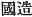
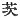

  
[Intangible Textual Heritage](../../index)  [Shinto](../index.md) 
[Index](index)  [Previous](kj020)  [Next](kj022.md) 

------------------------------------------------------------------------

[Buy this Book at
Amazon.com](https://www.amazon.com/exec/obidos/ASIN/B0028Y4SZY/internetsacredte.md)

------------------------------------------------------------------------

  
*The Kojiki*, translated by Basil Hall Chamberlain, \[1919\], at
Intangible Textual Heritage

------------------------------------------------------------------------

p. 58

## \[SECT. XIV.—THE AUGUST DECLARATION OF THE DIVISION OF THE AUGUST MALE CHILDREN AND THE AUGUST FEMALE CHILDREN.\]

Hereupon the Heavenly Shining-Great-August-Deity said to
His-Swift-Impetuous-Male-Augustness: "As for the seed [1](#fn_343.md) of the five male Deities born last,
their birth was from things of mine; so undoubtedly they are my
children. As for the seed of the three female Deities \[50\] born first,
their birth was from a thing of thine; so doubtless they are thy
children." Thus did she declare the division. So Her Augustness
Torrent-Mist-Princess, the Deity born first, dwells in the Inner temple
of Munakata. [2](#fn_344.md) The next, Her
Augustness Lovely-Island-Princess, dwells in the middle temple of
Munakata. The next, Her Augustness Princess-of-the-Torrent, dwells in
the outer temple [3](#fn_345.md) of Munakata.
These three Deities are the three Great Deities [4](#fn_346.md) held in reverence by the Dukes of
Munakata. [5](#fn_347.md) So His Augustness
Brave-Rustic-Illuminator, child of His Augustness Ame-no-hohi, one of
the five children born afterwards ( [6](#fn_348.md) this is the ancestor of the Rulers of
the Land of Idzumo, [7](#fn_349.md) of the Rulers
of the Land of Musashi, [8](#fn_350.md) of the
Rulers of the Upper Land of Unakami, [9](#fn_351.md) of the Rulers of the Lower Land of
Unakami, [10](#fn_352.md) of the Rulers of the
Land of Izhimu, [11](#fn_353.md) of the
Departmental Suzerains of the Island of Tsu [12](#fn_354.md) and of the Rulers of the Land of
Tohotsu-Afumi [13](#fn_355).md). The next,
His Augustness Prince-Lord-of-Heaven (is the
Ancestor of the Rulers of the Land of Ofushi-kafuchi, [14](#fn_356.md) of the Chiefs of
Nukatabe-no-yuwe, [15](#fn_357.md) of the Rulers
of the Land of Ki, [16](#fn_358.md) of the
Suzerains of Tanaka [17](#fn_359.md) in Yamato, of
the Rulers of the Land of Yamashiro, [18](#fn_360.md) of the Rulers of the Land of
Umaguta, [19](#fn_361.md) of the Rulers of the
Land of Kine [20](#fn_362.md) in
Michi-no-Shiri, [21](#fn_363.md) of the Rulers of
the Land of Suhau, [22](#fn_364.md) of the Rulers
of Amuchi, [23](#fn_365.md) in Yamato, of the
Departmental Suzerains of Takechi, [24](#fn_366.md) of the Territorial Lords of
Kamafu, [25](#fn_367.md) and of the Rulers of
Sakikusabe [26](#fn_368).md).

p. 59 p. 60

------------------------------------------------------------------------

### Footnotes

[58:1](kj021.htm#fr_346.md) p.
59 *I.e.*, the origin.

[58:2](kj021.htm#fr_347.md) A place in the
province of Chikuzen. The name signifies either "breast-shape" or
"body-shape."

[58:3](kj021.htm#fr_348.md) Or "sea-shore temple."

[58:4](kj021.htm#fr_349.md) Or "'the Great Deities
of the three shrines."

[58:5](kj021.htm#fr_350.md) *Munakata-no-kimi*.
Remember that all the names in this and similar lists are hereditary
"gentile names" (see Introduction, [p. xvi](kj002.htm#page_xvi).md), and
that "Duke" and the other tides used in this translation to designate
them must only be regarded as approximations towards giving the force of
the Japanese originals, which are themselves by no means always clear,
either etymologically or historically. Indeed Motowori in a chapter
entitled "*Kuni no Miyatsuko*" (
) in his "*Tama-Katsuma*," Vol. VI, p. 25, remarks
that the distinctions obtaining between the various titles of *Kimi*,
*Wake*, *Murazhi*, etc., are no longer to be ascertained, if indeed they
were ever sharply drawn, and that Kuni no Miyatsuko (here rendered
"Rulers of the Land") seems to have been a general term including all
the rest, and roughly corresponding to the modern title of *Daimyo*.—It
must be well understood that all these names, though properly and
originally denoting an office, were inherited as tides, and ended (after
the custom of conferring new ones had died out) by being little more
than an extra surname appended to the surname proper (*uji*). This kind
of quasi-official quasi-titular surname is what is called by the
Japanese a *kabane*, which the translator, for want of a better
equivalent, renders, by "gentile name." Motowori's learned note in Vol.
XXXIX, pp. 14-15 of his Commentary, should be consulted for a full
exposition of this somewhat intricate subject, on which there has been
much misapprehension, chiefly owing to the want of a fitting Chinese
character to denote the word *kabane*.

[58:6](kj021.htm#fr_351.md) Here and throughout
the work passages of this nature containing genealogies are in all the
editions printed small, and might therefore be supposed to be either
intended as foot-notes, or to be later glosses. Motowori however rightly
rejects such an inference. To an English reader the word "this" may
seem, by disturbing the grammar of the sentence, to support that
inference; but in Japanese construction little importance need he
attached to the presence of this double Nominative.—The name in the
original of the ancestral deity whose children are here enumerated is
*Taka-Hira-Tori-no-mikoto*, and the interpretation thereof in the sense
given in the translation is Motowori's *Hira-tori* being supposed by him
to stand for *Hina-teri*.

[58:7](kj021.htm#fr_352.md)
*Idzumo-no-kuni-no-miyatsuko*.

[58:8](kj021.htm#fr_353.md) p.
60 *Muzashi-no-kuni-no-miyatsuko*. In classical and modern usage
*Musashi* does not take the *nigori*.

[58:9](kj021.htm#fr_354.md)
*Kami-tsu-Unakami-no-kuni-no-miyatsuko*. Unakami was a part of what
forms the modern province of Kadzusa. The name probably signifies "on
the sea."

[58:10](kj021.htm#fr_355.md)
*Shimo-tsu-Unakami-no-kuni-no-miyatsuko*.

[58:11](kj021.htm#fr_356.md)
*Izhimu-no-kuni-miyatsuko*. Izhimu (given in the "Japanese Words
Classified and Explained" as *Izhimi*) was a portion of the modern
province of Kadzusa. The etymology of the name is unknown.

[58:12](kj021.htm#fr_357.md)
*Tsushima-no-agata-no-atahe*.

[58:13](kj021.htm#fr_358.md)
*Toho-tsu-afumi-no-kuni-no-miyatsuko*. In modern times *Toho-tsu-afumi*
has been contracted to *Tohotafumi* and is pronounced *Tōtōmi*. The name
signifies "distant fresh sea" (*i.e.* "distant lake") the province which
bears it being thus designated in reference to a large lagoon which it
contains, and in contradistinction to *Chika-tsu-afumi*, "near fresh
sea," the name of the province in which lies Lake Biha. In modern times
the latter has come to be known simply as Afumi (pronounced Omi), and
the original connection of ideas between its name and that of Tōtōmi is
lost sight of.

[58:14](kj021.htm#fr_359.md)
*Ohoshi-kafuchi-no-kuni-no-miyatsuko*. *Ohoshi-kafuchi* (in modern times
pronounced *Ochikochi*) signifies "within the great rivers."

[58:15](kj021.htm#fr_360.md)
*Nukatabe-no-yuwe-no-murazhi*. The meaning of this name is not certain,
but *yuwe* seems to be the word for "bathing woman" mentioned in Sect.
LXXI (Note 11). See Motowori's remarks in Vol. XXIV, p. 56 of his
"Commentary" and the story of the origin of the name given in the
"Catalogue of Family Names," Vol. II, pp. 8-9, edit. of 1834).

[58:16](kj021.htm#fr_361.md)
*Kino-kuni-no-miyatsuko*. *Ki* signifies "tree," and the province
doubtless received this name from its forests. Motowori supposes the
character   to have been
lost in this place, and reads *Ubaraki* (the modern *Ibaraki*), a
portion of the province of Hitachi. See Vol. VII, pp. 75-76 of his
"Commentary."

[58:17](kj021.htm#fr_362.md) *Tanaka-no-atahe*.
The word *tana-ka* signifies "in the middle of rice-fields."

[58:18](kj021.htm#fr_363.md)
*Yamashiro-no-kuni-no-miyatsuko*. *Yama-shiro* signifies "behind the
mountains," though it is now, by a play upon words, written with
characters signifying "mountain-castle."

[58:19](kj021.htm#fr_364.md)
*Umaguta-no-kuni-no-miyatsuko*, Umaguta is a portion of the modern
province of Kadzusa. The etymology of the name is not known.

[58:20](kj021.htm#fr_365.md) p.
61 *Kiuhe-no-kuni-no-miyatsuko*. The etymology of the name and
the position of the place are equally obscure.

[58:21](kj021.htm#fr_366.md) The modern province
of Echigo, or perhaps any not well defined district in the north of Main
Island. (See Section LX, Note 20.)

[58:22](kj021.htm#fr_367.md)
*Suhau-no-kuni-no-miyatsuko*. The etymology of Suhau is not known; but
the name sounds Chinese.

[58:23](kj021.htm#fr_368.md)
*Amuchi-no-miyatsubo*. The derivation of Amuchi is unknown.

[58:24](kj021.htm#fr_369.md)
*Takechi-no-agata-nushi*. Takechi means "high market" or "high town."

[58:25](kj021.htm#fr_370.md) *Kamafu-no-inaki*.
Kamafu was a portion of Afumi. Motowori's suggestion that the name may
be derived from *kama* (*gama*), "a bullfrog," does not seem a happy
one.

[58:26](kj021.htm#fr_371.md)
*Sakikusabe-no-miyatsuko*. *Sakikusa-be* means literally "lily clan,"
*saki-kusa*, the old name for the lily (or one species of lily) being
literally "the luck-plant." The story of the origin of this cognomen is
to be found in the "Catalogue of Family Names," Vol. II, p. 9.

------------------------------------------------------------------------

[Next: Section XV.—The August Ravages of His
Impetuous-Male-Augustness](kj022.md)
