  
[Intangible Textual Heritage](../../index)  [Shinto](../index.md) 
[Index](index)  [Previous](kj022)  [Next](kj024.md) 

------------------------------------------------------------------------

[Buy this Book at
Amazon.com](https://www.amazon.com/exec/obidos/ASIN/B0028Y4SZY/internetsacredte.md)

------------------------------------------------------------------------

  
*The Kojiki*, translated by Basil Hall Chamberlain, \[1919\], at
Intangible Textual Heritage

------------------------------------------------------------------------

p. 63

## \[SECT. XVI.—THE DOOR OF THE HEAVENLY ROCK-DWELLING.\]

So thereupon the Heaven-Shining-Great-August-Deity, terrified at the
sight, closed \[behind her\] the door of the Heavenly
Rock-Dwelling, [1](#fn_380.md) made it fast, [2](#fn_381.md) and retired. Then the whole Plain of
High Heaven was obscured and all the Central Land of Reed-Plains
darkened. Owing to this, eternal [3](#fn_382.md)
night prevailed. Hereupon the voices of the myriad [4](#fn_383.md) Deities were like unto the flies in the
fifth moon as they swarmed, and a myriad portents of woe all arose.
Therefore did the eight hundred myriad [5](#fn_384.md) Deities assemble in a divine assembly in
the bed [6](#fn_385.md) of the Tranquil River of
Heaven, and bid the Deity Thought-Includer, [7](#fn_386.md) child of the
High-August-Producing-Wondrous-Deity think of a plan, assembling the
long-singing birds of eternal night [8](#fn_387.md) and making them sing, taking the hard
rocks of Heaven from the river-bed of the Tranquil River of Heaven, and
taking the iron [9](#fn_388.md) from \[55\] the
Heavenly Metal-Mountains, [10](#fn_389.md) calling
in the smith Ama-tsu-ma-ra, [11](#fn_390.md)
charging Her Augustness I-shi-ko-ri-do-me [12](#fn_391.md)

p. 64

to make a mirror, and charging His Augustness jewel-Ancestor [13](#fn_392.md) to make an augustly complete \[string\]
of curved jewels eight feet \[long\],—of five hundred jewels, [14](#fn_393.md)—and summoning His Augustness
Heavenly-Beckoning-Ancestor-Lord [15](#fn_394.md)
\[56\] and His Augustness Great-Jewel, [16](#fn_395.md) and causing them to pull out with a
complete pulling the shoulder \[-blade\] of a true [17](#fn_396.md) stag from the Heavenly Mount
Kagu, [18](#fn_397.md) and take cherrybark [19](#fn_398.md) from the Heavenly Mount Kagu, and
perform divination, [20](#fn_399.md) and pulling
up by pulling its roots a true *cleyera japonica* [21](#fn_400.md) with five hundred \[branches\] from the
Heavenly Mount Kagu, and taking and putting upon its upper branches the
augustly complete \[string\] of curved jewels eight feet \[57\]
\[long\],—of five hundred jewels,—and taking and tying to the middle
branches [22](#fn_401.md) the mirror eight feet
\[long\], [23](#fn_402.md) and taking and hanging
upon its lower branches the white pacificatory offerings [24](#fn_403.md) and the blue pacificatory offerings,
His Augustness Grand-jewel taking these divers things and holding them
together with the grand august Offerings, [25](#fn_404.md) and His Augustness
Heavenly-Beckoning-Ancestor-Lord prayerfully reciting grand
liturgies, [26](#fn_405.md) and the Heavenly
Hand-Strength-Male-Deity [27](#fn_406.md) standing
hidden beside the door, and Her Augustness Heavenly-Alarming
Female [28](#fn_407.md) hanging \[round her\] the
heavenly clubmoss of the Heavenly Mount Kagu as a sash, [29](#fn_408.md) and making the heavenly spindle-tree
her head-dress, [30](#fn_409.md) and binding the
\[58\] leaves of the bamboo-grass of the Heavenly Mount Kagu in a posy
for her hands, and laying a soundingboard [31](#fn_410.md) before the door of the Heavenly
Rock-Dwelling, and stamping till she made it resound and doing as if
possessed by a Deity, [32](#fn_411.md) and pulling
out the nipples of her breasts, pushing down her skirt-string usque ad
privates

p. 65

partes. [33](#fn_412.md) Then the Plain of High
Heaven shook, and the eight hundred myriad Deities laughed together.
Hereupon the Heaven-Shining-Great-August-Deity was amazed, and, slightly
opening the door of the Heavenly Rock-Dwelling, spoke thus from the
inside: "Methought that owing to my retirement the Plain of Heaven would
be dark, and likewise the Central Land of Reed-Plains would all be dark:
how then is it that the Heavenly-Alarming-Female makes merry, and that
likewise the eight hundred myriad Deities all laugh?" Then the
Heavenly-Alarming-Female spoke saying: "We rejoice and are glad because
there is a Deity more illustrious than Thine Augustness." While she was
thus speaking, His Augustness Heavenly-Beckoning-Ancestor-Lord and His
Augustness Grand-jewel pushed forward the mirror and respectfully showed
it to the Heaven-Shining-Great-August-Deity, whereupon the
Heaven-Shining-Great-August-Deity, more and more astonished, gradually
came forth from the door and gazed upon it, whereupon the
Heavenly-Hand-Strength-Male-Deity, who was standing hidden, took her
august hand and drew her out, and then His Augustness Grand-jewel drew
the bottom-tied rope [34](#fn_413.md) \[59\] along
at her august back, and spoke, saying: "Thou must not go back further in
than this!" So when the Heaven-Shining-Great-August-Deity had come
forth, both the Plain of High Heaven and the Central-Land-of-Reed-Plains
of course again became light. [35](#fn_414.md)

p. 66 p. 67 p. 68 p. 69

------------------------------------------------------------------------

### Footnotes

[63:1](kj023.htm#fr_383.md) p.
65 Motowori says that the word "rock" need not here be taken
literally. But it is always (and the translator thinks rightly) so
understood, and the compound considered to mean a cave in the rocks,
which is also the expression found in the "Chronicles" ( 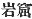).

[63:2](kj023.htm#fr_384.md) The word *sasu*, which
is here used, implies that the goddess p. 66
made the door fast either by sticking something against it or by bolting
it,—perhaps with one of the metal hooks of which mentioned is made in
Sect. LXV (Note 7).

[63:3](kj023.htm#fr_385.md) *Toko-yo*, here
properly written  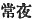, and a
few lines lower down semi-phonetically 
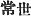.

[63:4](kj023.htm#fr_386.md) Motowori supposes
"myriad" to be a copyist's error for "evil." This clause is a repetition
of one in Sect. XII.

[63:5](kj023.htm#fr_387.md) The parallel passage
in the "Chronicles" has "eighty myriads."

[63:6](kj023.htm#fr_388.md) The Japanese word
*kohara*, translated "bed," is thus defined in Dr, Hepburn's Dictionary,
2nd Edit. *s v.* *Kawara*: "That part of the stony bed of a river which
is dry except in high water."

[63:7](kj023.htm#fr_389.md) *Omohi-kane-no-kami*,
"He *included* in his single mind the thoughts and contrivances of
many," says Motowori.

[63:8](kj023.htm#fr_390.md) *I.e.,* as is
generally believed, the barndoor fowl.

[63:9](kj023.htm#fr_391.md) The text has the
character  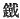, "iron," which
Hirata. reads *ma-gane*, lit. "true metal," the common Japanese term
being *kuro-gane*, lit, "black metal," Motowori prefers to read simply
*kane*, "metal" in general, The main text of the parallel passage in the
"Chronicles" omits to mention the metal of which the mirror was made;
but "One account" has the character 
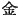, "metal" in general, often in Chinese, but rarely if
ever in old Japanese, with the specific sense of "gold." The "Chronicles
of Old Matters" alone, which are of very doubtful authenticity, say that
the mirror was made of copper. (Copper was not discovered in Japan till
the eighth century of the Christian era, a few years before the
discovery of gold). The best and most obvious course is to adhere to the
character in the text, which is, as above stated, "iron."

[63:10](kj023.htm#fr_392.md) *I.e.*, the mines.
The original expression is *Ame no kana-yama*.

[63:11](kj023.htm#fr_393.md) *Ama-tsu* signifies
"of Heaven," but the rest of this name is not to be explained. Motowori
adopts from the "Chronicles" the reading, *Ama-tsu-ma-ura*, where the
character used for *ma* signifies "true," and that for *ura* signifies
"sea-shore." (It should be remarked that the forging of a spear by this
personage is referred by the author of the "Chronicles," not to the
"Divine Age" but to the reign of the Emperor Sui-zei.) Motowori also
proposes to supplement after the name the words "to make a spear."
Hirata identifies this god with *Ama-no-ma-hito-tsu-no-mikoto*, His
Augustness Heavenly-One-Eye, who is however not mentioned. in the
"Records." Obvius hujus nominis sensus foret "Coelestis Penis," sed
nullius commentatoris auctoritate commendatur.

[63:12](kj023.htm#fr_394.md) This name is written
in the "Chronicles" with characters signifying
Stone-Coagulating-Old-Woman, which however seem to be as p. 67 merely phonetic as those in the present text
( 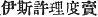). Motowori proposes the
interpretation of "Again-Forging-Old-Woman" ( 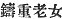, *I-shikiri-tome*) which is
supported by a tradition preserved in the "Gleanings of the Ancient
Story," where it is related that the mirror, not having given
satisfaction at first, was forged a second time. There is a long note on
the subjects of this name in Hirata's "Exposition of the Ancient
Histories," Vol. IX, p. 56, where that author propounds the novel
opinion that I-shi-ko-ri-do-me was not a goddess at all, but a god.

[64:13](kj023.htm#fr_395.md)
*Tama-noya-no-mikoto*. The "Chronicles" write this name with characters
signifying "Jewel-House," but such a reading seems less good.

[64:14](kj023.htm#fr_396.md) See Sect. XIII, Note
5.

[64:15](kj023.htm#fr_397.md)
*Ame-no-ko-ya-ne-no-mikoto*, also reads *Ame-no* etc. and *Ama tsu* etc.
The signification of the syllables *ko-ya*, rendered "beckoning
ancestor" in accordance with Motowori's view connecting the name with
the share taken by the god who bore it in the legend here narrated, is
obscure. Mr. Satow thinks that Koya may be the name of a place (see
these "Transactions" Vol. VII, Pt. IV. p. 400).

[64:16](kj023.htm#fr_398.md)
*Futo-tama-no-mikoto*. The name is here rendered in accordance with the
import of the Chinese characters with which it is written. Motowori,
however, emits a plausible opinion when he proposes to consider *tama*
as an abbreviation of *tamuke*, "holding in the hands as an offering,"
in connection with what we are told below about this deity and
*Ame-no-ko-ya-ne* holding the symbolic offerings.

[64:17](kj023.htm#fr_399.md) The word "true"
(*ma*) here and below is not much more than an Honorific.

[64:18](kj023.htm#fr_400.md) We might also, though
less well, translate by "Mount Kagu in Heaven." This would suit the view
of Motowori, who is naturally averse to the identification of this Mount
Kagu with the well-known mountain of that name in Yamato (see Sect. VII,
Note 12). But of course an European scholar cannot allow of such a
distinction being drawn.

[64:19](kj023.htm#fr_401.md) Or perhaps the bark
of the common birch is intended. The word in the original is *haha-ka*.

[64:20](kj023.htm#fr_402.md) See Mr. Satow's
already quoted note in Vol. VII, Pt. II, p. 425 *et seq*, and more
especially pp. 430-432, of these "Transactions."

[64:21](kj023.htm#fr_403.md) In Japanese
*saka-ki*. It is commonly planted in the precincts of Shintō temples.

[64:22](kj023.htm#fr_404.md) We might also
translate in the Singular "to a middle branch," in order to conform to
the rigid distinction which our language draws between Singular and
Plural.

[64:23](kj023.htm#fr_405.md) p.
68 A note to the edition of 1687 proposes to substitute the
characters  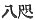 for  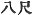 and a note in the original
tells us to read them not *ya-ta*, but *ya-ata*. Hereupon Motowori
founds his derivation of *ya-ta*, from *ya-atama*, "eight heads," and
supposes the mirror to have been, not eight feet in length, but
octangular, while Moribe, who in the case of the jewels accepts the
obvious interpretation "eight feet \[long\]," thinks that the mirror had
"an eightfold flowery pattern" (*yaha-na-gata*) round its border. But
both these etymologies are unsupported by the other cases in which the
word *ya-ta* occurs, and are rendered specially untenable by the fact of
the mirror and curved beads being spoken of together further on as the
 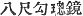 (Sect. XXXIII, Note 20).

[64:24](kj023.htm#fr_406.md) In rendering the
original word *nigi-te* (here written phonetically, but elsewhere with
the characters  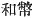), the
explanation given by Tanigaha Shisei, and indeed suggested by the
characters, has been followed. Motowori's view does not materially
differ, but he considers "pacificatory" or "softening" to be equivalent
to "soft" applied to the offerings themselves, which consisted of soft
cloth, the syllable *te* of *nigi-te* being believed to be a contraction
of *tahe* which signifies cloth. The white cloth in ancient times was
made of the paper mulberry (*Broussonetia papyrifera*), and the blue of
hemp.

[64:25](kj023.htm#fr_407.md) The original word is
written with the same character as the *te* of *nigi-te* translated
"offerings" above.

[64:26](kj023.htm#fr_408.md) Or in the Singular "a
grand liturgy," or "ritual."

[64:27](kj023.htm#fr_409.md)
*Ame-no-ta-jikara-wo-no-kami*.

[64:28](kj023.htm#fr_410.md)
*Ame-no-uzume-no-mikoto*. The translator has followed the best
authorities in rendering the obscure syllable *uzu* by the word
"alarming." Another interpretation quoted in Tanigaha Shisei's
"Perpetual Commentary on the Chronicles of Japan" and adopted by Moribe
in his "*Idzu no Chi-waki*," is that *uzu* means head-dress, and that
the goddess took her name from the head-dress of spindle-tree leaves
which she wore. The character 
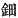, with which the syllables in question (here written
phonetically) are rendered ideographically in the "Chronicles,"
signifies "metal head-gear," "flowers of gold or silver."

[64:29](kj023.htm#fr_411.md) *Tasuki*, "a cord or
sash passed over the shoulders, round the back of the neck, and attached
to the wrists, to strengthen the hands for the support of weights,
whence the name, which means 'hand-helper.' It was thus different both
in form and use from the modern *tasuki*, a cord with its two ends
joined which is worn behind the neck, under the p.
69 arms and round the back, to keep the modern loose sleeves out
of the way when household duties are being performed." (E. Satow).

[64:30](kj023.htm#fr_412.md) *I.e.*, making for
herself a head-dress of spindle-tree leaves.

[64:31](kj023.htm#fr_413.md) The original of these
words, *uke fusete*, is written phonetically, and the exact meaning of
*uke*, here rendered "sounding-board," is open to doubt. The parallel
passage in the "Chronicles" has the character,  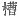, which signifies a "trough,"
"manger" or "tub," and the commentators seem therefore right in
supposing that the meaning intended to be conveyed in both histories is
that of some kind of improvised wooden structure used for the purpose of
amplifying sound.

[64:32](kj023.htm#fr_414.md) Neither the text nor
Motowori's Commentary (which Hirata adopts word for word) is absolutely
explicit, but the imitation and not the reality of divine possession
appears to be here intended. In the parallel passage of the
"Chronicles," on the other hand, we seem to be reading of genuine
possession.

[65:33](kj023.htm#fr_415.md) The subject of the
Verb is not clear in many of the clauses of this immensely long
sentence, which does not properly hang together. Some clauses read as if
the different deities who take a part in the action did so of their own
free will; but the intention of the author must have been to let a
Causative sense be understood throughout, as he begins by telling us
that a plan was devised by the deity Thought-Includer, which plan must
have influenced all the subsequent details.

[65:34](kj023.htm#fr_416.md) *Shiri-kume-naha*,
*i.e.*, rope made of straw drawn up by the roots, which stick out from
the end of the rope. Straw-ropes thus manufactured are still used in
certain ceremonies and are called *shime-naha*, a corruption of the
Archaic term, Motowori's explanation shows that this is more likely to
be the proper signification of the word than "back-limiting-rope"
(*shiri-ho-kagiri-me-naha*), which had been previously suggested by
Mabuchi with reference to its supposed origin at the time of the event
narrated in this legend.

[65:35](kj023.htm#fr_417.md) Motowori plausibly
conjectures the character 
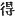 in the concluding words of this passage to be a
copyist's error for  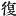, and
the translator has accordingly rendered it by the English word "again."
As it stands, the clause 
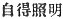, though making sense, does not read like the
composition of a Japanese.

------------------------------------------------------------------------

[Next: Section XVII.—The August Expulsion of
His-Impetuous-Male-Augustness](kj024.md)
