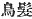
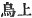
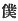
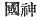
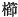
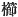
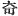
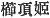
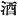
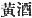

  
[Intangible Textual Heritage](../../index)  [Shinto](../index) 
[Index](index)  [Previous](kj024)  [Next](kj026) 

------------------------------------------------------------------------

[Buy this Book at
Amazon.com](https://www.amazon.com/exec/obidos/ASIN/B0028Y4SZY/internetsacredte)

------------------------------------------------------------------------

  
*The Kojiki*, translated by Basil Hall Chamberlain, \[1919\], at
Intangible Textual Heritage

------------------------------------------------------------------------

p. 71

## \[[SECT.](errata.htm#14) XVIII.—THE EIGHT-FORKED SERPENT.\]

So, having been expelled, \[His-Swift-impetuous-Male-Augustness\]
descended to a place \[called\] Tori-kami [1](#fn_422) at the head-waters of the River Hi [2](#fn_423) in the Land of Idzumo. At this time some
chopsticks [3](#fn_424) came floating down the
stream. So His-Swift-Impetuous-Male-Augustness, thinking that there must
be people at the head-waters of the river, went up it in quest of them,
when he came upon an old man and an old woman,—two of them,—who had a
young girl between them, [4](#fn_425) and were
weeping. Then he deigned to ask: "Who are ye?" So the old man replied,
saying: "I [5](#fn_426) am an Earthly
Deity, [6](#fn_427) child of the Deity
Great-Mountain-Possessor. [7](#fn_428) I am
called by the name of Foot-Stroking-Elder, [8](#fn_429) my wife is called by the \[61\] name of
Hand-Stroking Elder, and my daughter is called by the name of
Wondrous-Inada-Princess." [9](#fn_430) Again he
asked: What is the cause of your crying?" \[The old man answered\]
saying: "I had originally eight young girls as daughters. But the
eight-forked serpent of Koshi [10](#fn_431) has
come every year and devoured \[one\], and it is now its time to come,
wherefore we weep." Then he asked him: "What is its form like?" \[The
old man\] answered, saying: "Its eyes are like *akakagachi*, [11](#fn_432) it has one body with eight heads and
eight tails. Moreover on

p. 72

its body grows moss, and also chamaecyparis [12](#fn_433) and cryptomerias. Its length extends
over eight valleys and eight hills, and if one look at its belly, it is
all constantly \[62\] bloody and inflamed." (What is
called here *akakagachi* is the modern *hohodzuki*. [13](#fn_434)) Then
His-Swift-Impetuous-Male-Augustness said to the old man: "If this be thy
daughter, wilt thou offer her to me?" He replied, saying: "With
reverence, [14](#fn_435) but I know not thine
august name." Then he replied, saying: "I am elder brother [15](#fn_436) to the
Heaven-Shining-Great-August-Deity. So I have now descended from Heaven."
Then the Deities Foot-Stroker-Elder and Hand-Stroking-Elder said: "If
that be so, with reverence will we offer \[her to thee\]." So
His-Swift-Impetuous-Male-Augustness, at once taking and changing the
young girl into a multitudinous and close-toothed comb which he stuck
into his august hair-bunch, said to the Deities Foot-Stroking-Elder and
Hand-Stroking-Elder: "Do you distill some eight-fold refined
liquor. [16](#fn_437) Also make a fence round
about, in that fence make eight gates, at each gate tie \[together\]
eight platforms, [17](#fn_438) on each platform
put a liquor-vat, and into each vat pour \[63\] the eight-fold refined
liquor, and wait." So as they waited after having thus prepared
everything in accordance with his bidding, the eight-forked serpent came
truly as \[the old man\] had said, and immediately dipped a head into
each vat, and drank the liquor. Thereupon it was intoxicated with
drinking, and all \[the heads\] lay down and slept. Then
His-Swift-Impetuous-Male-Augustness drew the ten-grasp sabre, [18](#fn_439) that was augustly girded on him, and
cut the serpent in pieces, so that the River Hi flowed on changed into a
river of blood. So when he cut the middle tail, the edge of his august
sword broke. Then, thinking it

p. 73

strange, he thrust into and split \[the flesh\] with the point of his
august sword and looked, and there was a great sword \[within\]. So he
took this great sword, and, thinking it a strange thing, he respectfully
informed the Heaven-Shining-Great-August-Deity. [19](#fn_440) This is the Herb-Quelling Great
Sword. [20](#fn_441)

p. 74

------------------------------------------------------------------------

### Footnotes

[71:1](kj025.htm#fr_425) p.
73 Written with the characters 
, "bird's hairs," but these must surely be phonetic.
In the "Chronicles" the same name is written  .

[71:2](kj025.htm#fr_426) Or Hii, the chief
river in Idzumo. The name is supposed by some to have been derived from
the name of the god *Hi-hayabi* (see Section VIII, Note 6).

[71:3](kj025.htm#fr_427) Or in the Singular, "a
chopstick."

[71:4](kj025.htm#fr_428) Literally "had placed
a young girl between them," a similar construction to that in Section
XIII, (Note 11).

[71:5](kj025.htm#fr_429) The humble character
  "servant" is used by the
old man for the First Personal Pronoun.

[71:6](kj025.htm#fr_430)  . Being generally used
antithetically to  ,
"Heavenly Deity," it seems better to translate the characters thus than
by "Country "Deity" or "Deity of the Land." (See Section I, Note 11).

[71:7](kj025.htm#fr_431)
*Oho-yama-tsu-mi-no-kami*, first mentioned in Sect. VI, (Note 17).

[71:8](kj025.htm#fr_432) *Ashi-nadzu-chi*, the
wife's being *Te-nadzu-chi*. "One account" in the "Chronicles" gives
*Ashi nadzu-te-nadzu* ( )
as the name of the old father alone, while the mother is called
*Inada-no-miya-nushi Susa-no-yatsu-mimi*. (*Inada-no-miya-nushi*
signifies "Mistress of the Temple of Inada"; the signification of the
second compound, which forms the name properly so called is not clear,
but should probably be interpreted to mean "Impetuous-Eight-Ears," the
word *susa*, "impetuous," containing an allusion to the name of her
divine visitor, and "eight ears" being Honorific).

[71:9](kj025.htm#fr_433)
*Kushi*-\[*I*\]*nada*-*hime*, *Inada* (*i.e.* *ina-da*, "rice-field")
being the name of a place. *Kushi* signifies not only "wondrous" but
"comb," and is indeed here written with the character for "comb"  , so that there is a play on
the word in connection with the incident of her transformation into a
comb which is mentioned immediately below, though most authorities agree
in considering   to be
here used phonetically for 
, which is the reading in the "Chronicles." Moribe,
however, in his "*Idzu no Chi-waki*" suggests the etymology
*Kushi-itadaki-hime* ( )
*i.e.*, "Princess \[used as\] a comb \[for\] the head."

[71:10](kj025.htm#fr_434) p.
74 Derivation quite obscure. Motowori quotes an absurd etymology
given in the "Japanese Words Classified and Explained," which identifies
the name of *Koshi* with the Past Tense of the Verb *kuru*, "to come"!
There is a district (*kohori*) named Koshi in the modern province of
Echigo; but Koshi was down to historical times a somewhat vague
designation of all the north-western provinces,—Echizen, Kaga, Noto,
Etchiū, and Echigo. A tradition preserved in the "Chronicles" tells us
that it was meant to denote the Island of Yezo (or rather, perhaps, the
land of the Yezo, *i.e.* the Ainos). The expression in the first Song in
Sect. XXIV, and other similar ones in the early literature show that it
was not looked upon as a part of Japan proper.

[71:11](kj025.htm#fr_435) See Note 13.

[72:12](kj025.htm#fr_436) A coniferous tree,
the *Chamæcyparis obtusa*, in Japanese *hi-no-ki*. The cryptomeria is
*Cryptomeria japonica*.

[72:13](kj025.htm#fr_437) The winter-cherry,
*Physalis Alkekengi*.

[72:14](kj025.htm#fr_438) For the word
"reverence" here and a few lines further on. conf. Sect. IX, Note 4.

[72:15](kj025.htm#fr_439) He was her younger
brother; but see Introduction, [p. xxxvii](kj005.htm#page_xxxvii).

[72:16](kj025.htm#fr_440) In Japanese *sake*,
and archaically *ki*, written with the character   and generally translated
"rice-beer," but by Dr. Rein "rice-brandy" (*Reis-branntwein*). The
modern *sake* resembles the Chinese *huang chiu* ( ). If we translated it by
"rice-beer," we should of course have to render by "to brew" the Verb
*kamu* or *kamosu* ( )
here rendered "to distill." It should be mentioned that Professor
Atkinson who, like Dr. Rein, has studied the subject specially, uses the
word "brewing;" but apparently no English term exactly represents the
process which the liquor undergoes in the course of preparation. A
curious question is suggested by the fact that the old Japanese word for
"distilling" or "brewing" liquor is homonymous with the Verb "to chew,"
But there is not, beyond this isolated verbal resemblance, any
documentary evidence in favour of the Japanese ever having practised a
method of making liquor which still obtains in some of the South Sea
Islands.—"One account" of the Chronicles of Japan makes *Susa-no-wo* say
"Take *all the fruits*, and distill liquor."

[72:17](kj025.htm#fr_441) The author doubtless
intended, as Motowori suggests, to speak only of eight platforms,—one at
each gate,—and not of sixty-four. But what he actually says is as in the
translation.

[72:18](kj025.htm#fr_442) See Section VIII,
Note 1.

[73:19](kj025.htm#fr_443) p.
75 The text is not quite clear, but the above gives the
interpretation which the words most naturally lend themselves. Motowori,
influenced by the parallel passage in the "Chronicles," which says
explicitly that the sword itself was sent up to the Sun-Goddess, reads
the passage thus: "thinking it a strange thing, he sent it up with a
message to the Heaven-Shining-Great-August- Deity"; and Mr. Satow
follows him in thus translating (see Note 4 to Ritual 8, Vol. IX, Pt.
II, 198-200 of these "Transactions," where the whole of this legend is
translated with one or two slight verbal differences from the version
here given). In the opinion of the present writer, Hirata's arguments in
favour of the view here taken are conclusive (see his "Sources of the
Ancient Histories." Section LXXII, in the second part of Vol. III, pp.
66-67). That the sword afterwards appears at the temple of the
Sun-Goddess in Ise (see end of Section LXXXII), by the high-priestess of
which it is bestowed on the legendary hero Yamato-take, is not to the
point in this connection, as it is not necessary that all the parts of a
myth should be perfectly consistent.

[73:20](kj025.htm#fr_444) *Kusa-nagi no tachi*.
For the applicability of this name see Sect. LXXXIII.

------------------------------------------------------------------------

[Next: Section XIX.—The Palace of Suga](kj026)
