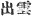
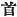
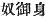

  
[Intangible Textual Heritage](../../index)  [Shinto](../index.md) 
[Index](index)  [Previous](kj025)  [Next](kj027.md) 

------------------------------------------------------------------------

[Buy this Book at
Amazon.com](https://www.amazon.com/exec/obidos/ASIN/B0028Y4SZY/internetsacredte.md)

------------------------------------------------------------------------

  
*The Kojiki*, translated by Basil Hall Chamberlain, \[1919\], at
Intangible Textual Heritage

------------------------------------------------------------------------

p. 75

## \[SECT. XIX.—THE PALACE OF SUGA.\]

So thereupon His Swift-Impetuous-Male-Augustness sought in the land of
Idzumo for a place where he might build a palace. Then he arrived at a
place \[called\] Suga, [2](#fn_443.md) and said:
"On coming to this place my august heart is pure," [1](#fn_442.md)—and in that place he built a palace to
dwell in. So that place is now called Suga. [2](#fn_443.md) When this Great Deity first built [3](#fn_444.md) the palace of Suga, clouds rose up
thence. Then he made an august song. [4](#fn_445.md) That song said: [5](#fn_446.md)

"Eight clouds arise. The eight-fold fence of Idzumo makes an eight-fold
fence for the spouses to retire \[within\]. Oh! that eight-fold
fence." [6](#fn_447.md)

 

p. 76

\[65\] Then he called the Deity Foot-Stroking-Elder and said: "Thee do I
appoint Headman [7](#fn_448.md) of my palace;" and
moreover bestowed on him the name of
Master-of-the-Temple-of-Inada-Eight-Eared-Deity-of-Suga. [8](#fn_449.md)

p. 77

------------------------------------------------------------------------

### Footnotes

[75:1](kj026.htm#fr_446.md) p.
76 *I.e.,* "I feel refreshed." The Japanese term used is
*suga-sugashi*, whence the origin ascribed to the name of the place
Suga. But move probably the name gave rise to this detail of the legend.

[75:2](kj026.htm#fr_447.md) The real derivation of
Suga is unknown, all the native commentators accepting the statement in
the text, and Motowori supposing that up to the time of the Deity's
arrival it had borne the name of Inada. We may perhaps conjecture some
connection between *Suga* and *Susa-no-wo* ("Impetuous Male," see
Motowori's Commentary, Vol. IX, p. 49), and it may be mentioned that the
"Eight-Eared Deity of Suga" is also mentioned as the "Eight-Eared Deity
of Susa."

[75:3](kj026.htm#fr_448.md) Or "began to build."

[75:4](kj026.htm#fr_449.md) "Ode" is another
rendering of the Japanese term *uta*, which has been used by the present
writer and by others. *Uta* being however connected with *utafu*, "to
sing," it seems more consistent to translate it by the English word
"song."

[75:5](kj026.htm#fr_450.md) Or perhaps rather "in
that song he said."

[75:6](kj026.htm#fr_451.md) This difficult song
has been rather differently rendered by Mr. Aston in the Second Appendix
to his "Grammar of the Japanese Written Language" (2nd Edition), and
again by Mr. Satow in the note to his translation of the Ritual already
quoted. Mr. Aston (premising that he follows Motowori's interpretation)
translates it thus:

"Many clouds arise:  
The clouds which come forth (are) a manifold fence:  
For the husband and wife to retire within  
They have formed a manifold fence:  
Oh! that manifold fence!"

Mr. Satow's translation is as follows:

"Many clouds arise.  
The manifold fence of the forth-issuing clouds  
Makes a manifold fence  
For the spouses to be within.  
Oh! that manifold fence."

p. 77 In any case the meaning simply is that
the multitudinous clouds rose up like a fence or screen behind which the
newly-married deities might retire from public gaze, and Moribe suggests
that the repetitions are an after-addition made to bring up to the usual
number of thirty-one syllables what were originally but the three lines—

Tachi-idzuru kumo mo  
       Tsuma-gome ni  
Yo-he-gahi tsukuru yo!

*I.e.*—

"The uprising clouds even, to shut up  
       the spouses, make an eight-fold fence."

(See his discussion on this song in the "Idzu no Kotowaki Vol. I, pp.
1-3.)—The present writer has already stated in the Introduction (see [p.
lx](kj006.htm#page_lx).md) his reasons for always rendering the native word
for "eight" (*ya*) by "eight" instead of by "many" or "numerous," as is
done by the two eminent scholars above quoted. With regard to the word
*Idzumo* which they, in deference to the opinions of the native
commentators, render by "clouds which come forth" or "forth-issuing
clouds" (the Chinese characters 
 with which the word is written having that
signification), the present writer cannot persuade himself that such a
corruption as *idzumo* for *ide-kumo* either retained at the time of the
composition of the song, or should now be credited with, the
signification which this its supposed etymology assigns to it. The
etymology moreover is far from being established, and in this, as in
many other cases, the Chinese characters used to write the name of the
province of Idzumo, may well have rested on nothing more than a vague
similarity of sound, and probably no European scholar would endorse the
opinion of the native commentators, to whom the "Records" are a sacred
book, that the province of Idzumo received its name from this very poem.
On the other hand, we need have no difficulty in conceding that the
Pillow-Word *ya-kumo-tatsu*, by which Idzumo is preceded in poetical
compositions, did probably here originate.—This song is in the
"Chronicles" only quoted in a note, for which reason some authorities
dispute its antiquity. In the note in question, we find the reading
-*gome* (the "Records" have -*gomi*), the Transitive form instead of the
Intransitive. If this were adopted, the translation would have to run
thus: . . . . . "The eight-fold fence of Idzumo makes an eight-fold
fence to shut up the spouse\[s?\] in;" and probably "spouse" should be
understood in the Feminine to mean "wife."

[76:7](kj026.htm#fr_452.md) p.
78 *Obito*, written with the Chinese character  , while the Japanese word is
probably derived from *oho-bito*, "great man." When used, as it often
is, as a "gentile name," the translator renders it by "Grandee."

[76:8](kj026.htm#fr_453.md) *Inada-no-miya-nushi
Suga-no ya-tsui-mimi-no-kami*. It should be stated that Motowori, as
usual, objects to the view that *mimi* signifies "ears" (its proper
meaning) in this name. But he has no better explanation to offer, and
the Chinese characters give us *ya-tsu mimi*, "eight ears." The author
of the "*Tokiha-gusa*" ingeniously proposes to consider *ya-tsu mimi* as
a corruption of *yatsuko mi mi* (
) "servant august body," but this cannot be seriously
entertained (Conf. Sect. XIII, Note 18).

------------------------------------------------------------------------

[Next: Section XX.—The August Ancestors of the Deity-Master-Of-The-Great
Land](kj027.md)
