  
[Intangible Textual Heritage](../../index)  [Shinto](../index.md) 
[Index](index)  [Previous](kj028)  [Next](kj030.md) 

------------------------------------------------------------------------

[Buy this Book at
Amazon.com](https://www.amazon.com/exec/obidos/ASIN/B0028Y4SZY/internetsacredte.md)

------------------------------------------------------------------------

  
*The Kojiki*, translated by Basil Hall Chamberlain, \[1919\], at
Intangible Textual Heritage

------------------------------------------------------------------------

p. 83

### \[SECT. XXII.—MOUNT TEMA.\]

Thereupon the Princess of Yakami answered [1](#fn_479.md) the eighty Deities, saying: "I will not
listen to your words. I mean to marry the Deity Great-Name-Possessor."
So \[70\] the eighty Deities, being enraged, and wishing to slay the
Deity Great-Name-Possessor, took counsel together, on arriving at the
foot of Tema [2](#fn_480.md) in the land of
Hahaki, and said \[to him\]: "On this mountain there is a red boar. So
when we drive it down, do thou wait and catch it. If thou do not wait
and catch it, we will certainly slay thee." Having \[thus\] spoken, they
took fire, and burnt a large stone like unto a boar, and rolled it down.
Then, as \[they\] drove it down and \[he\] caught it, [3](#fn_481.md) he got stuck to and burnt by the stone,
and died. Thereupon Her Augustness his august parent [4](#fn_482.md) cried and lamented, and went up to
Heaven, and entreated His Divine-Producing-Wondrous-Augustness, [5](#fn_483.md) who at once sent Princess
Cockle-Shell [6](#fn_484.md) and Prince Clam [7](#fn_485.md) to bring him to life. Then Princess
Cockle-Shell triturated and scorched [8](#fn_486.md) \[her shell\], and Princess Clam carried
water and

p. 84

smeared \[him\] as with mother's [9](#fn_487.md)
milk, whereupon he became a beautiful young man, and wandered off.
Hereupon the eighty Deities, seeing \[this\], again deceived him, \[71\]
taking him with them into the mountains, where they cut down a large
tree, inserted a wedge in the tree, [10](#fn_488.md) and made him stand in the middle,
whereupon they took away the wedge and tortured him to death. [11](#fn_489.md) Then on Her Augustness his august
parent again seeking him with cries, she perceived him, and at once
cleaving the tree, took him out and brought him to life, and said to
him: [12](#fn_490.md) "If thou remain here, thou
wilt at last be destroyed by the eighty Deities." Then she sent him
swiftly off to the august place of the Deity Great-House-Prince [13](#fn_491.md) in the land of Ki. [14](#fn_492.md) Then when the eighty Deities searched
and pursued till they came up to him, and fixed their arrows \[in their
bows\], he escaped by clipping under the fork of a tree, and
disappeared.

p. 85

------------------------------------------------------------------------

### Footnotes

[83:1](kj029.htm#fr_483.md) p.
84 It must be understood that in the meantime they had arrived at
her dwelling and begun to court her.

[83:2](kj029.htm#fr_484.md) Etymology unknown.

[83:3](kj029.htm#fr_485.md) The text is here
concise to obscurity, but yet there ought not to be much doubt as to the
author's intention.

[83:4](kj029.htm#fr_486.md) The text has the
character  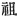 signifying
properly "grand-parent," but frequently used in Archaic Japanese
writings in the sense of "mother." It is then read *oya*, which the
English word "parent" exactly represents.

[83:5](kj029.htm#fr_487.md)
*Kami-musu-bi-no-mikoto*. See Sect. I, Note 6.

[83:6](kj029.htm#fr_488.md) *Kisa-gahi-hime*. The
*kiga-gahi* here mentioned is the modern *aka-gahi*, a cockle, the *Arca
inflata*.

[83:7](kj029.htm#fr_489.md) *Umugi-hime*. The
*umugi* here mentioned is the modern *hamagari*, a clam of the family
*Mactridæ*, the *Cytherea Mereirix*.

[83:8](kj029.htm#fr_490.md) The character used is
 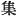, "collected," "gathered
together." But the combined authority of Mabuchi, Motowori and Hirata
obliges us either to consider it a copyist's error for  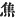, "scorched," or else to
believe that in early time in Japan the two characters were used
interchangeably.

[84:9](kj029.htm#fr_491.md) p.
85 Or "nurse's." The meaning is that a paste like milk was made
of the triturated and calcined shell mixed with water. There is in this
passage a play upon words which it is impossible to reproduce in
English, the Japanese term for "triturating," *kisage* (which the author
has taken care to write phonetically) resembling the name of Princess
*Kisa-gahi* (Cockle-Shell), while *omo*, "mother" or "nurse," similarly
recalls that of Princess *Umugi* (Clam). Motowori traces the names of
the shell-fish in question to this exploit of the two goddesses. We
shall be justified in applying an inverse interpretation to the legend.

[84:10](kj029.htm#fr_492.md) The original of this
clause,  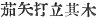 or according to
another reading  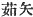, etc. is
a great crux to the native commentators, who can make sure neither of
the exact sense nor of the Japanese reading of the first two characters,
which seem to be ideographic for three others occurring immediately
below,  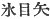, which are
themselves of doubtful import. An elaborate discussion of the question
will be found in Hirata's "Exposition of the Ancient Histories," Vol.
XVII, pp. 25-27. The general sense at all events is that here given.

[84:11](kj029.htm#fr_493.md) The characters  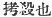, here rendered "tortured him
to death," are by the modern commentators read *uchi-koroshiki*, which
simply means killed \[him\]."

[84:12](kj029.htm#fr_494.md) Literally "to her
child."

[84:13](kj029.htm#fr_495.md)
*Oha-ya-biko-no-kami*. This Deity is identified with the Deity
*I-dakeru* mentioned in the "Chronicle" as a son of *Susa-no-wo* (the
"Impetuous-Male-Deity"), and as the introducer into the Island of
Tsukushi in particular and into all the "Eight Great Islands" of Japan
of the seeds of plants and trees. Motowori's note on this name in Vol.
X, pp. 28-29, is worth consulting, though his idea of connecting the
agricultural and arboricultural renown of the Deity bearing it with the
name of the province of Ki is doubtless quite fanciful.

[84:14](kj029.htm#fr_496.md) *I.e.*, "the land of
tree" ( 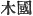). Later the
character  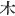 was replaced
by  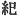, which in
Sinico-Japanese has the same sound *ki*, while a second one,  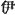, was added in order to conform
to an edict of the Empress *Gem-miyō* (A. D. 713) to the effect that all
names of places were to be written with two Chinese characters, as was
usual in China and Korea. The second character in this case simply
carried on the *i* sound with which the first ends, so that the name
became *Kii*.

------------------------------------------------------------------------

[Next: Section XXIII.—The Nether-Distant-Land](kj030.md)
