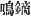
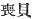
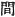
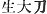
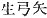
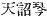
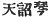
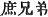
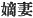
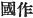

  
[Intangible Textual Heritage](../../index)  [Shinto](../index) 
[Index](index)  [Previous](kj029)  [Next](kj031) 

------------------------------------------------------------------------

[Buy this Book at
Amazon.com](https://www.amazon.com/exec/obidos/ASIN/B0028Y4SZY/internetsacredte)

------------------------------------------------------------------------

  
*The Kojiki*, translated by Basil Hall Chamberlain, \[1919\], at
Intangible Textual Heritage

------------------------------------------------------------------------

p. 86

## \[SECT. XXIII.—THE NETHER-DISTANT-LAND.\]

\[The Deity Great-House-Prince spoke to him [1](#fn_493)\] saying: "Thou must set off to the
Nether-Distant-Land where \[72\] dwells His Impetuous-Mate-Augustness.
That Great Deity will certainly counsel thee." So on his obeying her
command and arriving at the august place [2](#fn_494) of His Impetuous-Male-Augustness, the
latter's daughter the Forward-Princess [3](#fn_495) came out and saw him, and they exchanged
glances and were married, and \[she\] went in again, and told her
father, saying: "A very beautiful Deity has come." Then the Great Deity
went out and looked, and said: 'This is the
Ugly-Male-Deity-of-the-Reed-Plain," [4](#fn_496) and at once calling him in, made him
sleep in the snake-house. Hereupon his wife, Her Augustness the
Forward-Princess, gave her husband a snake-scarf, [5](#fn_497) saying: "When the snakes are about to
bite thee, drive them away by waving this scarf thrice." So, on his
doing as she had instructed, the snakes became quiet, so that he came
forth after calm slumbers. Again on the night of the next day \[the
Impetuous-Male-Deity\] put him into the centipede and wasp-house; [6](#fn_498) but as she again gave him a centipede
and wasp-scarf, and instructed him as before, he came forth calmly.
Again \[the Impetuous-Male-Deity\] shot a whizzing barb [7](#fn_499) into the middle of a large moor, and
sent him to fetch the arrow and, when he had entered the moor, at once
set fire to the moor all round. Thereupon, while he \[stood\] knowing no
place of exit, a mouse [8](#fn_500) came and
said: "The inside is hollow-hollow; the outside is narrow-narrow." [9](#fn_501) Owing to its speaking thus, he trod on
the place, where, upon he fell in and hid himself, during which time the

p. 87

fire burnt past. Then the mouse brought out in its mouth and presented
to him the whizzing barb. The feathers of the arrow were brought in
their mouths by all the mouse's children. Hereupon his wife the
Forward-Princess came bearing mourning-implements, [10](#fn_502) and crying. Her father the Great Deity,
thinking that \[the Deity Great-Name-Possessor\] was already dead and
done for, went out and stood on the moor, whereupon \[the Deity
Great-Name-Possessor\] brought the arrow and presented it to him, upon
which \[the Great Deity\], taking him into the house and calling him
into an eight-foot spaced large room, [11](#fn_503) made him take the lice off his head.
So, on looking at the head \[he saw that\] there were many centipedes
\[there\]. Thereupon, as his wife gave to her husband berries of the
*muku* tree [12](#fn_504) and red earth, he
chewed the berries to pieces, and spat them out with the red earth which
he held in his mouth, so that the Great Deity believed him to be chewing
up and spitting out the centipedes, and, feeling fond \[of him\] in his
heart, fell asleep. Then \[the Deity Great-Name-Possessor\], grasping
the Great Deity's hair, tied it fast to the various rafters of the
house, and, blocking up the floor of the house with a five hundred
draught rock, [13](#fn_505) and taking his wife
the Forward Princess on his back, then carried off \[74\] the Great
Deity's great life-sword [14](#fn_506) and
life-bow-and-arrows, [15](#fn_507) as also his
heavenly speaking-lute, [16](#fn_508) and ran
out. But the heavenly speaking-lute brushed against a tree, and the
earth resounded. So the Great Deity, who was sleeping, started at the
sound, and pulled down the house. But while he was disentangling his
hair which was tied to the rafters, \[the Deity Great-Name-Possessor\]
fled a long way. So then, pursuing after him to the Even Pass

p. 88

of Hades, [17](#fn_509) and gazing on him from
afar, he called out to the Deity Great-Name-Possessor, saying: "With the
great life-sword and the life-bow-and-arrows which thou earnest, pursue
thy half-brethren [18](#fn_510) till they
crouch on the august slopes of the passes, [19](#fn_511) and pursue them till they are swept
into the reaches of the rivers, and do thou, wretch! [20](#fn_512) become the Deity
Master-of-the-Great-Land; [21](#fn_513) and
moreover, becoming the Deity Spirit-of-the-Living-Land, and making my
daughter the Forward-Princess thy \[75\] consort, [22](#fn_514) do thou make stout the temple-pillars
at the foot of Mount Uka [23](#fn_515) in the
nethermost rock-bottom, and make high the cross-beams to the
Plain-of-High-Heaven, and dwell \[there\], thou villain!" [24](#fn_516) So when, bearing the great sword and
bow, he pursued and scattered the eighty Deities, he did pursue them
till they crouched on the august slope of every pass, [25](#fn_517) he did pursue them till they were swept
into every river, and then he began to make the land. [26](#fn_518) Quamobrem Hera Yamaki, secundum
anterius pactum, \[cum eo\] in thalamo coivit. So he brought her with
him; but, fearing his consort the Forward Princess, she stuck into the
fork of a tree the child that she had borne, and went back. [27](#fn_519) So the child was called by the name of
the Tree-Fork-Deity, [28](#fn_520) and another
name was the Deity-of-August-Wells. [29](#fn_521)

p. 89 p. 90

------------------------------------------------------------------------

### Footnotes

[86:1](kj030.htm#fr_497) p.
88 Literally, "to the child." The words placed in brackets, and
which are not to be found in either of the early printed editions, are
supplied in accordance with a suggestion of Moribe's contained in his
Critique of Motowori's Commentary. Motowori himself had supplied the
words "Her Augustness his august parent spoke to him," which seem less
appropriate. It is true that one MS. is quoted by Motowori as favouring
his view; but such authority is insufficient, and the mistake, moreover,
peculiarly easy for a copyist to make (*mi oya* for *oho-ya*).

[86:2](kj030.htm#fr_498) *I.e.*, the Palace.

[86:3](kj030.htm#fr_499) p.
89 This is Motowori's view of the import of the original name
*Suseri-bime*, which he connects with *susumu*, "to advance," "to press
forward," and explains by reference to the bold, forward conduct of the
young goddess.

[86:4](kj030.htm#fr_500) One of the alternative
names of this Deity, who is mostly mentioned by one of his other four
designations, for a list of which see sect. XX. (Notes 17 to 21).

[86:5](kj030.htm#fr_501) *I.e.*, "a scarf by
waving which he might keep off the snakes." Similarly the "centipede and
wasp-scarf" mentioned a little farther on must be understood to mean "a
scarf to ward off centipedes and wasps with."

[86:6](kj030.htm#fr_502) The word *hachi*,
translated "wasp," is a general name including other insects of the
family of *Vespidæ*.

[86:7](kj030.htm#fr_503) *I.e.*, "arrow." The
original expression is *nari-kabura* (
), which has survived in the modern language under the
modified form of *kabura-ya*, defined in Dr. Hepburn's Dictionary as "an
arrow with a head shaped like a turnip, having a hole in it, which
causes it to hum as it flies." It was used in China in the time of the
Han dynasty.

[86:8](kj030.htm#fr_504) Or "rat."

[86:9](kj030.htm#fr_505) The translator cannot
think of any better English equivalents for the child-like onomatopoeias
*hora-hora* and *subu-subu* of the Japanese original.

[87:10](kj030.htm#fr_506) The edition of 1687
reads the two characters  
(here translated "mourning implements,") *mo-gari no sonahe*, *i.e.*,
"preparations for the funeral." Such preparations are detailed in the
latter part of Sect. XXXI.

[87:11](kj030.htm#fr_507) This is Mabuchi's
interpretation, as quoted by Motowori, of the expression *ya-ta-ma no
oho-muro-ya*. Motowori's own view is that *ya-ta* stands for *ya-tzu*,
which give us in English "an eight-spaced large room." The character
 , "space" has been in
later times used as a measure of length (six Japanese feet.) Altogether
the precise meaning of the expression is not quite clear, but the
general sense is a "large spacious room."

[87:12](kj030.htm#fr_508) *Aphananthe Aspera*,
also sometimes called *Celtis Muku*.

[87:13](kj030.htm#fr_509) *I.e.*, "a rock which
it would require five hundred men to lift."

[87:14](kj030.htm#fr_510) *Iku-tachi* ( ), supposed by Motowori to be
"a sword having the virtue of conferring long life upon its possessor."

[87:15](kj030.htm#fr_511) *Iku-yumi-ya* ( ).

[87:16](kj030.htm#fr_512) *Ame no nori-goto*
( ), so called because, as
will be seen Sect. XCVI, divine messages were conveyed through a person
playing p. 90 on the lute. Hirata, in his
"Exposition of the Ancient Histories." invents the reading *ame no
nu-goto* ( ), "heavenly
jewelled lute."

[88:17](kj030.htm#fr_513) See Sect. IX. (Note
16).

[88:18](kj030.htm#fr_514) They were not born of
the same mother. The Chinese characters in the text ( ) imply, properly speaking,
that the eighty brethren of the Great-Name-Possessor were the sons of
concubines. But Motowori denies that such is the Japanese usage with
regard to the characters in question.

[88:19](kj030.htm#fr_515) Or "hills."

[88:20](kj030.htm#fr_516) The word in the text
is *ore*, an insulting equivalent Second Personal Pronoun. If we were
translating into German, we might perhaps approximately represent its
force by "*er*."

[88:21](kj030.htm#fr_517) Thus according to
this legend, "Master-of-the-Great-Land" (*Oho-kuni-nushi*) was not the
original name of the Deity commonly designated by it, and his
sovereignty over the Land of the Living (whence the appropriateness of
the second name in this context) was derived by investiture from the god
of the Land of the Dead.

[88:22](kj030.htm#fr_518) The characters  , which are here used,
designate specifically the chief or legitimate wife, as opposed to the
lesser wives or concubines.

[88:23](kj030.htm#fr_519) *Uka-no-yama*. No
satisfactory etymology of *Uka* is forthcoming.

[88:24](kj030.htm#fr_520) *I.e.*, "Firmly
planting in the rock the pillars forming the foundation of thy palace,
and rearing its fabric to the skies, do thou rule therefrom the Land of
the Living, thou powerful wretch, who hast so successfully braved me!"

[88:25](kj030.htm#fr_521) Or "hill."

[88:26](kj030.htm#fr_522) This is taken to mean
that he continued the act of creation which had been interrupted by the
death of *Izanami* (the "Female-Who-Invites"). See Sect. IX, [p.
35](kj015.htm#page_35), where her husband Izanagi says to her: "The
lands that I and thou made are not yet finished making." The words
"*Kuni tsukuri*" ( ), here
used for "making the land," became a title for "Ruler-of-the-Land" and
finally a "gentile name" (*kabane*).

[88:27](kj030.htm#fr_523) *Q.d.*, to Inaba.

[88:28](kj030.htm#fr_524) *Ki-no-mata-no-kami*.

[88:29](kj030.htm#fr_525) *Mi-wi-no-kami*. He
is supposed to have benefitted the country by digging wells in many
places.

------------------------------------------------------------------------

[Next: Section XXIV.—The Wooing of the
Deity-of-Eight-Thousand-Spears](kj031)
